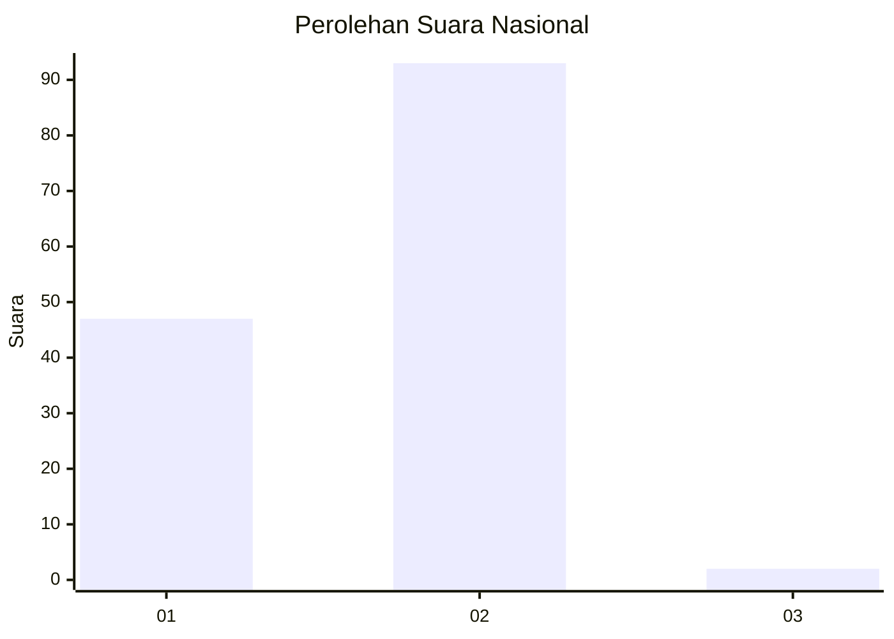
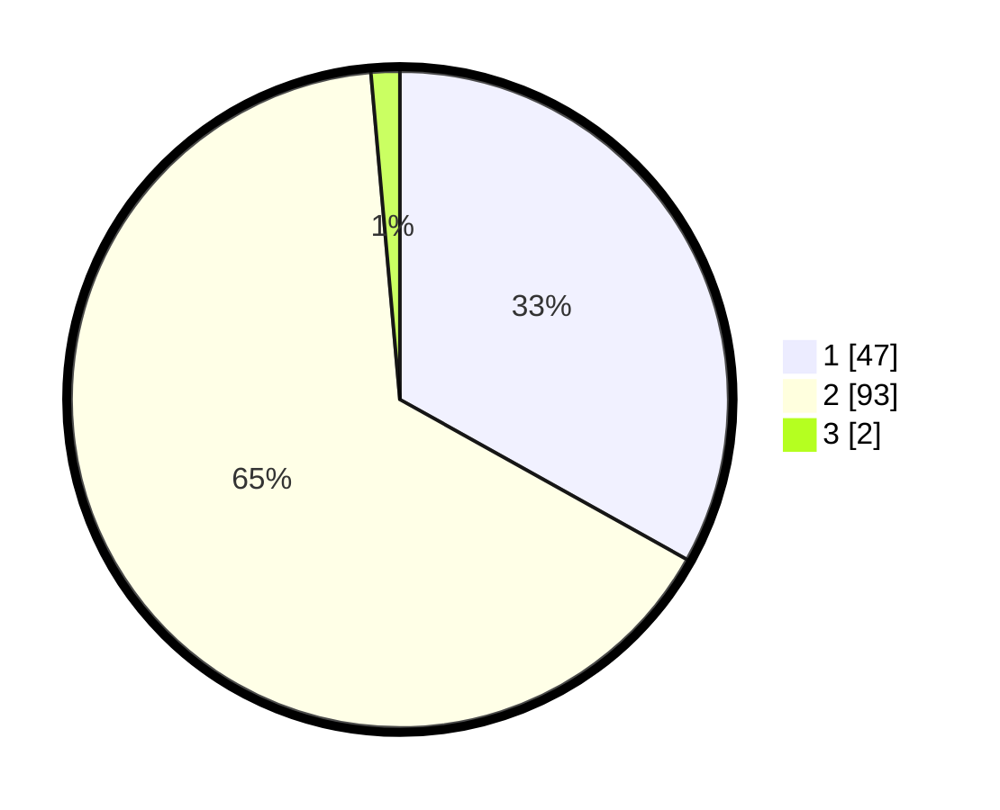

# Hasil

## Grafik

## Tabel

| No. | Nama Paslon    | Suara | Suara (raw) | Persentase |
|:--- |:-------------- | -----:| -----------:| ----------:|
| 1   | ANIES MUHAIMIN | 47    | [47][p-1]   | 33,10      |
| 2   | PRABOWO GIBRAN | 93    | [93][p-2]   | 65,49      |
| 3   | GANJAR MAHFUD  | 2     | [2][p-3]    | 1,41       |

[p-1]: https://github.com/gigit-pemilu/pemilu-2024/blob/main/pilpres/hitung-suara/sub/11-aceh/sub/02-aceh-tenggara/sub/12-ketambe/sub/2009-penyeberangan-cingkam/sub/001-tps/sub/paslon-1.txt
[p-2]: https://github.com/gigit-pemilu/pemilu-2024/blob/main/pilpres/hitung-suara/sub/11-aceh/sub/02-aceh-tenggara/sub/12-ketambe/sub/2009-penyeberangan-cingkam/sub/001-tps/sub/paslon-2.txt
[p-3]: https://github.com/gigit-pemilu/pemilu-2024/blob/main/pilpres/hitung-suara/sub/11-aceh/sub/02-aceh-tenggara/sub/12-ketambe/sub/2009-penyeberangan-cingkam/sub/001-tps/sub/paslon-3.txt

## Foto C Plano

https://sirekap-obj-formc.kpu.go.id/140e/pemilu/ppwp/11/02/12/20/09/1102122009001-20240214-235518--ccb4738f-5c06-419a-87cd-7a62d70dbd34.jpg

https://sirekap-obj-formc.kpu.go.id/140e/pemilu/ppwp/11/02/12/20/09/1102122009001-20240214-235623--136b5a6a-f644-421f-9445-656f7c0188c8.jpg

https://sirekap-obj-formc.kpu.go.id/140e/pemilu/ppwp/11/02/12/20/09/1102122009001-20240214-235815--cedb3679-f18d-46a1-91bf-d888ea587c72.jpg

## Metadata

| Key        | Value               |
| ---------- | ------------------- |
| Time Stamp | 2024-02-19 06:16:00 |

