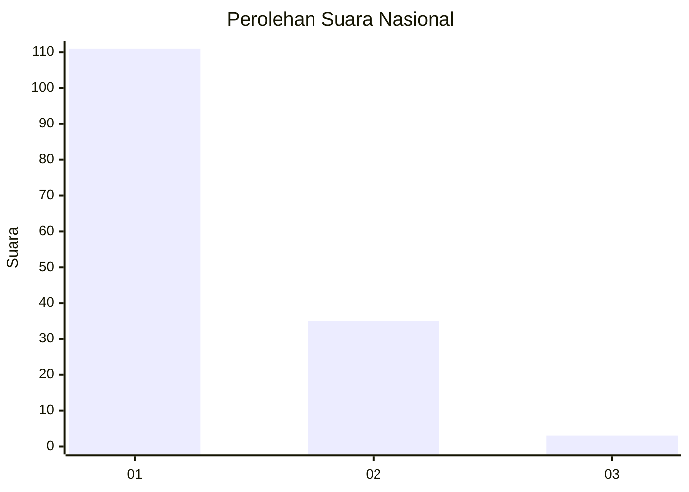
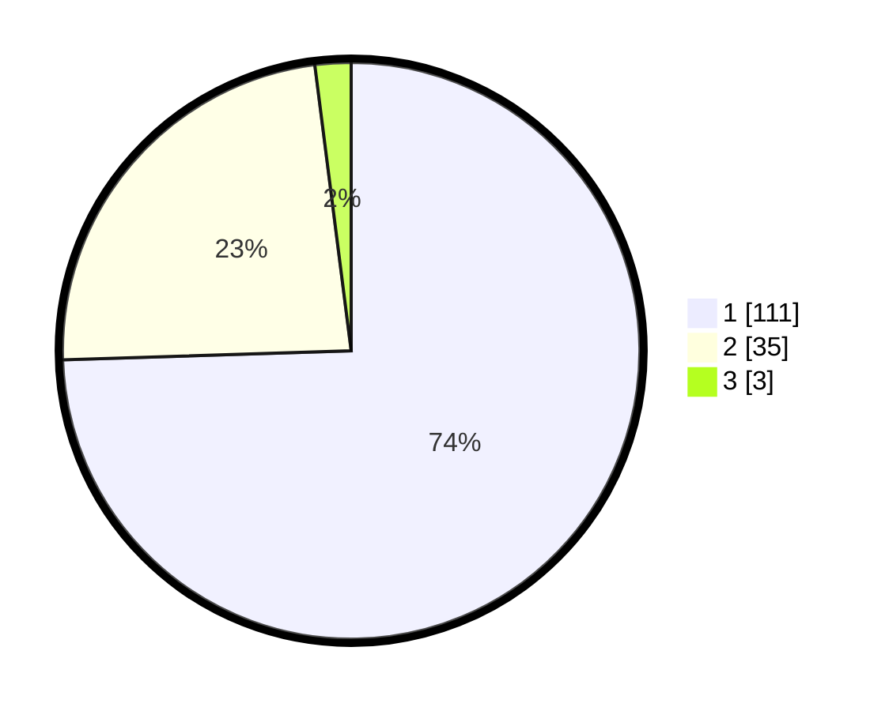

# Hasil

## Grafik

## Tabel

| No. | Nama Paslon    | Suara | Suara (raw) | Persentase |
|:--- |:-------------- | -----:| -----------:| ----------:|
| 1   | ANIES MUHAIMIN | 111   | [111][p-1]  | 74,50      |
| 2   | PRABOWO GIBRAN | 35    | [35][p-2]   | 23,49      |
| 3   | GANJAR MAHFUD  | 3     | [3][p-3]    | 2,01       |

[p-1]: https://github.com/gigit-pemilu/pemilu-2024/blob/main/pilpres/hitung-suara/sub/11-aceh/sub/02-aceh-tenggara/sub/12-ketambe/sub/2011-bintang-bener/sub/001-tps/sub/paslon-1.txt
[p-2]: https://github.com/gigit-pemilu/pemilu-2024/blob/main/pilpres/hitung-suara/sub/11-aceh/sub/02-aceh-tenggara/sub/12-ketambe/sub/2011-bintang-bener/sub/001-tps/sub/paslon-2.txt
[p-3]: https://github.com/gigit-pemilu/pemilu-2024/blob/main/pilpres/hitung-suara/sub/11-aceh/sub/02-aceh-tenggara/sub/12-ketambe/sub/2011-bintang-bener/sub/001-tps/sub/paslon-3.txt

## Foto C Plano

https://sirekap-obj-formc.kpu.go.id/1af1/pemilu/ppwp/11/02/12/20/11/1102122011001-20240215-104339--e716af55-1406-428a-97ff-e590d013f59a.jpg

https://sirekap-obj-formc.kpu.go.id/1af1/pemilu/ppwp/11/02/12/20/11/1102122011001-20240215-104356--7f0f6454-19e8-40cf-858c-ae7397b1e15b.jpg

https://sirekap-obj-formc.kpu.go.id/1af1/pemilu/ppwp/11/02/12/20/11/1102122011001-20240215-104410--e631b8b5-a184-4c4d-ab00-823a425fe12d.jpg

## Metadata

| Key        | Value               |
| ---------- | ------------------- |
| Time Stamp | 2024-02-24 22:31:28 |

