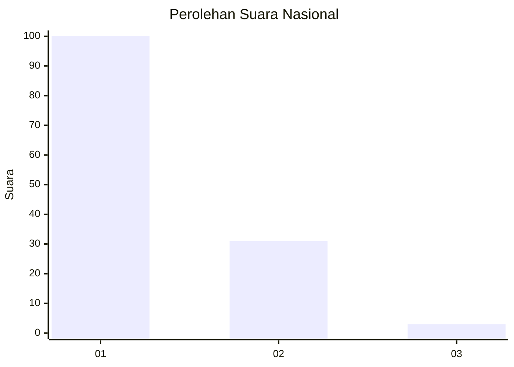
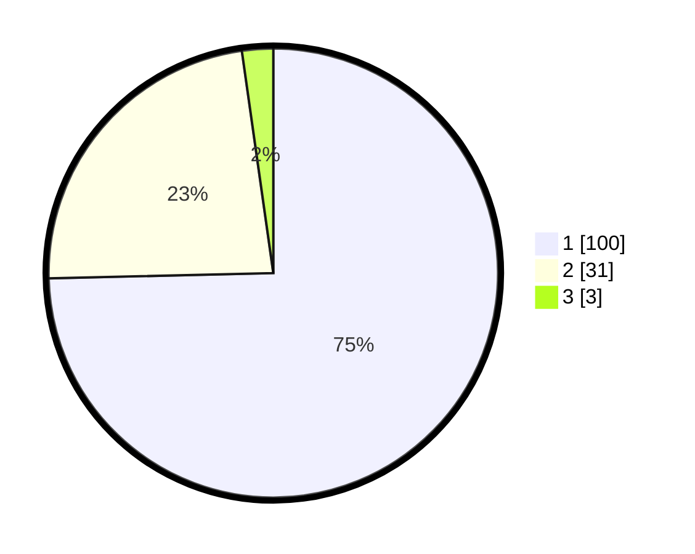

# Hasil

## Grafik

## Tabel

| No. | Nama Paslon    | Suara | Suara (raw) | Persentase |
|:--- |:-------------- | -----:| -----------:| ----------:|
| 1   | ANIES MUHAIMIN | 100   | [100][p-1]  | 74,63      |
| 2   | PRABOWO GIBRAN | 31    | [31][p-2]   | 23,13      |
| 3   | GANJAR MAHFUD  | 3     | [3][p-3]    | 2,24       |

[p-1]: https://github.com/gigit-pemilu/pemilu-2024/blob/main/pilpres/hitung-suara/sub/11-aceh/sub/02-aceh-tenggara/sub/12-ketambe/sub/2011-bintang-bener/sub/002-tps/sub/paslon-1.txt
[p-2]: https://github.com/gigit-pemilu/pemilu-2024/blob/main/pilpres/hitung-suara/sub/11-aceh/sub/02-aceh-tenggara/sub/12-ketambe/sub/2011-bintang-bener/sub/002-tps/sub/paslon-2.txt
[p-3]: https://github.com/gigit-pemilu/pemilu-2024/blob/main/pilpres/hitung-suara/sub/11-aceh/sub/02-aceh-tenggara/sub/12-ketambe/sub/2011-bintang-bener/sub/002-tps/sub/paslon-3.txt

## Foto C Plano

https://sirekap-obj-formc.kpu.go.id/f0df/pemilu/ppwp/11/02/12/20/11/1102122011002-20240215-003305--cfc8f60c-f29b-4fc6-aa60-6341a9f6a9b5.jpg

https://sirekap-obj-formc.kpu.go.id/f0df/pemilu/ppwp/11/02/12/20/11/1102122011002-20240215-141728--615cdc01-74ba-4797-8c95-0601b59e7c3c.jpg

https://sirekap-obj-formc.kpu.go.id/f0df/pemilu/ppwp/11/02/12/20/11/1102122011002-20240215-141545--00cec49f-d910-40fa-8503-ddf6f138cd02.jpg

## Metadata

| Key        | Value               |
| ---------- | ------------------- |
| Time Stamp | 2024-02-16 21:01:00 |

