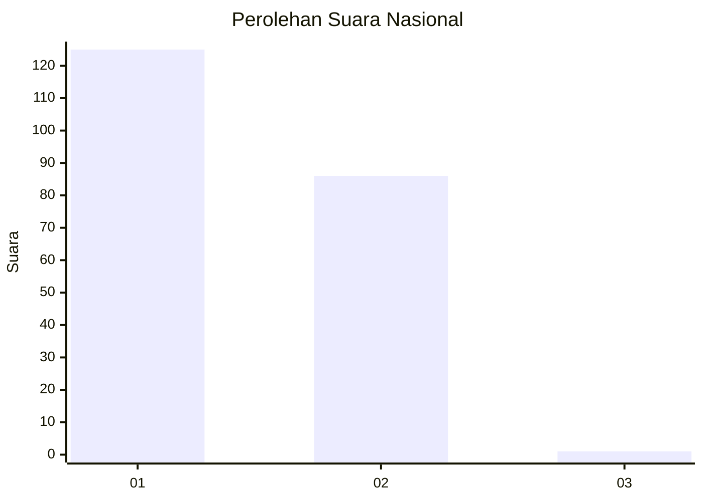
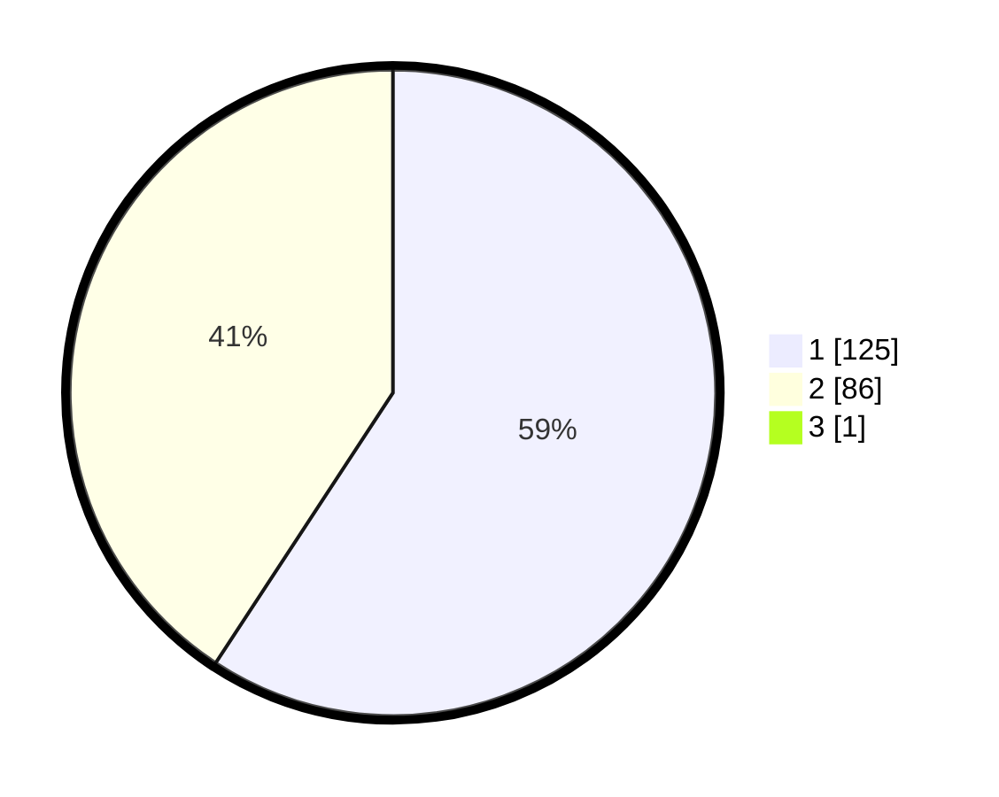

# Hasil

## Grafik

## Tabel

| No. | Nama Paslon    | Suara | Suara (raw) | Persentase |
|:--- |:-------------- | -----:| -----------:| ----------:|
| 1   | ANIES MUHAIMIN | 125   | [125][p-1]  | 58,96      |
| 2   | PRABOWO GIBRAN | 86    | [86][p-2]   | 40,57      |
| 3   | GANJAR MAHFUD  | 1     | [1][p-3]    | 0,47       |

[p-1]: https://github.com/gigit-pemilu/pemilu-2024/blob/main/pilpres/hitung-suara/sub/11-aceh/sub/02-aceh-tenggara/sub/12-ketambe/sub/2017-kati-maju/sub/001-tps/sub/paslon-1.txt
[p-2]: https://github.com/gigit-pemilu/pemilu-2024/blob/main/pilpres/hitung-suara/sub/11-aceh/sub/02-aceh-tenggara/sub/12-ketambe/sub/2017-kati-maju/sub/001-tps/sub/paslon-2.txt
[p-3]: https://github.com/gigit-pemilu/pemilu-2024/blob/main/pilpres/hitung-suara/sub/11-aceh/sub/02-aceh-tenggara/sub/12-ketambe/sub/2017-kati-maju/sub/001-tps/sub/paslon-3.txt

## Foto C Plano

https://sirekap-obj-formc.kpu.go.id/3774/pemilu/ppwp/11/02/12/20/17/1102122017001-20240215-103215--47a7138a-6fcd-4026-a36a-550a1b9132cd.jpg

https://sirekap-obj-formc.kpu.go.id/3774/pemilu/ppwp/11/02/12/20/17/1102122017001-20240218-174212--ed5a08ee-a91f-4c95-b5d8-b1c087c4d3cf.jpg

https://sirekap-obj-formc.kpu.go.id/3774/pemilu/ppwp/11/02/12/20/17/1102122017001-20240215-070611--c47352c9-875e-4593-861a-d4135c296eb7.jpg

## Metadata

| Key        | Value               |
| ---------- | ------------------- |
| Time Stamp | 2024-02-24 22:31:28 |

