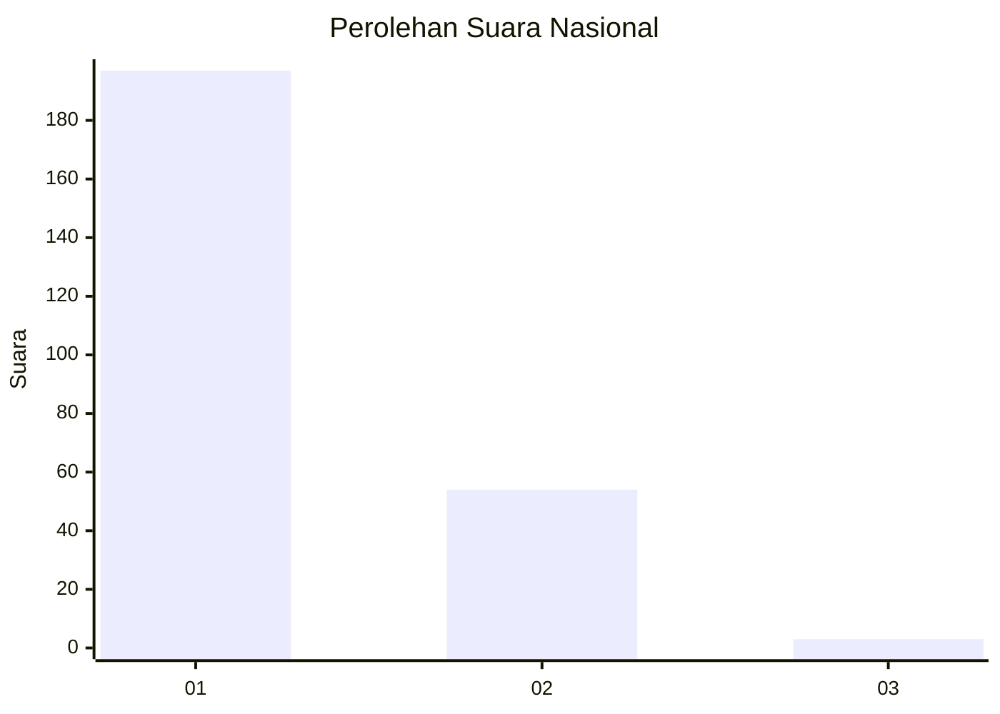
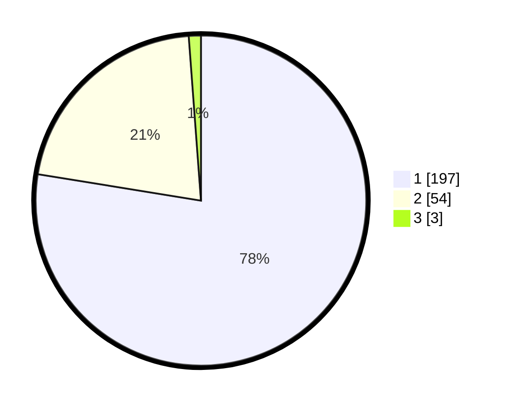

# Hasil

## Grafik

## Tabel

| No. | Nama Paslon    | Suara | Suara (raw) | Persentase |
|:--- |:-------------- | -----:| -----------:| ----------:|
| 1   | ANIES MUHAIMIN | 197   | [197][p-1]  | 77,56      |
| 2   | PRABOWO GIBRAN | 54    | [54][p-2]   | 21,26      |
| 3   | GANJAR MAHFUD  | 3     | [3][p-3]    | 1,18       |

[p-1]: https://github.com/gigit-pemilu/pemilu-2024/blob/main/pilpres/hitung-suara/sub/11-aceh/sub/02-aceh-tenggara/sub/12-ketambe/sub/2018-leuser/sub/001-tps/sub/paslon-1.txt
[p-2]: https://github.com/gigit-pemilu/pemilu-2024/blob/main/pilpres/hitung-suara/sub/11-aceh/sub/02-aceh-tenggara/sub/12-ketambe/sub/2018-leuser/sub/001-tps/sub/paslon-2.txt
[p-3]: https://github.com/gigit-pemilu/pemilu-2024/blob/main/pilpres/hitung-suara/sub/11-aceh/sub/02-aceh-tenggara/sub/12-ketambe/sub/2018-leuser/sub/001-tps/sub/paslon-3.txt

## Foto C Plano

https://sirekap-obj-formc.kpu.go.id/e165/pemilu/ppwp/11/02/12/20/18/1102122018001-20240215-101513--6591cc33-0e77-4ae3-8d29-818b0bd98d83.jpg

https://sirekap-obj-formc.kpu.go.id/e165/pemilu/ppwp/11/02/12/20/18/1102122018001-20240215-101938--ef3ea86f-e1c4-44cc-acd4-5ea7894721a0.jpg

https://sirekap-obj-formc.kpu.go.id/e165/pemilu/ppwp/11/02/12/20/18/1102122018001-20240215-102334--b6b11dbf-bc3d-436d-a089-b2d44fb5f488.jpg

## Metadata

| Key        | Value               |
| ---------- | ------------------- |
| Time Stamp | 2024-02-24 22:31:28 |

