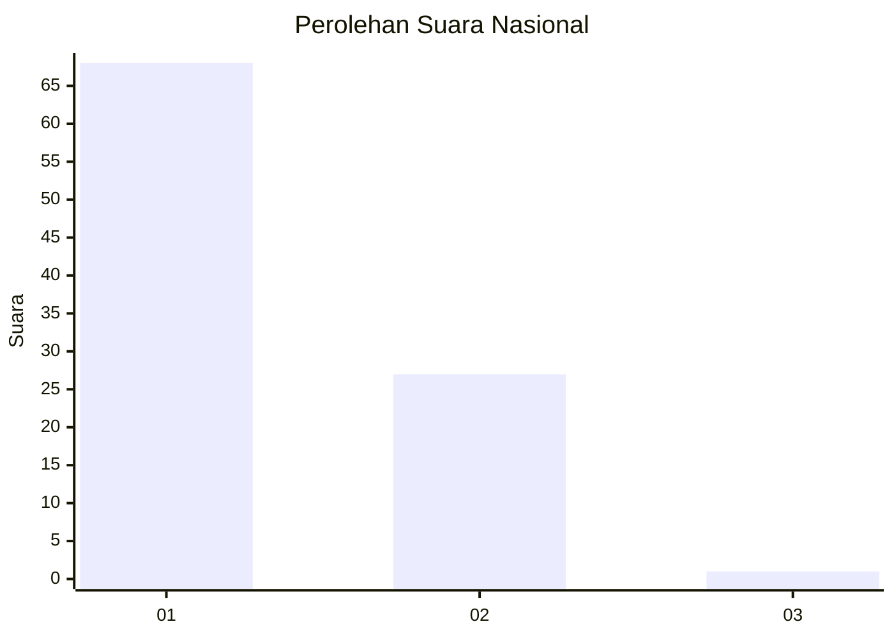
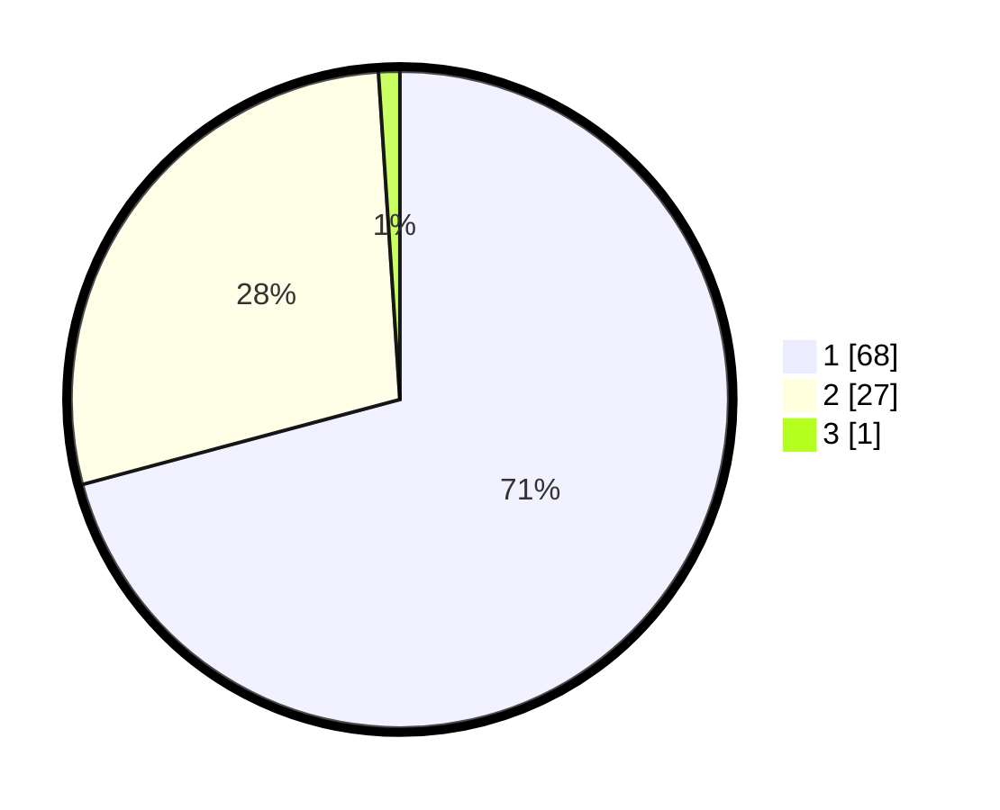

# Hasil

## Grafik

## Tabel

| No. | Nama Paslon    | Suara | Suara (raw) | Persentase |
|:--- |:-------------- | -----:| -----------:| ----------:|
| 1   | ANIES MUHAIMIN | 68    | [68][p-1]   | 70,83      |
| 2   | PRABOWO GIBRAN | 27    | [27][p-2]   | 28,13      |
| 3   | GANJAR MAHFUD  | 1     | [1][p-3]    | 1,04       |

[p-1]: https://github.com/gigit-pemilu/pemilu-2024/blob/main/pilpres/hitung-suara/sub/11-aceh/sub/02-aceh-tenggara/sub/12-ketambe/sub/2020-bukit-mbakhu/sub/002-tps/sub/paslon-1.txt
[p-2]: https://github.com/gigit-pemilu/pemilu-2024/blob/main/pilpres/hitung-suara/sub/11-aceh/sub/02-aceh-tenggara/sub/12-ketambe/sub/2020-bukit-mbakhu/sub/002-tps/sub/paslon-2.txt
[p-3]: https://github.com/gigit-pemilu/pemilu-2024/blob/main/pilpres/hitung-suara/sub/11-aceh/sub/02-aceh-tenggara/sub/12-ketambe/sub/2020-bukit-mbakhu/sub/002-tps/sub/paslon-3.txt

## Foto C Plano

https://sirekap-obj-formc.kpu.go.id/dbf1/pemilu/ppwp/11/02/12/20/20/1102122020002-20240219-203512--9f070deb-473f-42b1-83f3-dc45ba61d928.jpg

https://sirekap-obj-formc.kpu.go.id/dbf1/pemilu/ppwp/11/02/12/20/20/1102122020002-20240219-203513--b73b3f85-eff7-49a9-9138-3c6abdd5fc54.jpg

https://sirekap-obj-formc.kpu.go.id/dbf1/pemilu/ppwp/11/02/12/20/20/1102122020002-20240219-203513--f23d5950-b842-4913-b70d-960eb3a7b999.jpg

## Metadata

| Key        | Value               |
| ---------- | ------------------- |
| Time Stamp | 2024-02-21 17:00:00 |

## DATA PEMILIH TETAP

Jumlah pemilih dalam DPT: **128**.
 * L: **70**.
 * P: **58**.

## DATA PENGGUNA HAK PILIH

Jumlah pengguna hak pilih dalam DPT: **98**.
 * L: **48**.
 * P: **50**.

Jumlah pengguna hak pilih dalam DPTb: **0**.
 * L: **0**.
 * P: **0**.

Jumlah pengguna hak pilih dalam DPK: **0**.
 * L: **0**.
 * P: **0**.

Jumlah pengguna hak pilih: **98**.
 * L: **48**.
 * P: **50**.

## JUMLAH SUARA SAH DAN TIDAK SAH

JUMLAH SELURUH SUARA SAH: **96**.

JUMLAH SUARA TIDAK SAH: **2**.

JUMLAH SELURUH SUARA SAH DAN SUARA TIDAK SAH: **98**.

