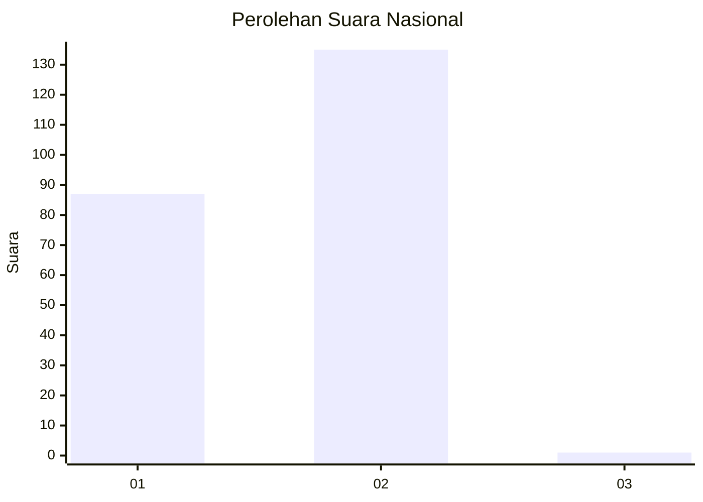
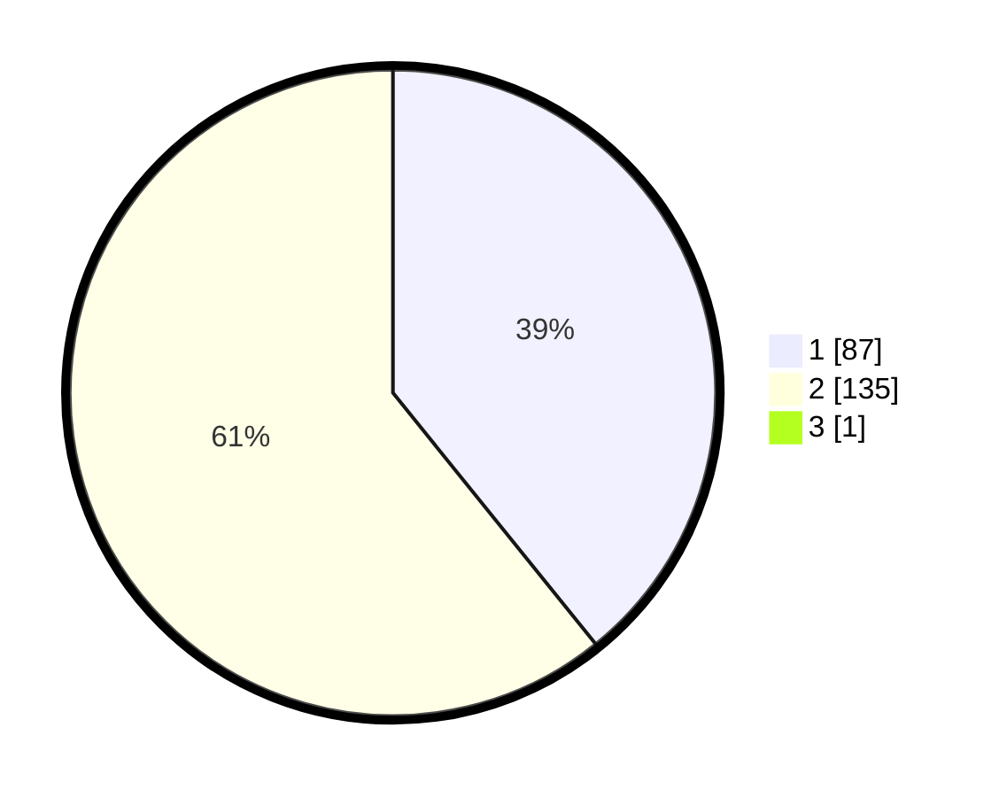

# Hasil

## Grafik

## Tabel

| No. | Nama Paslon    | Suara | Suara (raw) | Persentase |
|:--- |:-------------- | -----:| -----------:| ----------:|
| 1   | ANIES MUHAIMIN | 87    | [87][p-1]   | 39,01      |
| 2   | PRABOWO GIBRAN | 135   | [135][p-2]  | 60,54      |
| 3   | GANJAR MAHFUD  | 1     | [1][p-3]    | 0,45       |

[p-1]: https://github.com/gigit-pemilu/pemilu-2024/blob/main/pilpres/hitung-suara/sub/11-aceh/sub/02-aceh-tenggara/sub/12-ketambe/sub/2023-lawe-beringin/sub/001-tps/sub/paslon-1.txt
[p-2]: https://github.com/gigit-pemilu/pemilu-2024/blob/main/pilpres/hitung-suara/sub/11-aceh/sub/02-aceh-tenggara/sub/12-ketambe/sub/2023-lawe-beringin/sub/001-tps/sub/paslon-2.txt
[p-3]: https://github.com/gigit-pemilu/pemilu-2024/blob/main/pilpres/hitung-suara/sub/11-aceh/sub/02-aceh-tenggara/sub/12-ketambe/sub/2023-lawe-beringin/sub/001-tps/sub/paslon-3.txt

## Foto C Plano

https://sirekap-obj-formc.kpu.go.id/5a92/pemilu/ppwp/11/02/12/20/23/1102122023001-20240216-033814--dc8fe578-c9c8-49cb-803c-4c917672e728.jpg

https://sirekap-obj-formc.kpu.go.id/5a92/pemilu/ppwp/11/02/12/20/23/1102122023001-20240216-033808--557ca123-8cd3-4f16-812c-e823cac951f4.jpg

https://sirekap-obj-formc.kpu.go.id/5a92/pemilu/ppwp/11/02/12/20/23/1102122023001-20240216-033831--2b25ed28-2da8-4a6b-a24c-d72e0ad42acb.jpg

## Metadata

| Key        | Value               |
| ---------- | ------------------- |
| Time Stamp | 2024-02-24 22:31:28 |

