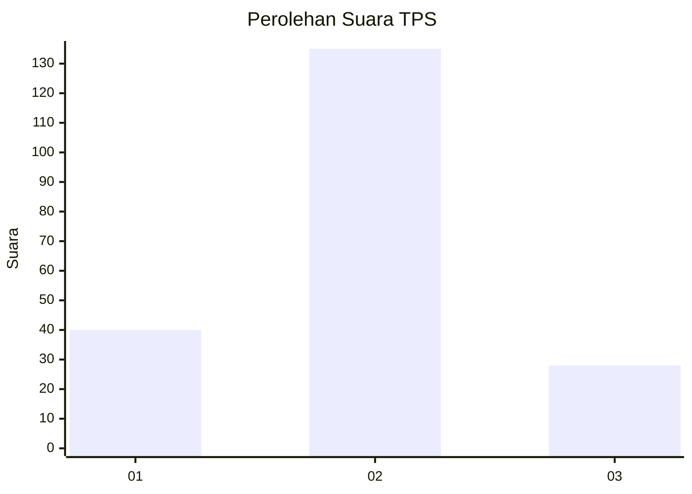
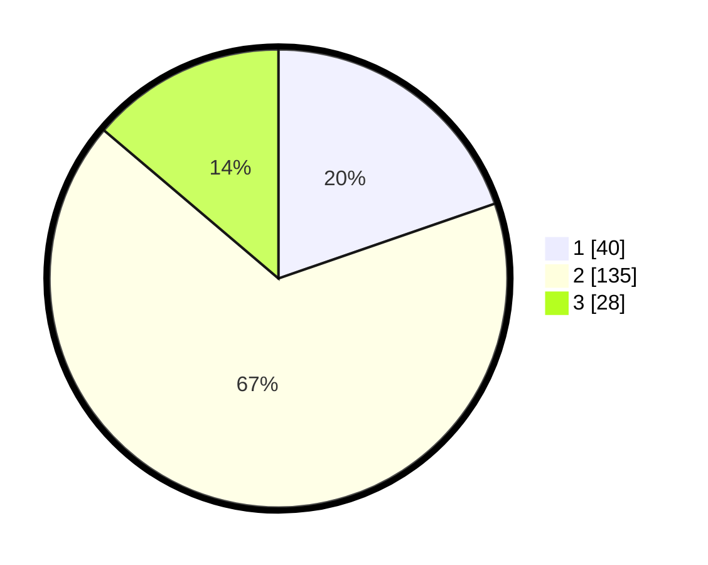

# Hasil

## Grafik

## Tabel

| No. | Nama Paslon    | Suara | Suara (raw) | Persentase |
|:--- |:-------------- | -----:| -----------:| ----------:|
| 1   | ANIES MUHAIMIN | 40    | [40][p-1]   | 19,70      |
| 2   | PRABOWO GIBRAN | 135   | [135][p-2]  | 66,50      |
| 3   | GANJAR MAHFUD  | 28    | [28][p-3]   | 13,79      |

[p-1]: https://github.com/gigit-pemilu/pemilu-2024-11-aceh/blob/main/pilpres/hitung-suara/sub/11-aceh/sub/02-aceh-tenggara/sub/13-deleng-pokhkisen/sub/2001-salang-baru/sub/001-tps/sub/paslon-1.txt
[p-2]: https://github.com/gigit-pemilu/pemilu-2024-11-aceh/blob/main/pilpres/hitung-suara/sub/11-aceh/sub/02-aceh-tenggara/sub/13-deleng-pokhkisen/sub/2001-salang-baru/sub/001-tps/sub/paslon-2.txt
[p-3]: https://github.com/gigit-pemilu/pemilu-2024-11-aceh/blob/main/pilpres/hitung-suara/sub/11-aceh/sub/02-aceh-tenggara/sub/13-deleng-pokhkisen/sub/2001-salang-baru/sub/001-tps/sub/paslon-3.txt

## Foto C Plano

https://sirekap-obj-formc.kpu.go.id/5009/pemilu/ppwp/11/02/13/20/01/1102132001001-20240216-135506--2053e438-4109-44f6-b9a5-ea008eb37cd2.jpg

https://sirekap-obj-formc.kpu.go.id/5009/pemilu/ppwp/11/02/13/20/01/1102132001001-20240216-135507--b21e32d5-663f-491b-9427-499e08fc3cac.jpg

https://sirekap-obj-formc.kpu.go.id/5009/pemilu/ppwp/11/02/13/20/01/1102132001001-20240216-135506--0cf664d9-a1a0-4bed-8cea-09e997cc184b.jpg

## Metadata

| Key        | Value               |
| ---------- | ------------------- |
| Time Stamp | 2024-02-21 11:00:00 |

## DATA PEMILIH TETAP

Jumlah pemilih dalam DPT: **267**.
 * L: **121**.
 * P: **146**.

## DATA PENGGUNA HAK PILIH

Jumlah pengguna hak pilih dalam DPT: **202**.
 * L: **88**.
 * P: **114**.

Jumlah pengguna hak pilih dalam DPTb: **1**.
 * L: **0**.
 * P: **1**.

Jumlah pengguna hak pilih dalam DPK: **0**.
 * L: **0**.
 * P: **0**.

Jumlah pengguna hak pilih: **203**.
 * L: **88**.
 * P: **115**.

## JUMLAH SUARA SAH DAN TIDAK SAH

JUMLAH SELURUH SUARA SAH: **203**.

JUMLAH SUARA TIDAK SAH: **0**.

JUMLAH SELURUH SUARA SAH DAN SUARA TIDAK SAH: **203**.

