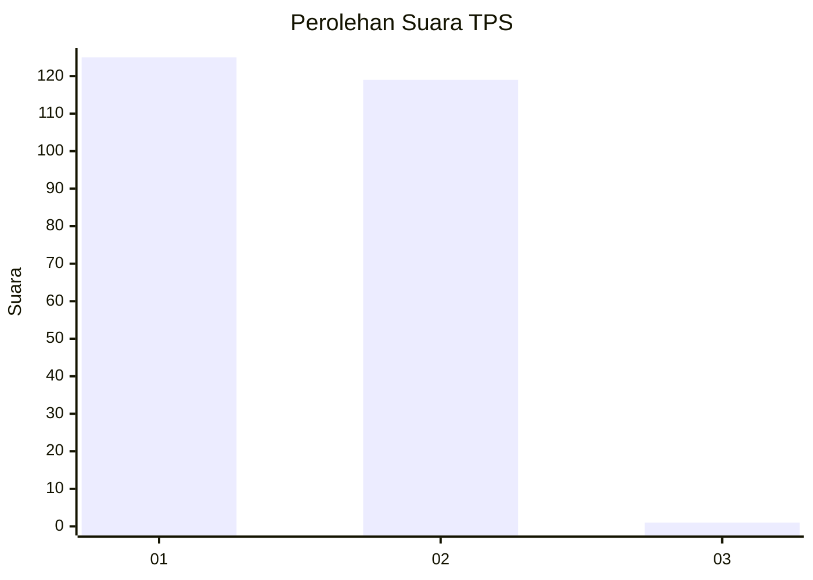
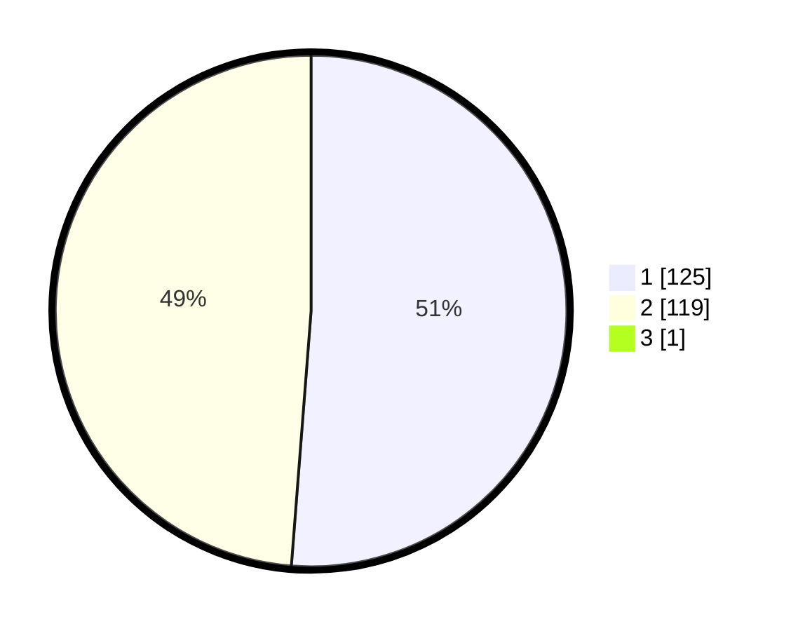

# Hasil

## Grafik

## Tabel

| No. | Nama Paslon    | Suara | Suara (raw) | Persentase |
|:--- |:-------------- | -----:| -----------:| ----------:|
| 1   | ANIES MUHAIMIN | 125   | [125][p-1]  | 51,02      |
| 2   | PRABOWO GIBRAN | 119   | [119][p-2]  | 48,57      |
| 3   | GANJAR MAHFUD  | 1     | [1][p-3]    | 0,41       |

[p-1]: https://github.com/gigit-pemilu/pemilu-2024-11-aceh/blob/main/pilpres/hitung-suara/sub/11-aceh/sub/02-aceh-tenggara/sub/13-deleng-pokhkisen/sub/2003-lembah-alas/sub/001-tps/sub/paslon-1.txt
[p-2]: https://github.com/gigit-pemilu/pemilu-2024-11-aceh/blob/main/pilpres/hitung-suara/sub/11-aceh/sub/02-aceh-tenggara/sub/13-deleng-pokhkisen/sub/2003-lembah-alas/sub/001-tps/sub/paslon-2.txt
[p-3]: https://github.com/gigit-pemilu/pemilu-2024-11-aceh/blob/main/pilpres/hitung-suara/sub/11-aceh/sub/02-aceh-tenggara/sub/13-deleng-pokhkisen/sub/2003-lembah-alas/sub/001-tps/sub/paslon-3.txt

## Foto C Plano

https://sirekap-obj-formc.kpu.go.id/7492/pemilu/ppwp/11/02/13/20/03/1102132003001-20240215-103647--1b40d4d1-5ad5-4958-9aea-13e7a08dde62.jpg

https://sirekap-obj-formc.kpu.go.id/7492/pemilu/ppwp/11/02/13/20/03/1102132003001-20240215-122238--e5ee7a80-02ed-4a32-b96e-a9d5aa716eb0.jpg

https://sirekap-obj-formc.kpu.go.id/7492/pemilu/ppwp/11/02/13/20/03/1102132003001-20240217-110405--24dd6238-56d6-4299-a5ea-44b244e64936.jpg

## Metadata

| Key        | Value               |
| ---------- | ------------------- |
| Time Stamp | 2024-02-17 11:30:03 |

