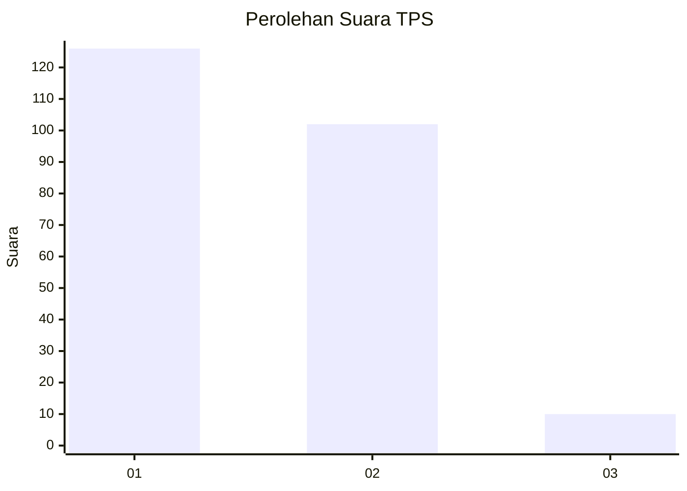
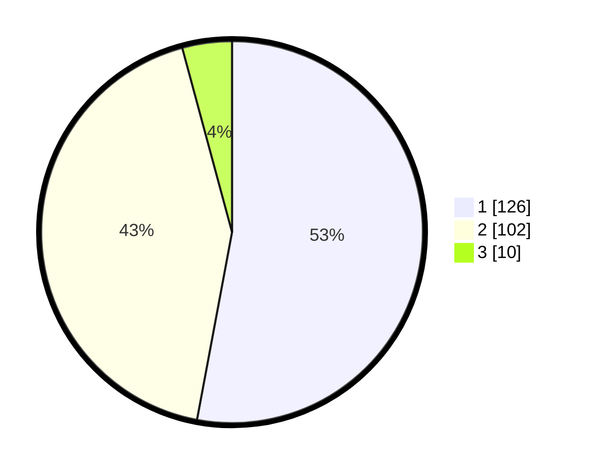

# Hasil

## Grafik

## Tabel

| No. | Nama Paslon    | Suara | Suara (raw) | Persentase |
|:--- |:-------------- | -----:| -----------:| ----------:|
| 1   | ANIES MUHAIMIN | 126   | [126][p-1]  | 52,94      |
| 2   | PRABOWO GIBRAN | 102   | [102][p-2]  | 42,86      |
| 3   | GANJAR MAHFUD  | 10    | [10][p-3]   | 4,20       |

[p-1]: https://github.com/gigit-pemilu/pemilu-2024-11-aceh/blob/main/pilpres/hitung-suara/sub/11-aceh/sub/02-aceh-tenggara/sub/13-deleng-pokhkisen/sub/2003-lembah-alas/sub/002-tps/sub/paslon-1.txt
[p-2]: https://github.com/gigit-pemilu/pemilu-2024-11-aceh/blob/main/pilpres/hitung-suara/sub/11-aceh/sub/02-aceh-tenggara/sub/13-deleng-pokhkisen/sub/2003-lembah-alas/sub/002-tps/sub/paslon-2.txt
[p-3]: https://github.com/gigit-pemilu/pemilu-2024-11-aceh/blob/main/pilpres/hitung-suara/sub/11-aceh/sub/02-aceh-tenggara/sub/13-deleng-pokhkisen/sub/2003-lembah-alas/sub/002-tps/sub/paslon-3.txt

## Foto C Plano

https://sirekap-obj-formc.kpu.go.id/ceb2/pemilu/ppwp/11/02/13/20/03/1102132003002-20240215-093426--00ce94c1-e60d-4e79-ba11-8dea652ec8f9.jpg

https://sirekap-obj-formc.kpu.go.id/ceb2/pemilu/ppwp/11/02/13/20/03/1102132003002-20240215-093624--6d44a7ae-fec8-4e0c-be3f-ce1f7f7df831.jpg

https://sirekap-obj-formc.kpu.go.id/ceb2/pemilu/ppwp/11/02/13/20/03/1102132003002-20240215-093749--4492813b-e038-4bb3-8c0d-032938c64bf4.jpg

## Metadata

| Key        | Value               |
| ---------- | ------------------- |
| Time Stamp | 2024-02-15 15:30:25 |

## DATA PEMILIH TETAP

Jumlah pemilih dalam DPT: **281**.
 * L: **134**.
 * P: **147**.

## DATA PENGGUNA HAK PILIH

Jumlah pengguna hak pilih dalam DPT: **243**.
 * L: **110**.
 * P: **133**.

Jumlah pengguna hak pilih dalam DPTb: **0**.
 * L: **0**.
 * P: **0**.

Jumlah pengguna hak pilih dalam DPK: **0**.
 * L: **0**.
 * P: **0**.

Jumlah pengguna hak pilih: **243**.
 * L: **110**.
 * P: **133**.

## JUMLAH SUARA SAH DAN TIDAK SAH

JUMLAH SELURUH SUARA SAH: **238**.

JUMLAH SUARA TIDAK SAH: **5**.

JUMLAH SELURUH SUARA SAH DAN SUARA TIDAK SAH: **243**.

