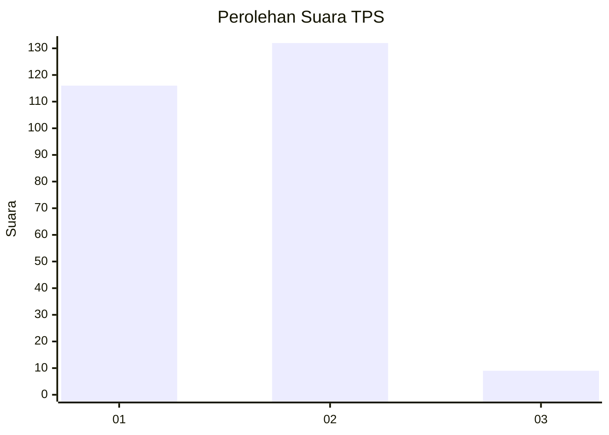
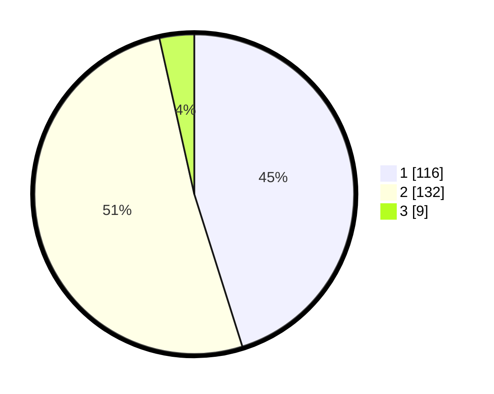

# Hasil

## Grafik

## Tabel

| No. | Nama Paslon    | Suara | Suara (raw) | Persentase |
|:--- |:-------------- | -----:| -----------:| ----------:|
| 1   | ANIES MUHAIMIN | 116   | [116][p-1]  | 45,14      |
| 2   | PRABOWO GIBRAN | 132   | [132][p-2]  | 51,36      |
| 3   | GANJAR MAHFUD  | 9     | [9][p-3]    | 3,50       |

[p-1]: https://github.com/gigit-pemilu/pemilu-2024-11-aceh/blob/main/pilpres/hitung-suara/sub/11-aceh/sub/02-aceh-tenggara/sub/13-deleng-pokhkisen/sub/2004-tenembak-lang-lang/sub/001-tps/sub/paslon-1.txt
[p-2]: https://github.com/gigit-pemilu/pemilu-2024-11-aceh/blob/main/pilpres/hitung-suara/sub/11-aceh/sub/02-aceh-tenggara/sub/13-deleng-pokhkisen/sub/2004-tenembak-lang-lang/sub/001-tps/sub/paslon-2.txt
[p-3]: https://github.com/gigit-pemilu/pemilu-2024-11-aceh/blob/main/pilpres/hitung-suara/sub/11-aceh/sub/02-aceh-tenggara/sub/13-deleng-pokhkisen/sub/2004-tenembak-lang-lang/sub/001-tps/sub/paslon-3.txt

## Foto C Plano

https://sirekap-obj-formc.kpu.go.id/2488/pemilu/ppwp/11/02/13/20/04/1102132004001-20240218-103841--fa4e8cec-5c62-4f6f-916a-5da3b230a749.jpg

https://sirekap-obj-formc.kpu.go.id/2488/pemilu/ppwp/11/02/13/20/04/1102132004001-20240218-103842--ad98984e-0e17-41d2-9ff6-7021cef7b938.jpg

https://sirekap-obj-formc.kpu.go.id/2488/pemilu/ppwp/11/02/13/20/04/1102132004001-20240218-103841--5ec7cc56-404f-4f50-9faf-4e7eb90096c1.jpg

## Metadata

| Key        | Value               |
| ---------- | ------------------- |
| Time Stamp | 2024-02-21 12:00:00 |

## DATA PEMILIH TETAP

Jumlah pemilih dalam DPT: **275**.
 * L: **139**.
 * P: **136**.

## DATA PENGGUNA HAK PILIH

Jumlah pengguna hak pilih dalam DPT: **257**.
 * L: **130**.
 * P: **127**.

Jumlah pengguna hak pilih dalam DPTb: **1**.
 * L: **0**.
 * P: **1**.

Jumlah pengguna hak pilih dalam DPK: **1**.
 * L: **0**.
 * P: **1**.

Jumlah pengguna hak pilih: **259**.
 * L: **130**.
 * P: **129**.

## JUMLAH SUARA SAH DAN TIDAK SAH

JUMLAH SELURUH SUARA SAH: **257**.

JUMLAH SUARA TIDAK SAH: **2**.

JUMLAH SELURUH SUARA SAH DAN SUARA TIDAK SAH: **259**.

