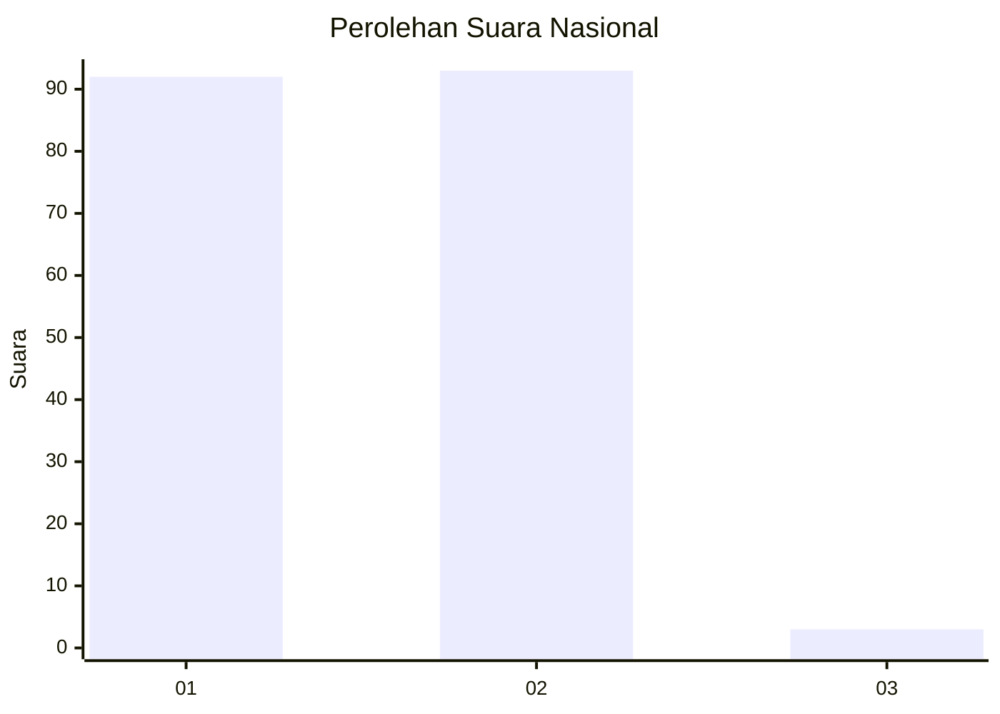
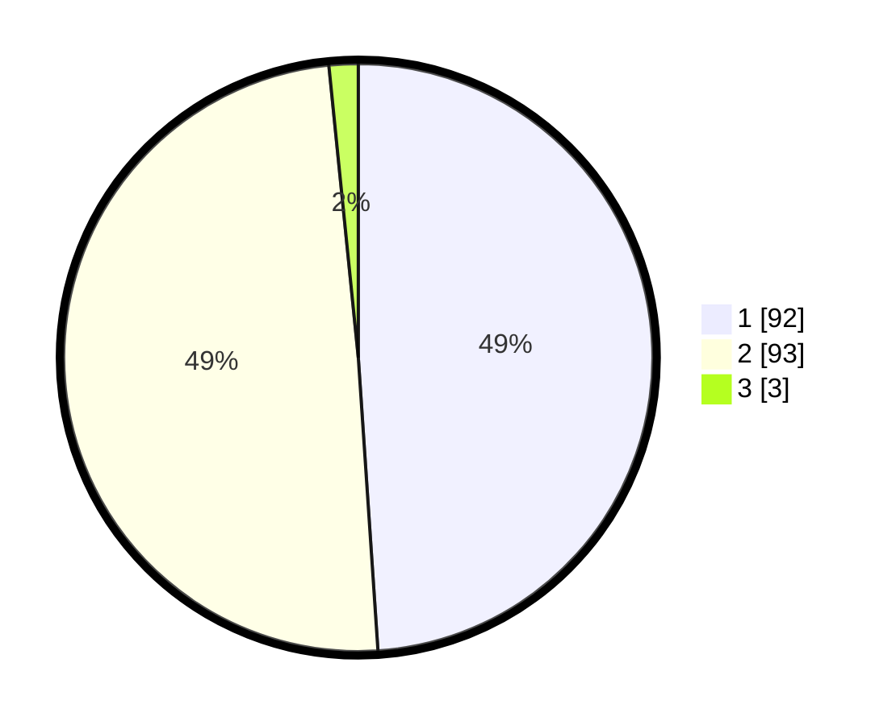

# Hasil

## Grafik

## Tabel

| No. | Nama Paslon    | Suara | Suara (raw) | Persentase |
|:--- |:-------------- | -----:| -----------:| ----------:|
| 1   | ANIES MUHAIMIN | 92    | [92][p-1]   | 48,94      |
| 2   | PRABOWO GIBRAN | 93    | [93][p-2]   | 49,47      |
| 3   | GANJAR MAHFUD  | 3     | [3][p-3]    | 1,60       |

[p-1]: https://github.com/gigit-pemilu/pemilu-2024/blob/main/pilpres/hitung-suara/sub/11-aceh/sub/02-aceh-tenggara/sub/13-deleng-pokhkisen/sub/2006-tualang-lama/sub/001-tps/sub/paslon-1.txt
[p-2]: https://github.com/gigit-pemilu/pemilu-2024/blob/main/pilpres/hitung-suara/sub/11-aceh/sub/02-aceh-tenggara/sub/13-deleng-pokhkisen/sub/2006-tualang-lama/sub/001-tps/sub/paslon-2.txt
[p-3]: https://github.com/gigit-pemilu/pemilu-2024/blob/main/pilpres/hitung-suara/sub/11-aceh/sub/02-aceh-tenggara/sub/13-deleng-pokhkisen/sub/2006-tualang-lama/sub/001-tps/sub/paslon-3.txt

## Foto C Plano

https://sirekap-obj-formc.kpu.go.id/880a/pemilu/ppwp/11/02/13/20/06/1102132006001-20240215-071723--b3155d29-6356-4b60-9284-518ab3c14c0b.jpg

https://sirekap-obj-formc.kpu.go.id/880a/pemilu/ppwp/11/02/13/20/06/1102132006001-20240215-071732--9c13b252-81b1-4bde-ace9-6d3010356ee6.jpg

https://sirekap-obj-formc.kpu.go.id/880a/pemilu/ppwp/11/02/13/20/06/1102132006001-20240215-071743--4f8efaef-097f-4ecc-98f2-f97924775185.jpg

## Metadata

| Key        | Value               |
| ---------- | ------------------- |
| Time Stamp | 2024-02-24 22:31:28 |

