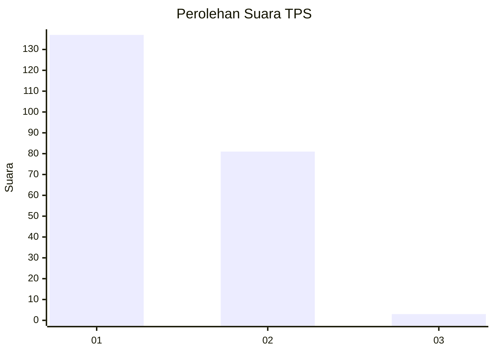
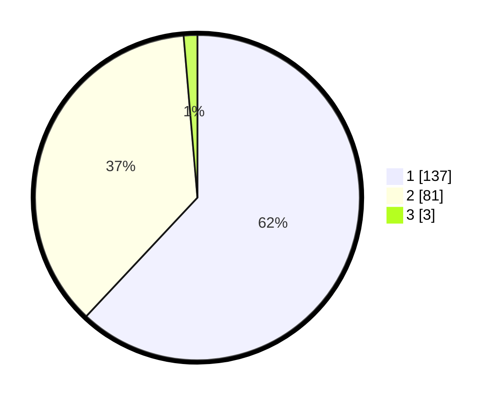

# Hasil

## Grafik

## Tabel

| No. | Nama Paslon    | Suara | Suara (raw) | Persentase |
|:--- |:-------------- | -----:| -----------:| ----------:|
| 1   | ANIES MUHAIMIN | 137   | [137][p-1]  | 61,99      |
| 2   | PRABOWO GIBRAN | 81    | [81][p-2]   | 36,65      |
| 3   | GANJAR MAHFUD  | 3     | [3][p-3]    | 1,36       |

[p-1]: https://github.com/gigit-pemilu/pemilu-2024-11-aceh/blob/main/pilpres/hitung-suara/sub/11-aceh/sub/02-aceh-tenggara/sub/13-deleng-pokhkisen/sub/2012-penampaan/sub/002-tps/sub/paslon-1.txt
[p-2]: https://github.com/gigit-pemilu/pemilu-2024-11-aceh/blob/main/pilpres/hitung-suara/sub/11-aceh/sub/02-aceh-tenggara/sub/13-deleng-pokhkisen/sub/2012-penampaan/sub/002-tps/sub/paslon-2.txt
[p-3]: https://github.com/gigit-pemilu/pemilu-2024-11-aceh/blob/main/pilpres/hitung-suara/sub/11-aceh/sub/02-aceh-tenggara/sub/13-deleng-pokhkisen/sub/2012-penampaan/sub/002-tps/sub/paslon-3.txt

## Foto C Plano

https://sirekap-obj-formc.kpu.go.id/a7f0/pemilu/ppwp/11/02/13/20/12/1102132012002-20240215-031826--30fc38ba-f00e-474e-9f8f-5e4cbbc8f85a.jpg

https://sirekap-obj-formc.kpu.go.id/a7f0/pemilu/ppwp/11/02/13/20/12/1102132012002-20240215-031834--cfa2d364-9523-40f3-be6c-13de1dc419ce.jpg

https://sirekap-obj-formc.kpu.go.id/a7f0/pemilu/ppwp/11/02/13/20/12/1102132012002-20240215-031841--b9334d6c-4638-4752-86b5-5210c5b05477.jpg

## Metadata

| Key        | Value               |
| ---------- | ------------------- |
| Time Stamp | 2024-02-16 00:00:26 |

## DATA PEMILIH TETAP

Jumlah pemilih dalam DPT: **258**.
 * L: **127**.
 * P: **131**.

## DATA PENGGUNA HAK PILIH

Jumlah pengguna hak pilih dalam DPT: **110**.
 * L: **226**.
 * P: **116**.

Jumlah pengguna hak pilih dalam DPTb: **2**.
 * L: **3**.
 * P: **1**.

Jumlah pengguna hak pilih dalam DPK: **0**.
 * L: **0**.
 * P: **0**.

Jumlah pengguna hak pilih: **229**.
 * L: **117**.
 * P: **112**.

## JUMLAH SUARA SAH DAN TIDAK SAH

JUMLAH SELURUH SUARA SAH: **221**.

JUMLAH SUARA TIDAK SAH: **8**.

JUMLAH SELURUH SUARA SAH DAN SUARA TIDAK SAH: **229**.

