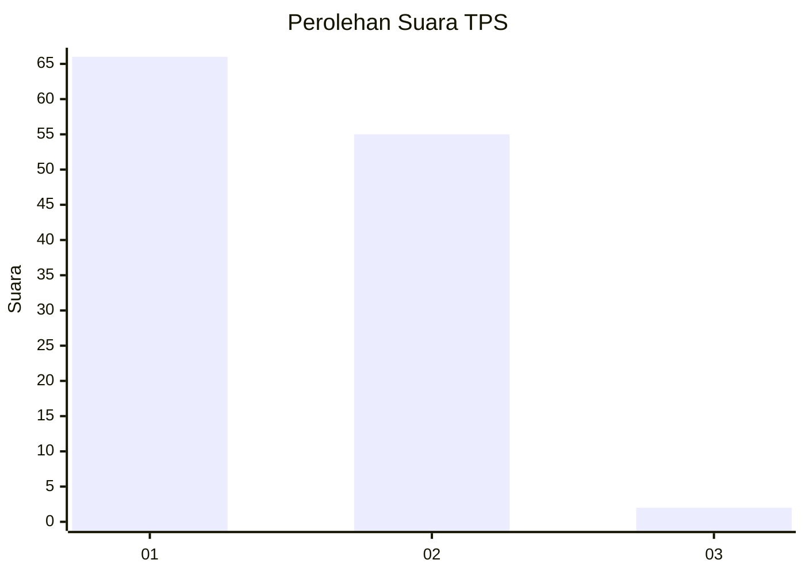
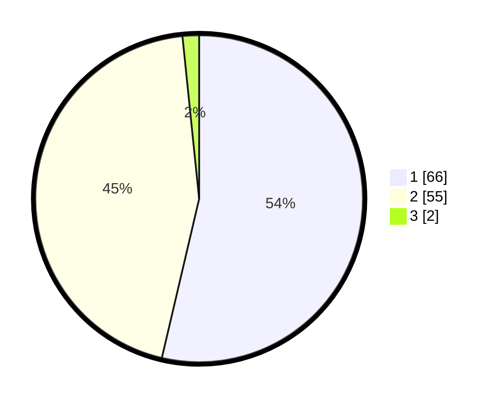

# Hasil

## Grafik

## Tabel

| No. | Nama Paslon    | Suara | Suara (raw) | Persentase |
|:--- |:-------------- | -----:| -----------:| ----------:|
| 1   | ANIES MUHAIMIN | 66    | [66][p-1]   | 53,66      |
| 2   | PRABOWO GIBRAN | 55    | [55][p-2]   | 44,72      |
| 3   | GANJAR MAHFUD  | 2     | [2][p-3]    | 1,63       |

[p-1]: https://github.com/gigit-pemilu/pemilu-2024-11-aceh/blob/main/pilpres/hitung-suara/sub/11-aceh/sub/02-aceh-tenggara/sub/13-deleng-pokhkisen/sub/2018-peseluk-pesimbe/sub/001-tps/sub/paslon-1.txt
[p-2]: https://github.com/gigit-pemilu/pemilu-2024-11-aceh/blob/main/pilpres/hitung-suara/sub/11-aceh/sub/02-aceh-tenggara/sub/13-deleng-pokhkisen/sub/2018-peseluk-pesimbe/sub/001-tps/sub/paslon-2.txt
[p-3]: https://github.com/gigit-pemilu/pemilu-2024-11-aceh/blob/main/pilpres/hitung-suara/sub/11-aceh/sub/02-aceh-tenggara/sub/13-deleng-pokhkisen/sub/2018-peseluk-pesimbe/sub/001-tps/sub/paslon-3.txt

## Foto C Plano

https://sirekap-obj-formc.kpu.go.id/fe9e/pemilu/ppwp/11/02/13/20/18/1102132018001-20240214-214247--3793b50b-1c0e-4dc1-bacb-7afba5bc1a37.jpg

https://sirekap-obj-formc.kpu.go.id/fe9e/pemilu/ppwp/11/02/13/20/18/1102132018001-20240215-104911--814f5a5c-64df-4c18-ad68-9c5daced6afd.jpg

https://sirekap-obj-formc.kpu.go.id/fe9e/pemilu/ppwp/11/02/13/20/18/1102132018001-20240214-214132--d9e9c44f-df27-4e47-ab8e-dc4b84cef877.jpg

## Metadata

| Key        | Value               |
| ---------- | ------------------- |
| Time Stamp | 2024-02-24 22:31:28 |

