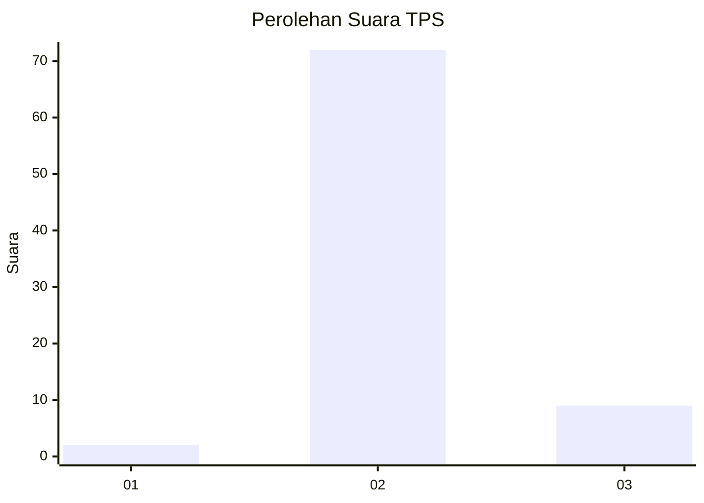
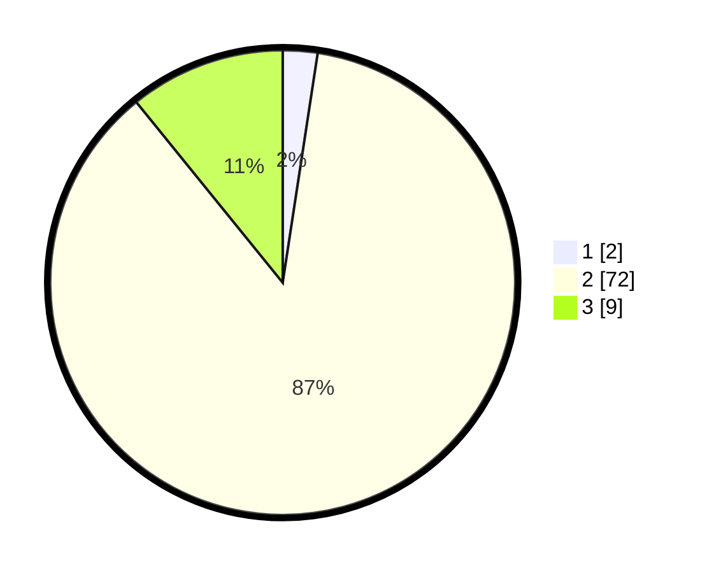

# Hasil

## Grafik

## Tabel

| No. | Nama Paslon    | Suara | Suara (raw) | Persentase |
|:--- |:-------------- | -----:| -----------:| ----------:|
| 1   | ANIES MUHAIMIN | 2     | [2][p-1]    | 2,41       |
| 2   | PRABOWO GIBRAN | 72    | [72][p-2]   | 86,75      |
| 3   | GANJAR MAHFUD  | 9     | [9][p-3]    | 10,84      |

[p-1]: https://github.com/gigit-pemilu/pemilu-2024-11-aceh/blob/main/pilpres/hitung-suara/sub/11-aceh/sub/02-aceh-tenggara/sub/13-deleng-pokhkisen/sub/2019-kane-lot/sub/001-tps/sub/paslon-1.txt
[p-2]: https://github.com/gigit-pemilu/pemilu-2024-11-aceh/blob/main/pilpres/hitung-suara/sub/11-aceh/sub/02-aceh-tenggara/sub/13-deleng-pokhkisen/sub/2019-kane-lot/sub/001-tps/sub/paslon-2.txt
[p-3]: https://github.com/gigit-pemilu/pemilu-2024-11-aceh/blob/main/pilpres/hitung-suara/sub/11-aceh/sub/02-aceh-tenggara/sub/13-deleng-pokhkisen/sub/2019-kane-lot/sub/001-tps/sub/paslon-3.txt

## Foto C Plano

https://sirekap-obj-formc.kpu.go.id/eeec/pemilu/ppwp/11/02/13/20/19/1102132019001-20240214-225855--9bed1de8-2ce0-4384-b370-a8a782c14682.jpg

https://sirekap-obj-formc.kpu.go.id/eeec/pemilu/ppwp/11/02/13/20/19/1102132019001-20240214-194002--42a13dfd-c921-47a0-84a5-557979556040.jpg

https://sirekap-obj-formc.kpu.go.id/eeec/pemilu/ppwp/11/02/13/20/19/1102132019001-20240214-194047--978f47d2-f9a1-4631-a3d6-0e3af5623f4e.jpg

## Metadata

| Key        | Value               |
| ---------- | ------------------- |
| Time Stamp | 2024-02-15 12:00:28 |

