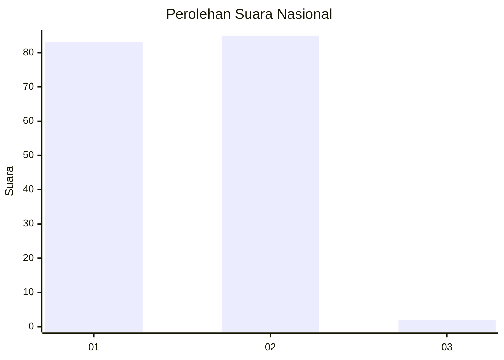
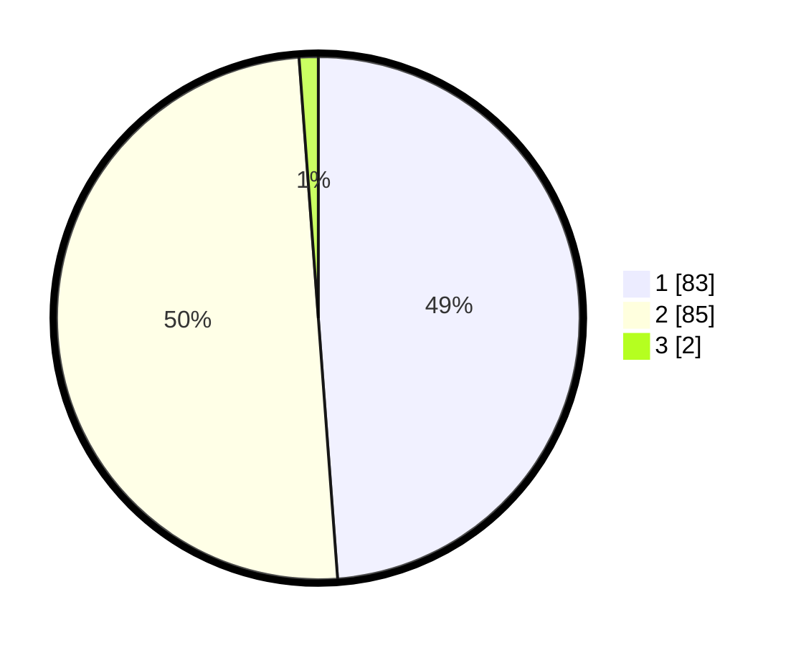

# Hasil

## Grafik

## Tabel

| No. | Nama Paslon    | Suara | Suara (raw) | Persentase |
|:--- |:-------------- | -----:| -----------:| ----------:|
| 1   | ANIES MUHAIMIN | 83    | [83][p-1]   | 48,82      |
| 2   | PRABOWO GIBRAN | 85    | [85][p-2]   | 50,00      |
| 3   | GANJAR MAHFUD  | 2     | [2][p-3]    | 1,18       |

[p-1]: https://github.com/gigit-pemilu/pemilu-2024/blob/main/pilpres/hitung-suara/sub/11-aceh/sub/02-aceh-tenggara/sub/14-lawe-sumur/sub/2001-terutung-megara-lawe-pasaran/sub/001-tps/sub/paslon-1.txt
[p-2]: https://github.com/gigit-pemilu/pemilu-2024/blob/main/pilpres/hitung-suara/sub/11-aceh/sub/02-aceh-tenggara/sub/14-lawe-sumur/sub/2001-terutung-megara-lawe-pasaran/sub/001-tps/sub/paslon-2.txt
[p-3]: https://github.com/gigit-pemilu/pemilu-2024/blob/main/pilpres/hitung-suara/sub/11-aceh/sub/02-aceh-tenggara/sub/14-lawe-sumur/sub/2001-terutung-megara-lawe-pasaran/sub/001-tps/sub/paslon-3.txt

## Foto C Plano

https://sirekap-obj-formc.kpu.go.id/8737/pemilu/ppwp/11/02/14/20/01/1102142001001-20240219-124332--bacb5201-133c-452e-ac74-a406f37fb2f0.jpg

https://sirekap-obj-formc.kpu.go.id/8737/pemilu/ppwp/11/02/14/20/01/1102142001001-20240219-124333--d3a8845a-1360-4c2f-94f7-ec3bb52cdd5c.jpg

https://sirekap-obj-formc.kpu.go.id/8737/pemilu/ppwp/11/02/14/20/01/1102142001001-20240219-124333--380a1afd-9d68-412d-8977-15beb27b2124.jpg

## Metadata

| Key        | Value               |
| ---------- | ------------------- |
| Time Stamp | 2024-02-24 22:31:28 |

## DATA PEMILIH TETAP

Jumlah pemilih dalam DPT: **172**.
 * L: **90**.
 * P: **82**.

## DATA PENGGUNA HAK PILIH

Jumlah pengguna hak pilih dalam DPT: **172**.
 * L: **90**.
 * P: **82**.

Jumlah pengguna hak pilih dalam DPTb: **0**.
 * L: **0**.
 * P: **0**.

Jumlah pengguna hak pilih dalam DPK: **4**.
 * L: **2**.
 * P: **2**.

Jumlah pengguna hak pilih: **176**.
 * L: **92**.
 * P: **84**.

## JUMLAH SUARA SAH DAN TIDAK SAH

JUMLAH SELURUH SUARA SAH: **173**.

JUMLAH SUARA TIDAK SAH: **3**.

JUMLAH SELURUH SUARA SAH DAN SUARA TIDAK SAH: **176**.

