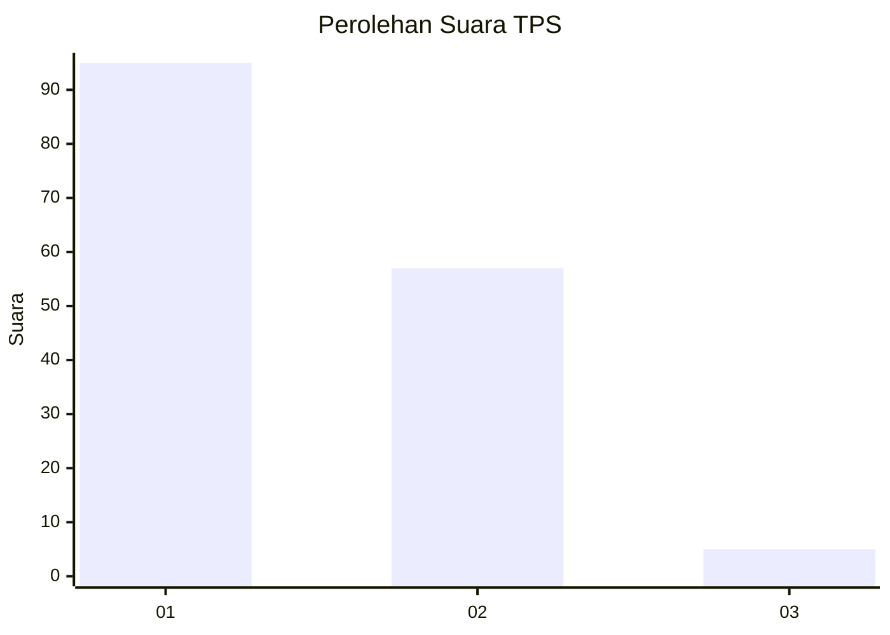
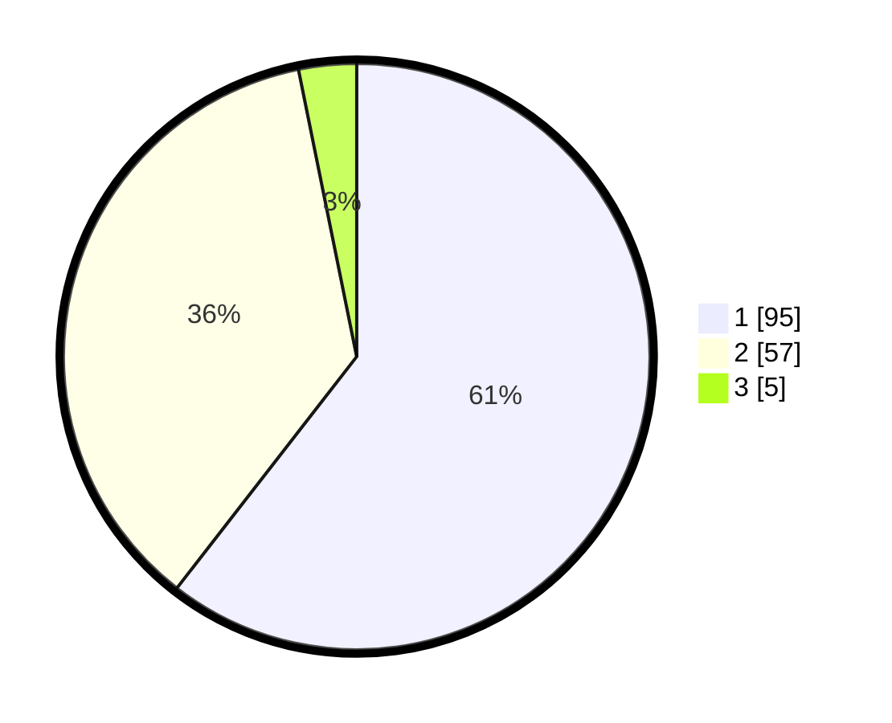

# Hasil

## Grafik

## Tabel

| No. | Nama Paslon    | Suara | Suara (raw) | Persentase |
|:--- |:-------------- | -----:| -----------:| ----------:|
| 1   | ANIES MUHAIMIN | 95    | [95][p-1]   | 60,51      |
| 2   | PRABOWO GIBRAN | 57    | [57][p-2]   | 36,31      |
| 3   | GANJAR MAHFUD  | 5     | [5][p-3]    | 3,18       |

[p-1]: https://github.com/gigit-pemilu/pemilu-2024-11-aceh/blob/main/pilpres/hitung-suara/sub/11-aceh/sub/02-aceh-tenggara/sub/14-lawe-sumur/sub/2001-terutung-megara-lawe-pasaran/sub/002-tps/sub/paslon-1.txt
[p-2]: https://github.com/gigit-pemilu/pemilu-2024-11-aceh/blob/main/pilpres/hitung-suara/sub/11-aceh/sub/02-aceh-tenggara/sub/14-lawe-sumur/sub/2001-terutung-megara-lawe-pasaran/sub/002-tps/sub/paslon-2.txt
[p-3]: https://github.com/gigit-pemilu/pemilu-2024-11-aceh/blob/main/pilpres/hitung-suara/sub/11-aceh/sub/02-aceh-tenggara/sub/14-lawe-sumur/sub/2001-terutung-megara-lawe-pasaran/sub/002-tps/sub/paslon-3.txt

## Foto C Plano

https://sirekap-obj-formc.kpu.go.id/4543/pemilu/ppwp/11/02/14/20/01/1102142001002-20240219-140840--d277c7f8-0e12-4d10-b23b-4d63a3f5c437.jpg

https://sirekap-obj-formc.kpu.go.id/4543/pemilu/ppwp/11/02/14/20/01/1102142001002-20240219-140842--810e7e8c-75ec-4471-a812-f433cefd35e1.jpg

https://sirekap-obj-formc.kpu.go.id/4543/pemilu/ppwp/11/02/14/20/01/1102142001002-20240219-140841--45bff4e7-81b1-4669-a5ba-5d2224b5c7d3.jpg

## Metadata

| Key        | Value               |
| ---------- | ------------------- |
| Time Stamp | 2024-02-21 10:00:00 |

## DATA PEMILIH TETAP

Jumlah pemilih dalam DPT: **158**.
 * L: **81**.
 * P: **77**.

## DATA PENGGUNA HAK PILIH

Jumlah pengguna hak pilih dalam DPT: **156**.
 * L: **79**.
 * P: **77**.

Jumlah pengguna hak pilih dalam DPTb: **0**.
 * L: **0**.
 * P: **0**.

Jumlah pengguna hak pilih dalam DPK: **6**.
 * L: **2**.
 * P: **4**.

Jumlah pengguna hak pilih: **162**.
 * L: **81**.
 * P: **81**.

## JUMLAH SUARA SAH DAN TIDAK SAH

JUMLAH SELURUH SUARA SAH: **157**.

JUMLAH SUARA TIDAK SAH: **5**.

JUMLAH SELURUH SUARA SAH DAN SUARA TIDAK SAH: **162**.

