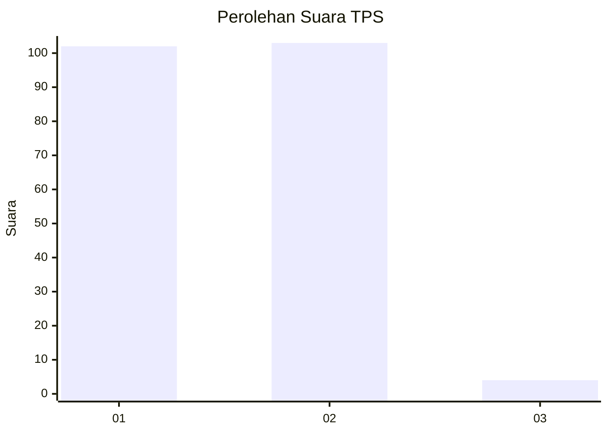
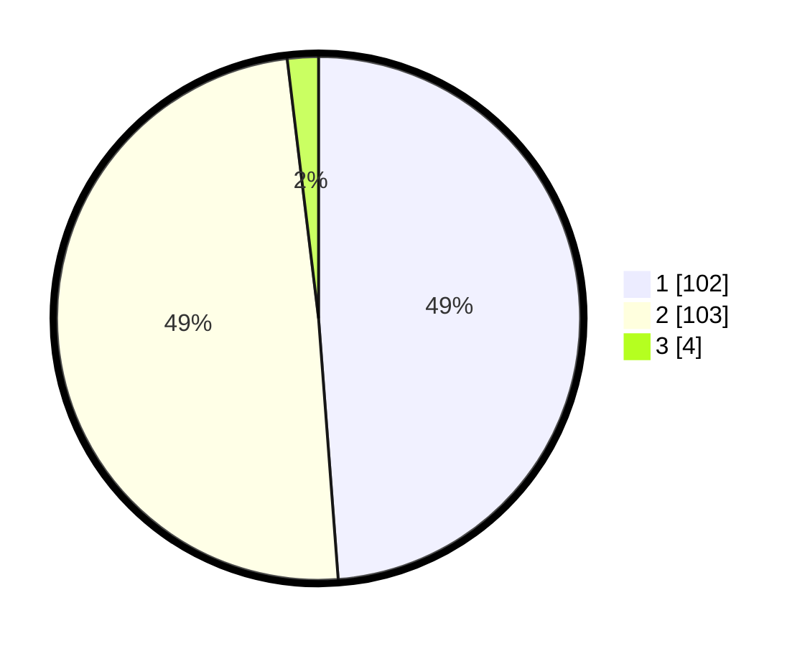

# Hasil

## Grafik

## Tabel

| No. | Nama Paslon    | Suara | Suara (raw) | Persentase |
|:--- |:-------------- | -----:| -----------:| ----------:|
| 1   | ANIES MUHAIMIN | 102   | [102][p-1]  | 48,80      |
| 2   | PRABOWO GIBRAN | 103   | [103][p-2]  | 49,28      |
| 3   | GANJAR MAHFUD  | 4     | [4][p-3]    | 1,91       |

[p-1]: https://github.com/gigit-pemilu/pemilu-2024-11-aceh/blob/main/pilpres/hitung-suara/sub/11-aceh/sub/02-aceh-tenggara/sub/14-lawe-sumur/sub/2002-kisam-gabungan/sub/001-tps/sub/paslon-1.txt
[p-2]: https://github.com/gigit-pemilu/pemilu-2024-11-aceh/blob/main/pilpres/hitung-suara/sub/11-aceh/sub/02-aceh-tenggara/sub/14-lawe-sumur/sub/2002-kisam-gabungan/sub/001-tps/sub/paslon-2.txt
[p-3]: https://github.com/gigit-pemilu/pemilu-2024-11-aceh/blob/main/pilpres/hitung-suara/sub/11-aceh/sub/02-aceh-tenggara/sub/14-lawe-sumur/sub/2002-kisam-gabungan/sub/001-tps/sub/paslon-3.txt

## Foto C Plano

https://sirekap-obj-formc.kpu.go.id/00cf/pemilu/ppwp/11/02/14/20/02/1102142002001-20240218-175241--b8d54e89-a184-425b-ba77-79c77acca226.jpg

https://sirekap-obj-formc.kpu.go.id/00cf/pemilu/ppwp/11/02/14/20/02/1102142002001-20240218-175842--4b741538-0c21-44b5-ad58-cf8c6158a465.jpg

https://sirekap-obj-formc.kpu.go.id/00cf/pemilu/ppwp/11/02/14/20/02/1102142002001-20240218-180223--0f3da7bd-b4bf-44bc-b39a-98f3b6e78045.jpg

## Metadata

| Key        | Value               |
| ---------- | ------------------- |
| Time Stamp | 2024-02-21 21:00:04 |

## DATA PEMILIH TETAP

Jumlah pemilih dalam DPT: **245**.
 * L: **118**.
 * P: **127**.

## DATA PENGGUNA HAK PILIH

Jumlah pengguna hak pilih dalam DPT: **217**.
 * L: **105**.
 * P: **112**.

Jumlah pengguna hak pilih dalam DPTb: **0**.
 * L: **0**.
 * P: **0**.

Jumlah pengguna hak pilih dalam DPK: **3**.
 * L: **1**.
 * P: **2**.

Jumlah pengguna hak pilih: **220**.
 * L: **106**.
 * P: **114**.

## JUMLAH SUARA SAH DAN TIDAK SAH

JUMLAH SELURUH SUARA SAH: **209**.

JUMLAH SUARA TIDAK SAH: **11**.

JUMLAH SELURUH SUARA SAH DAN SUARA TIDAK SAH: **220**.

