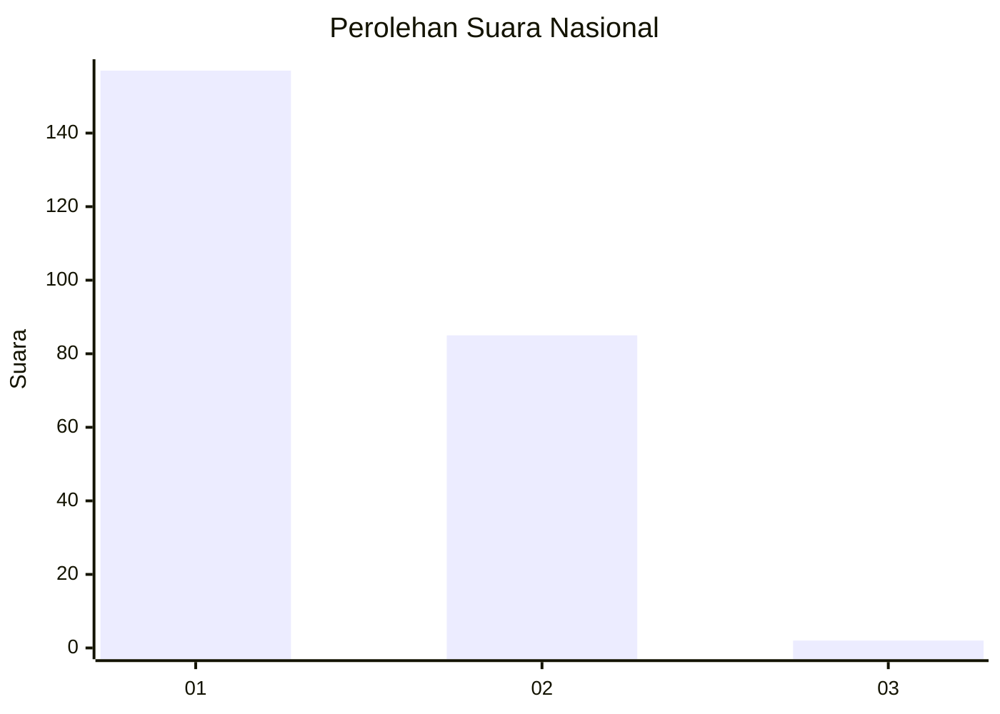
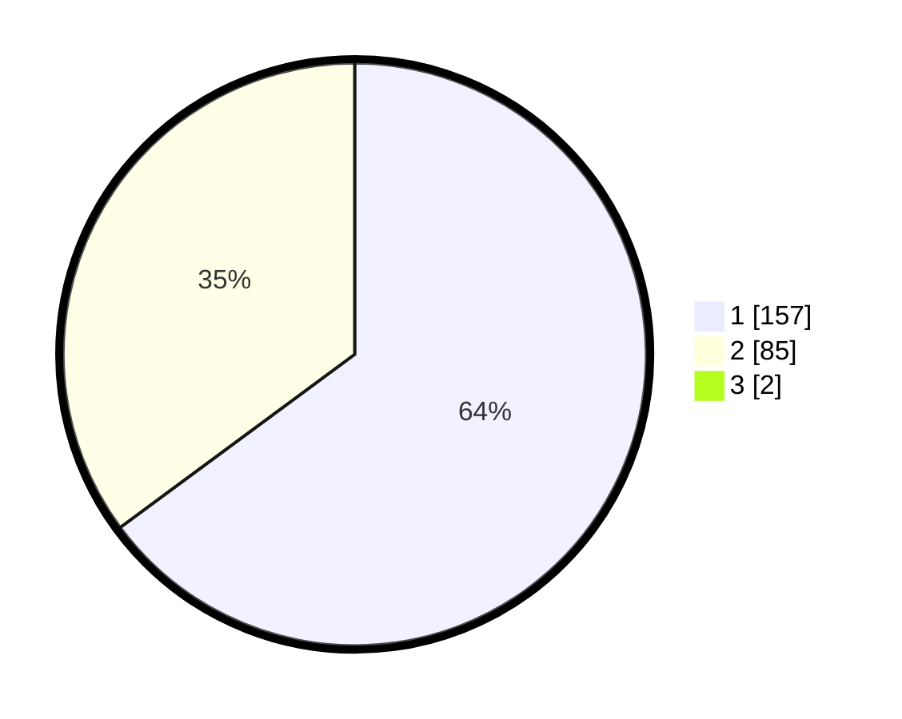

# Hasil

## Grafik

## Tabel

| No. | Nama Paslon    | Suara | Suara (raw) | Persentase |
|:--- |:-------------- | -----:| -----------:| ----------:|
| 1   | ANIES MUHAIMIN | 157   | [157][p-1]  | 64,34      |
| 2   | PRABOWO GIBRAN | 85    | [85][p-2]   | 34,84      |
| 3   | GANJAR MAHFUD  | 2     | [2][p-3]    | 0,82       |

[p-1]: https://github.com/gigit-pemilu/pemilu-2024/blob/main/pilpres/hitung-suara/sub/11-aceh/sub/02-aceh-tenggara/sub/14-lawe-sumur/sub/2009-buah-pala/sub/001-tps/sub/paslon-1.txt
[p-2]: https://github.com/gigit-pemilu/pemilu-2024/blob/main/pilpres/hitung-suara/sub/11-aceh/sub/02-aceh-tenggara/sub/14-lawe-sumur/sub/2009-buah-pala/sub/001-tps/sub/paslon-2.txt
[p-3]: https://github.com/gigit-pemilu/pemilu-2024/blob/main/pilpres/hitung-suara/sub/11-aceh/sub/02-aceh-tenggara/sub/14-lawe-sumur/sub/2009-buah-pala/sub/001-tps/sub/paslon-3.txt

## Foto C Plano

https://sirekap-obj-formc.kpu.go.id/2eeb/pemilu/ppwp/11/02/14/20/09/1102142009001-20240215-142047--bb6975c6-5293-4b03-b82d-a6919fb51e87.jpg

https://sirekap-obj-formc.kpu.go.id/2eeb/pemilu/ppwp/11/02/14/20/09/1102142009001-20240215-142210--5f585b5b-8ad3-4279-a644-b3a142a7ab06.jpg

https://sirekap-obj-formc.kpu.go.id/2eeb/pemilu/ppwp/11/02/14/20/09/1102142009001-20240215-142402--b37416ee-7ca5-45ac-a512-ebc974c991c2.jpg

## Metadata

| Key        | Value               |
| ---------- | ------------------- |
| Time Stamp | 2024-02-24 22:31:28 |

