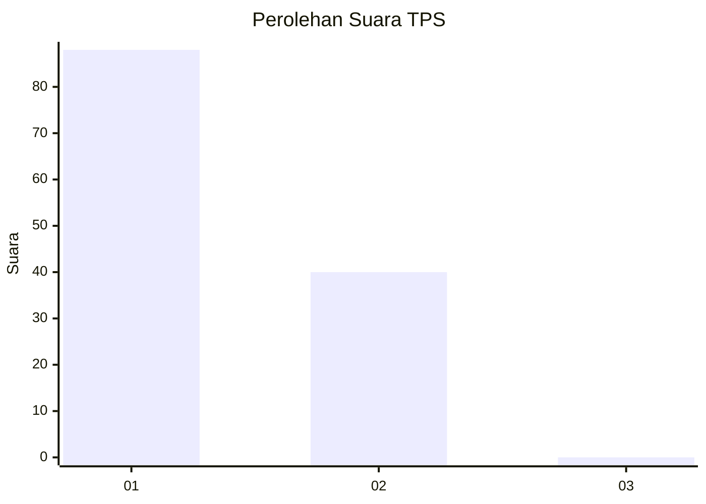
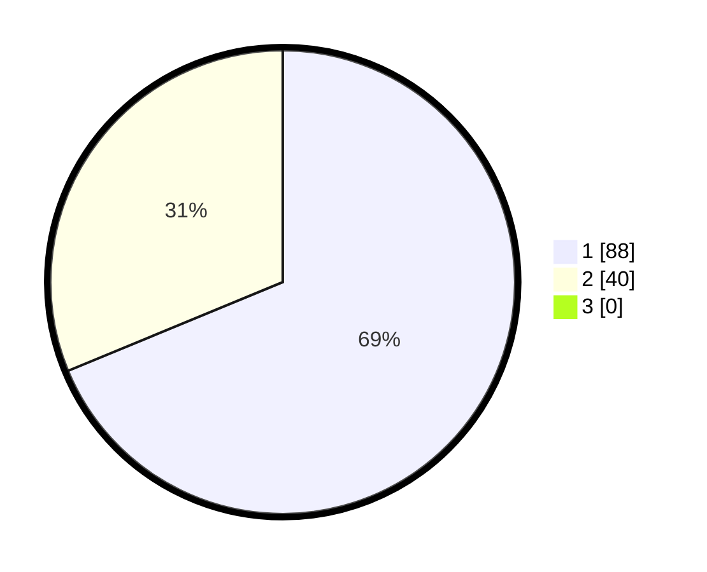

# Hasil

## Grafik

## Tabel

| No. | Nama Paslon    | Suara | Suara (raw) | Persentase |
|:--- |:-------------- | -----:| -----------:| ----------:|
| 1   | ANIES MUHAIMIN | 88    | [88][p-1]   | 68,75      |
| 2   | PRABOWO GIBRAN | 40    | [40][p-2]   | 31,25      |
| 3   | GANJAR MAHFUD  | 0     | [0][p-3]    | 0,00       |

[p-1]: https://github.com/gigit-pemilu/pemilu-2024-11-aceh/blob/main/pilpres/hitung-suara/sub/11-aceh/sub/02-aceh-tenggara/sub/14-lawe-sumur/sub/2012-terutung-megahke-mbakhu/sub/002-tps/sub/paslon-1.txt
[p-2]: https://github.com/gigit-pemilu/pemilu-2024-11-aceh/blob/main/pilpres/hitung-suara/sub/11-aceh/sub/02-aceh-tenggara/sub/14-lawe-sumur/sub/2012-terutung-megahke-mbakhu/sub/002-tps/sub/paslon-2.txt
[p-3]: https://github.com/gigit-pemilu/pemilu-2024-11-aceh/blob/main/pilpres/hitung-suara/sub/11-aceh/sub/02-aceh-tenggara/sub/14-lawe-sumur/sub/2012-terutung-megahke-mbakhu/sub/002-tps/sub/paslon-3.txt

## Foto C Plano

https://sirekap-obj-formc.kpu.go.id/422b/pemilu/ppwp/11/02/14/20/12/1102142012002-20240215-103401--64fb55d3-6e6d-4741-8010-d84b50fe13d0.jpg

https://sirekap-obj-formc.kpu.go.id/422b/pemilu/ppwp/11/02/14/20/12/1102142012002-20240214-194339--881a21ca-6e19-47c9-807e-d195df8a244b.jpg

https://sirekap-obj-formc.kpu.go.id/422b/pemilu/ppwp/11/02/14/20/12/1102142012002-20240215-103840--767240c2-f1ea-4a34-b124-72c10d000d68.jpg

## Metadata

| Key        | Value               |
| ---------- | ------------------- |
| Time Stamp | 2024-02-15 15:30:25 |

