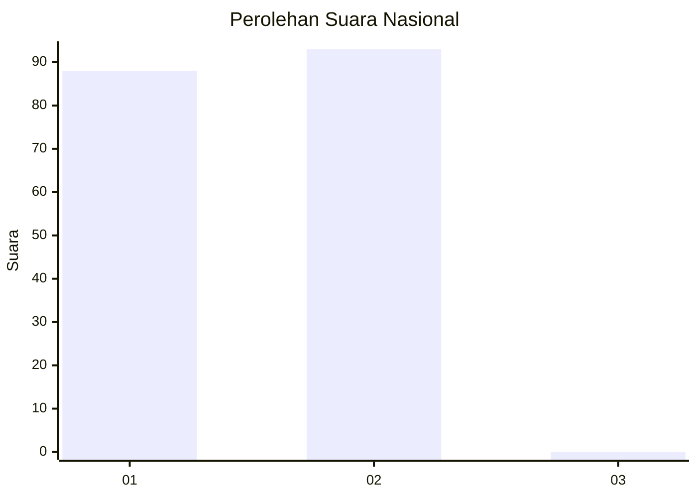
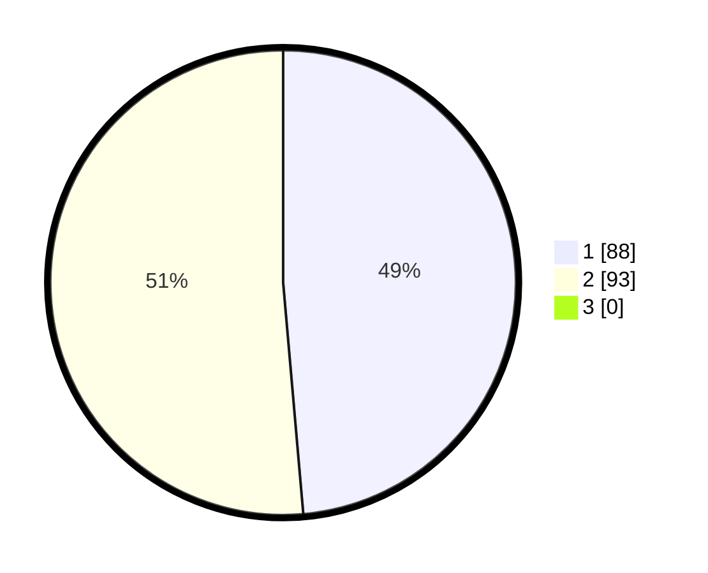

# Hasil

## Grafik

## Tabel

| No. | Nama Paslon    | Suara | Suara (raw) | Persentase |
|:--- |:-------------- | -----:| -----------:| ----------:|
| 1   | ANIES MUHAIMIN | 88    | [88][p-1]   | 48,62      |
| 2   | PRABOWO GIBRAN | 93    | [93][p-2]   | 51,38      |
| 3   | GANJAR MAHFUD  | 0     | [0][p-3]    | 0,00       |

[p-1]: https://github.com/gigit-pemilu/pemilu-2024/blob/main/pilpres/hitung-suara/sub/11-aceh/sub/02-aceh-tenggara/sub/14-lawe-sumur/sub/2014-kisam-kute-rambe/sub/001-tps/sub/paslon-1.txt
[p-2]: https://github.com/gigit-pemilu/pemilu-2024/blob/main/pilpres/hitung-suara/sub/11-aceh/sub/02-aceh-tenggara/sub/14-lawe-sumur/sub/2014-kisam-kute-rambe/sub/001-tps/sub/paslon-2.txt
[p-3]: https://github.com/gigit-pemilu/pemilu-2024/blob/main/pilpres/hitung-suara/sub/11-aceh/sub/02-aceh-tenggara/sub/14-lawe-sumur/sub/2014-kisam-kute-rambe/sub/001-tps/sub/paslon-3.txt

## Foto C Plano

https://sirekap-obj-formc.kpu.go.id/e46a/pemilu/ppwp/11/02/14/20/14/1102142014001-20240215-034602--7ee1783e-f06d-4d87-b027-0408ea3525d6.jpg

https://sirekap-obj-formc.kpu.go.id/e46a/pemilu/ppwp/11/02/14/20/14/1102142014001-20240215-034621--19f8a318-3943-4792-8703-05fc8f5cb120.jpg

https://sirekap-obj-formc.kpu.go.id/e46a/pemilu/ppwp/11/02/14/20/14/1102142014001-20240215-034638--cd31a1b8-c429-4694-8f7b-4b830efb2888.jpg

## Metadata

| Key        | Value               |
| ---------- | ------------------- |
| Time Stamp | 2024-02-15 22:00:27 |

