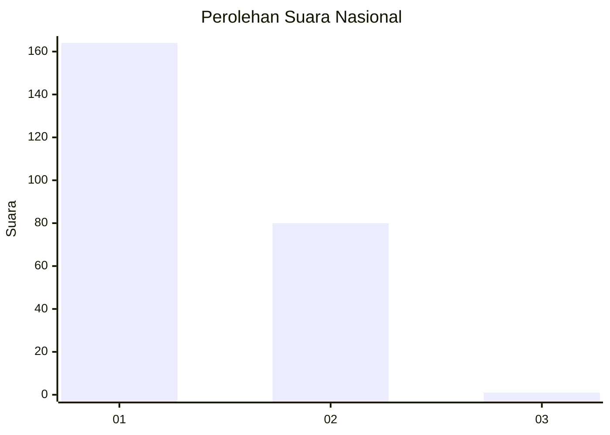
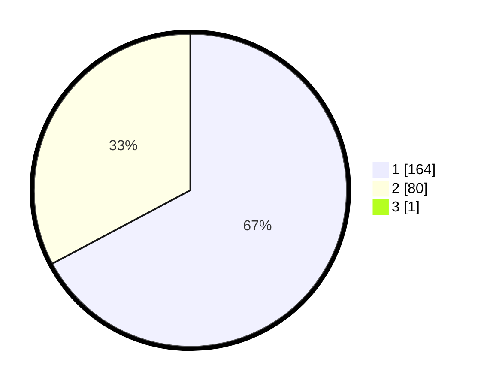

# Hasil

## Grafik

## Tabel

| No. | Nama Paslon    | Suara | Suara (raw) | Persentase |
|:--- |:-------------- | -----:| -----------:| ----------:|
| 1   | ANIES MUHAIMIN | 164   | [164][p-1]  | 66,94      |
| 2   | PRABOWO GIBRAN | 80    | [80][p-2]   | 32,65      |
| 3   | GANJAR MAHFUD  | 1     | [1][p-3]    | 0,41       |

[p-1]: https://github.com/gigit-pemilu/pemilu-2024/blob/main/pilpres/hitung-suara/sub/11-aceh/sub/02-aceh-tenggara/sub/14-lawe-sumur/sub/2015-lawe-polak/sub/001-tps/sub/paslon-1.txt
[p-2]: https://github.com/gigit-pemilu/pemilu-2024/blob/main/pilpres/hitung-suara/sub/11-aceh/sub/02-aceh-tenggara/sub/14-lawe-sumur/sub/2015-lawe-polak/sub/001-tps/sub/paslon-2.txt
[p-3]: https://github.com/gigit-pemilu/pemilu-2024/blob/main/pilpres/hitung-suara/sub/11-aceh/sub/02-aceh-tenggara/sub/14-lawe-sumur/sub/2015-lawe-polak/sub/001-tps/sub/paslon-3.txt

## Foto C Plano

https://sirekap-obj-formc.kpu.go.id/dfbb/pemilu/ppwp/11/02/14/20/15/1102142015001-20240215-051234--c669a94f-190e-4c19-b622-8d5158710ad1.jpg

https://sirekap-obj-formc.kpu.go.id/dfbb/pemilu/ppwp/11/02/14/20/15/1102142015001-20240215-051423--c9572fad-2b31-4d1e-89d3-ebcce31ed9dc.jpg

https://sirekap-obj-formc.kpu.go.id/dfbb/pemilu/ppwp/11/02/14/20/15/1102142015001-20240215-220947--c33ae092-efeb-439f-b885-1abacc6df250.jpg

## Metadata

| Key        | Value               |
| ---------- | ------------------- |
| Time Stamp | 2024-02-16 00:00:26 |

