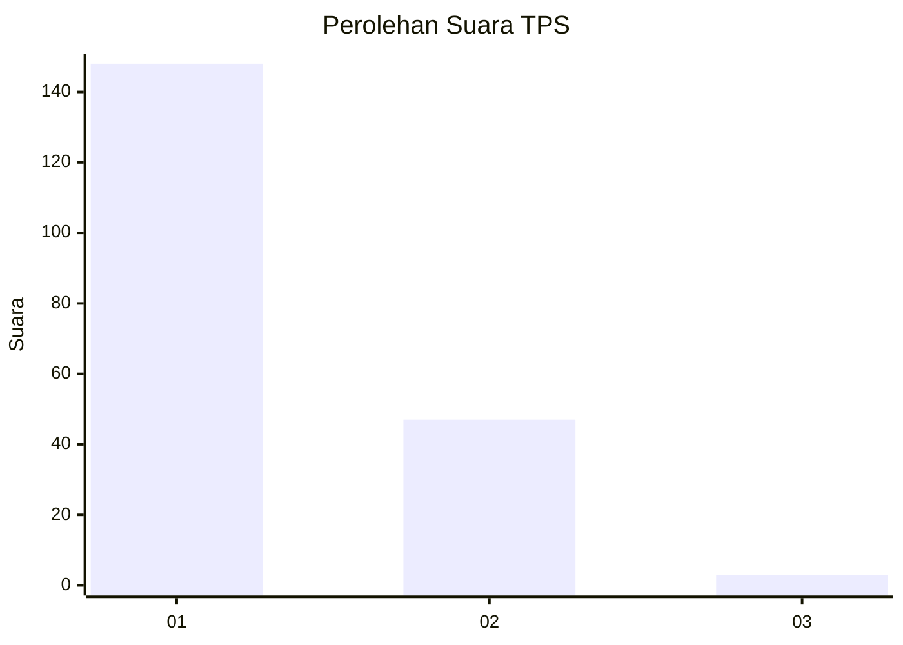
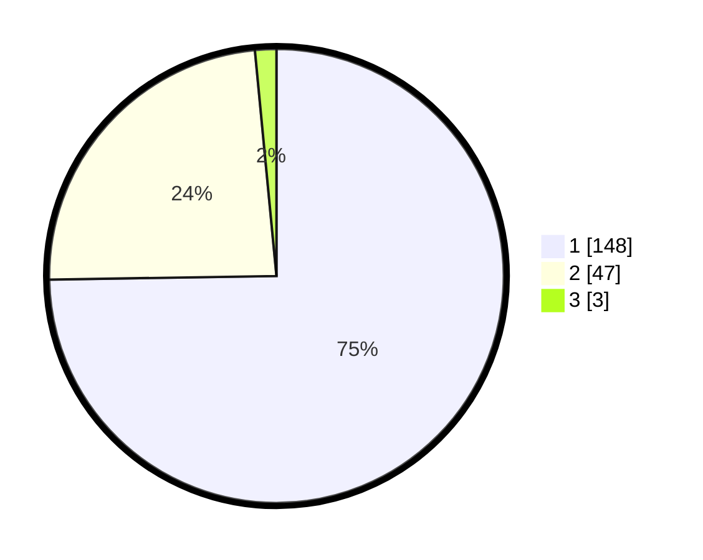

# Hasil

## Grafik

## Tabel

| No. | Nama Paslon    | Suara | Suara (raw) | Persentase |
|:--- |:-------------- | -----:| -----------:| ----------:|
| 1   | ANIES MUHAIMIN | 148   | [148][p-1]  | 74,75      |
| 2   | PRABOWO GIBRAN | 47    | [47][p-2]   | 23,74      |
| 3   | GANJAR MAHFUD  | 3     | [3][p-3]    | 1,52       |

[p-1]: https://github.com/gigit-pemilu/pemilu-2024-11-aceh/blob/main/pilpres/hitung-suara/sub/11-aceh/sub/02-aceh-tenggara/sub/15-tanoh-alas/sub/2004-rambah-sayang/sub/001-tps/sub/paslon-1.txt
[p-2]: https://github.com/gigit-pemilu/pemilu-2024-11-aceh/blob/main/pilpres/hitung-suara/sub/11-aceh/sub/02-aceh-tenggara/sub/15-tanoh-alas/sub/2004-rambah-sayang/sub/001-tps/sub/paslon-2.txt
[p-3]: https://github.com/gigit-pemilu/pemilu-2024-11-aceh/blob/main/pilpres/hitung-suara/sub/11-aceh/sub/02-aceh-tenggara/sub/15-tanoh-alas/sub/2004-rambah-sayang/sub/001-tps/sub/paslon-3.txt

## Foto C Plano

https://sirekap-obj-formc.kpu.go.id/63c7/pemilu/ppwp/11/02/15/20/04/1102152004001-20240214-192843--6c3767df-3b37-4ff1-9f1d-e715e6ac8740.jpg

https://sirekap-obj-formc.kpu.go.id/63c7/pemilu/ppwp/11/02/15/20/04/1102152004001-20240214-191821--a0cc9249-c07b-4b44-8d8e-59f3e7f98868.jpg

https://sirekap-obj-formc.kpu.go.id/63c7/pemilu/ppwp/11/02/15/20/04/1102152004001-20240214-193132--092001dc-265c-4900-8226-d46d3063bdeb.jpg

## Metadata

| Key        | Value               |
| ---------- | ------------------- |
| Time Stamp | 2024-02-14 21:46:01 |

## DATA PEMILIH TETAP

Jumlah pemilih dalam DPT: **237**.
 * L: **110**.
 * P: **127**.

## DATA PENGGUNA HAK PILIH

Jumlah pengguna hak pilih dalam DPT: **197**.
 * L: **92**.
 * P: **105**.

Jumlah pengguna hak pilih dalam DPTb: **1**.
 * L: **0**.
 * P: **1**.

Jumlah pengguna hak pilih dalam DPK: **2**.
 * L: **1**.
 * P: **1**.

Jumlah pengguna hak pilih: **200**.
 * L: **93**.
 * P: **107**.

## JUMLAH SUARA SAH DAN TIDAK SAH

JUMLAH SELURUH SUARA SAH: **198**.

JUMLAH SUARA TIDAK SAH: **2**.

JUMLAH SELURUH SUARA SAH DAN SUARA TIDAK SAH: **200**.

