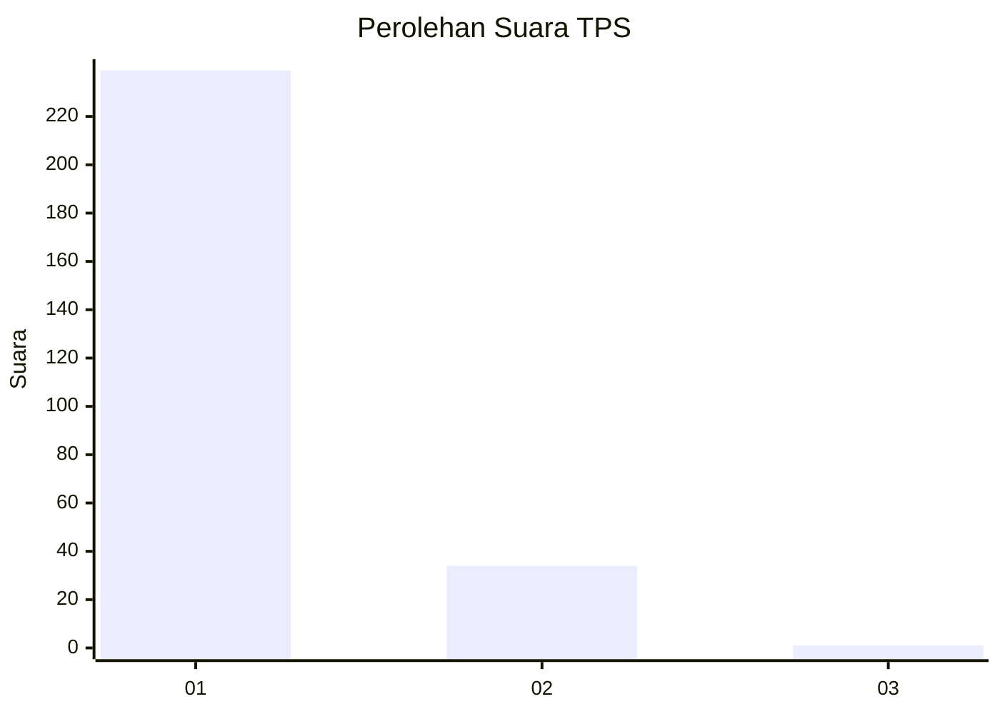
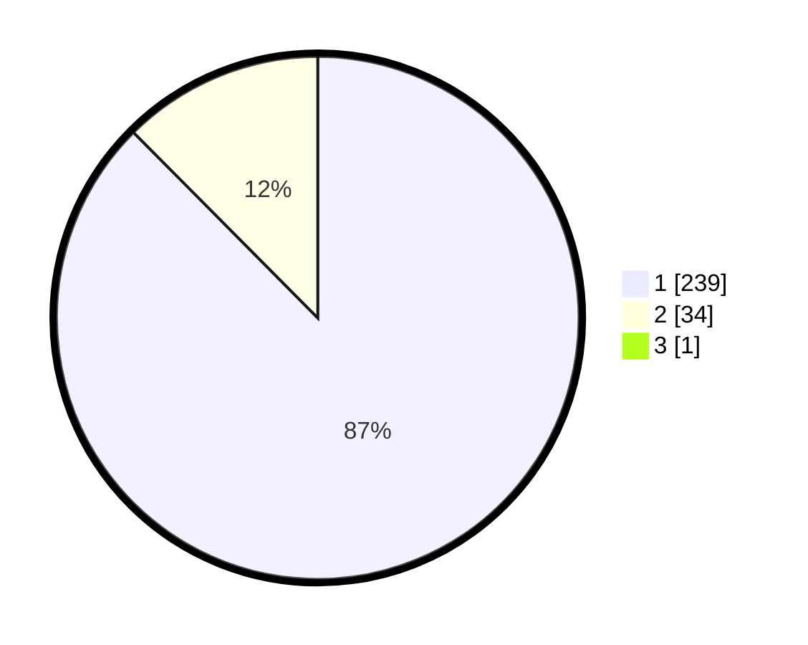

# Hasil

## Grafik

## Tabel

| No. | Nama Paslon    | Suara | Suara (raw) | Persentase |
|:--- |:-------------- | -----:| -----------:| ----------:|
| 1   | ANIES MUHAIMIN | 239   | [239][p-1]  | 87,23      |
| 2   | PRABOWO GIBRAN | 34    | [34][p-2]   | 12,41      |
| 3   | GANJAR MAHFUD  | 1     | [1][p-3]    | 0,36       |

[p-1]: https://github.com/gigit-pemilu/pemilu-2024-11-aceh/blob/main/pilpres/hitung-suara/sub/11-aceh/sub/02-aceh-tenggara/sub/15-tanoh-alas/sub/2006-rumah-luar/sub/001-tps/sub/paslon-1.txt
[p-2]: https://github.com/gigit-pemilu/pemilu-2024-11-aceh/blob/main/pilpres/hitung-suara/sub/11-aceh/sub/02-aceh-tenggara/sub/15-tanoh-alas/sub/2006-rumah-luar/sub/001-tps/sub/paslon-2.txt
[p-3]: https://github.com/gigit-pemilu/pemilu-2024-11-aceh/blob/main/pilpres/hitung-suara/sub/11-aceh/sub/02-aceh-tenggara/sub/15-tanoh-alas/sub/2006-rumah-luar/sub/001-tps/sub/paslon-3.txt

## Foto C Plano

https://sirekap-obj-formc.kpu.go.id/8ef9/pemilu/ppwp/11/02/15/20/06/1102152006001-20240215-194657--cc4d0478-af41-4b87-89a8-15c83fb4cdba.jpg

https://sirekap-obj-formc.kpu.go.id/8ef9/pemilu/ppwp/11/02/15/20/06/1102152006001-20240215-194718--93185088-f354-4c85-b324-4576be3737b8.jpg

https://sirekap-obj-formc.kpu.go.id/8ef9/pemilu/ppwp/11/02/15/20/06/1102152006001-20240215-194707--9c756a8c-5d40-48ab-9b89-39520ffd8a5a.jpg

## Metadata

| Key        | Value               |
| ---------- | ------------------- |
| Time Stamp | 2024-02-15 21:01:18 |

## DATA PEMILIH TETAP

Jumlah pemilih dalam DPT: **271**.
 * L: **135**.
 * P: **136**.

## DATA PENGGUNA HAK PILIH

Jumlah pengguna hak pilih dalam DPT: **271**.
 * L: **135**.
 * P: **136**.

Jumlah pengguna hak pilih dalam DPTb: **4**.
 * L: **0**.
 * P: **4**.

Jumlah pengguna hak pilih dalam DPK: **0**.
 * L: **0**.
 * P: **0**.

Jumlah pengguna hak pilih: **275**.
 * L: **135**.
 * P: **140**.

## JUMLAH SUARA SAH DAN TIDAK SAH

JUMLAH SELURUH SUARA SAH: **274**.

JUMLAH SUARA TIDAK SAH: **1**.

JUMLAH SELURUH SUARA SAH DAN SUARA TIDAK SAH: **275**.

