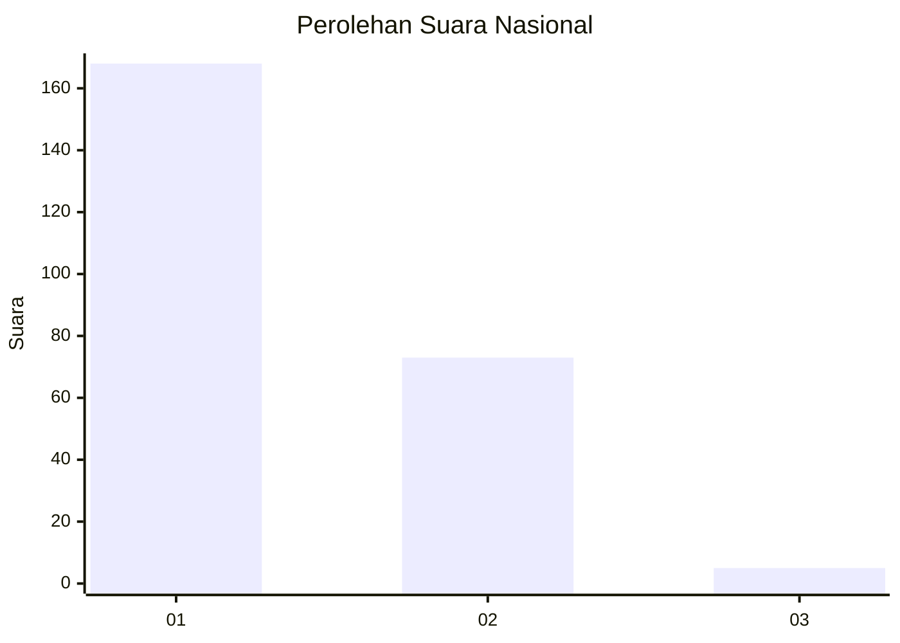
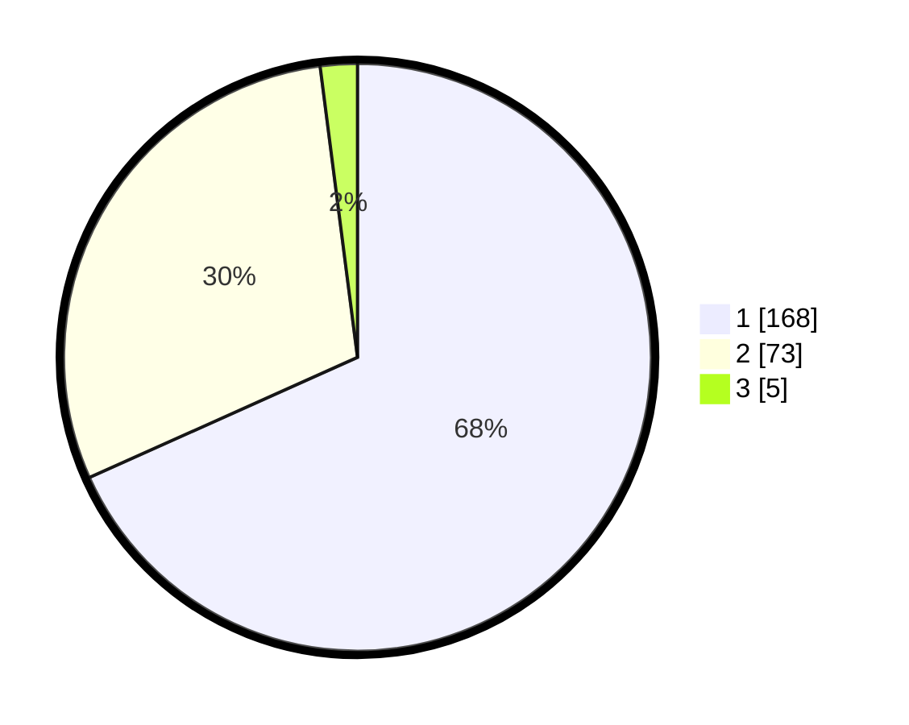

# Hasil

## Grafik

## Tabel

| No. | Nama Paslon    | Suara | Suara (raw) | Persentase |
|:--- |:-------------- | -----:| -----------:| ----------:|
| 1   | ANIES MUHAIMIN | 168   | [168][p-1]  | 68,29      |
| 2   | PRABOWO GIBRAN | 73    | [73][p-2]   | 29,67      |
| 3   | GANJAR MAHFUD  | 5     | [5][p-3]    | 2,03       |

[p-1]: https://github.com/gigit-pemilu/pemilu-2024/blob/main/pilpres/hitung-suara/sub/11-aceh/sub/02-aceh-tenggara/sub/15-tanoh-alas/sub/2007-tenembak-alas/sub/001-tps/sub/paslon-1.txt
[p-2]: https://github.com/gigit-pemilu/pemilu-2024/blob/main/pilpres/hitung-suara/sub/11-aceh/sub/02-aceh-tenggara/sub/15-tanoh-alas/sub/2007-tenembak-alas/sub/001-tps/sub/paslon-2.txt
[p-3]: https://github.com/gigit-pemilu/pemilu-2024/blob/main/pilpres/hitung-suara/sub/11-aceh/sub/02-aceh-tenggara/sub/15-tanoh-alas/sub/2007-tenembak-alas/sub/001-tps/sub/paslon-3.txt

## Foto C Plano

https://sirekap-obj-formc.kpu.go.id/3bf6/pemilu/ppwp/11/02/15/20/07/1102152007001-20240216-085731--9d9b4688-fe28-4489-a15d-fe24b558af84.jpg

https://sirekap-obj-formc.kpu.go.id/3bf6/pemilu/ppwp/11/02/15/20/07/1102152007001-20240216-085735--69b5d737-4d68-462a-b15b-e26ad6644555.jpg

https://sirekap-obj-formc.kpu.go.id/3bf6/pemilu/ppwp/11/02/15/20/07/1102152007001-20240216-085734--b2204439-3f0c-44bc-8132-011c3268d6a9.jpg

## Metadata

| Key        | Value               |
| ---------- | ------------------- |
| Time Stamp | 2024-02-16 21:01:00 |

## DATA PEMILIH TETAP

Jumlah pemilih dalam DPT: **271**.
 * L: **133**.
 * P: **138**.

## DATA PENGGUNA HAK PILIH

Jumlah pengguna hak pilih dalam DPT: **241**.
 * L: **122**.
 * P: **119**.

Jumlah pengguna hak pilih dalam DPTb: **2**.
 * L: **1**.
 * P: **1**.

Jumlah pengguna hak pilih dalam DPK: **7**.
 * L: **3**.
 * P: **4**.

Jumlah pengguna hak pilih: **250**.
 * L: **126**.
 * P: **124**.

## JUMLAH SUARA SAH DAN TIDAK SAH

JUMLAH SELURUH SUARA SAH: **246**.

JUMLAH SUARA TIDAK SAH: **4**.

JUMLAH SELURUH SUARA SAH DAN SUARA TIDAK SAH: **250**.

