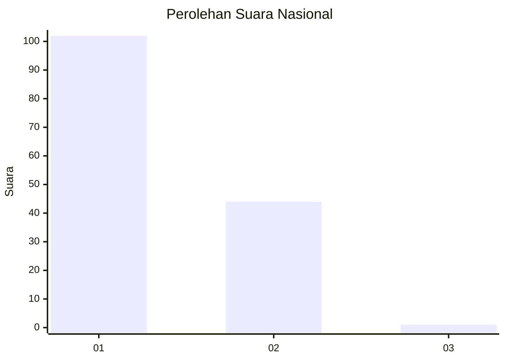
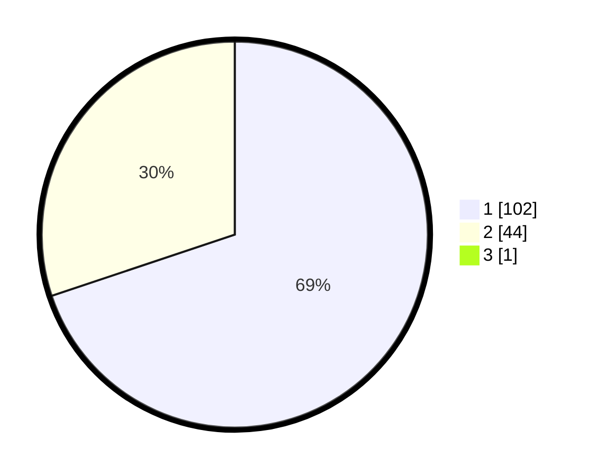

# Hasil

## Grafik

## Tabel

| No. | Nama Paslon    | Suara | Suara (raw) | Persentase |
|:--- |:-------------- | -----:| -----------:| ----------:|
| 1   | ANIES MUHAIMIN | 102   | [102][p-1]  | 69,39      |
| 2   | PRABOWO GIBRAN | 44    | [44][p-2]   | 29,93      |
| 3   | GANJAR MAHFUD  | 1     | [1][p-3]    | 0,68       |

[p-1]: https://github.com/gigit-pemilu/pemilu-2024/blob/main/pilpres/hitung-suara/sub/11-aceh/sub/02-aceh-tenggara/sub/15-tanoh-alas/sub/2009-salim-pinim-ii/sub/001-tps/sub/paslon-1.txt
[p-2]: https://github.com/gigit-pemilu/pemilu-2024/blob/main/pilpres/hitung-suara/sub/11-aceh/sub/02-aceh-tenggara/sub/15-tanoh-alas/sub/2009-salim-pinim-ii/sub/001-tps/sub/paslon-2.txt
[p-3]: https://github.com/gigit-pemilu/pemilu-2024/blob/main/pilpres/hitung-suara/sub/11-aceh/sub/02-aceh-tenggara/sub/15-tanoh-alas/sub/2009-salim-pinim-ii/sub/001-tps/sub/paslon-3.txt

## Foto C Plano

https://sirekap-obj-formc.kpu.go.id/2f84/pemilu/ppwp/11/02/15/20/09/1102152009001-20240215-015744--288c60cf-c630-4cc3-90de-d8e684a7277c.jpg

https://sirekap-obj-formc.kpu.go.id/2f84/pemilu/ppwp/11/02/15/20/09/1102152009001-20240215-020042--2a2f012b-f375-44a4-9ab7-4791853cdfe0.jpg

## Metadata

| Key        | Value               |
| ---------- | ------------------- |
| Time Stamp | 2024-02-15 21:30:27 |

