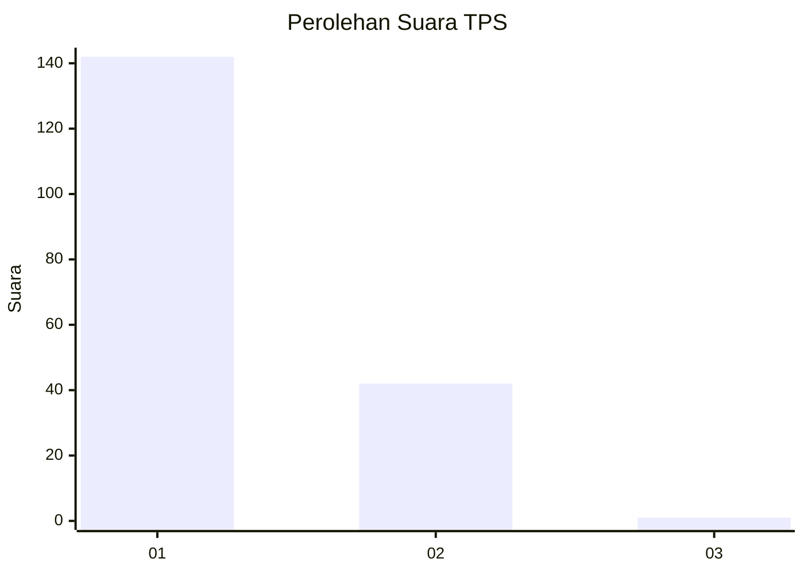
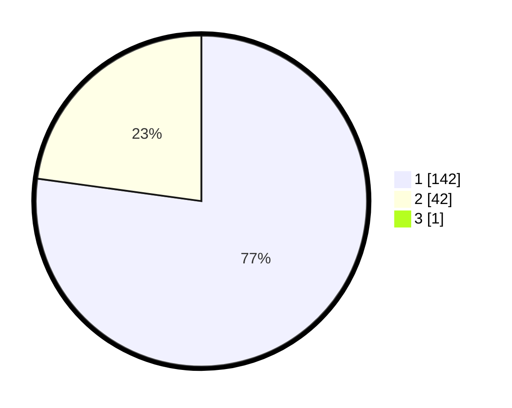

# Hasil

## Grafik

## Tabel

| No. | Nama Paslon    | Suara | Suara (raw) | Persentase |
|:--- |:-------------- | -----:| -----------:| ----------:|
| 1   | ANIES MUHAIMIN | 142   | [142][p-1]  | 76,76      |
| 2   | PRABOWO GIBRAN | 42    | [42][p-2]   | 22,70      |
| 3   | GANJAR MAHFUD  | 1     | [1][p-3]    | 0,54       |

[p-1]: https://github.com/gigit-pemilu/pemilu-2024-11-aceh/blob/main/pilpres/hitung-suara/sub/11-aceh/sub/02-aceh-tenggara/sub/15-tanoh-alas/sub/2010-jambukh-pekhmate/sub/001-tps/sub/paslon-1.txt
[p-2]: https://github.com/gigit-pemilu/pemilu-2024-11-aceh/blob/main/pilpres/hitung-suara/sub/11-aceh/sub/02-aceh-tenggara/sub/15-tanoh-alas/sub/2010-jambukh-pekhmate/sub/001-tps/sub/paslon-2.txt
[p-3]: https://github.com/gigit-pemilu/pemilu-2024-11-aceh/blob/main/pilpres/hitung-suara/sub/11-aceh/sub/02-aceh-tenggara/sub/15-tanoh-alas/sub/2010-jambukh-pekhmate/sub/001-tps/sub/paslon-3.txt

## Foto C Plano

https://sirekap-obj-formc.kpu.go.id/64c6/pemilu/ppwp/11/02/15/20/10/1102152010001-20240215-012458--07b2f43c-1325-4dbd-bb93-db7704fd611a.jpg

https://sirekap-obj-formc.kpu.go.id/64c6/pemilu/ppwp/11/02/15/20/10/1102152010001-20240215-012518--de0ea62a-00db-423d-a57f-adc67833b3cd.jpg

https://sirekap-obj-formc.kpu.go.id/64c6/pemilu/ppwp/11/02/15/20/10/1102152010001-20240215-012536--239d990d-9037-4884-9398-02768e7e751e.jpg

## Metadata

| Key        | Value               |
| ---------- | ------------------- |
| Time Stamp | 2024-02-16 12:51:22 |

