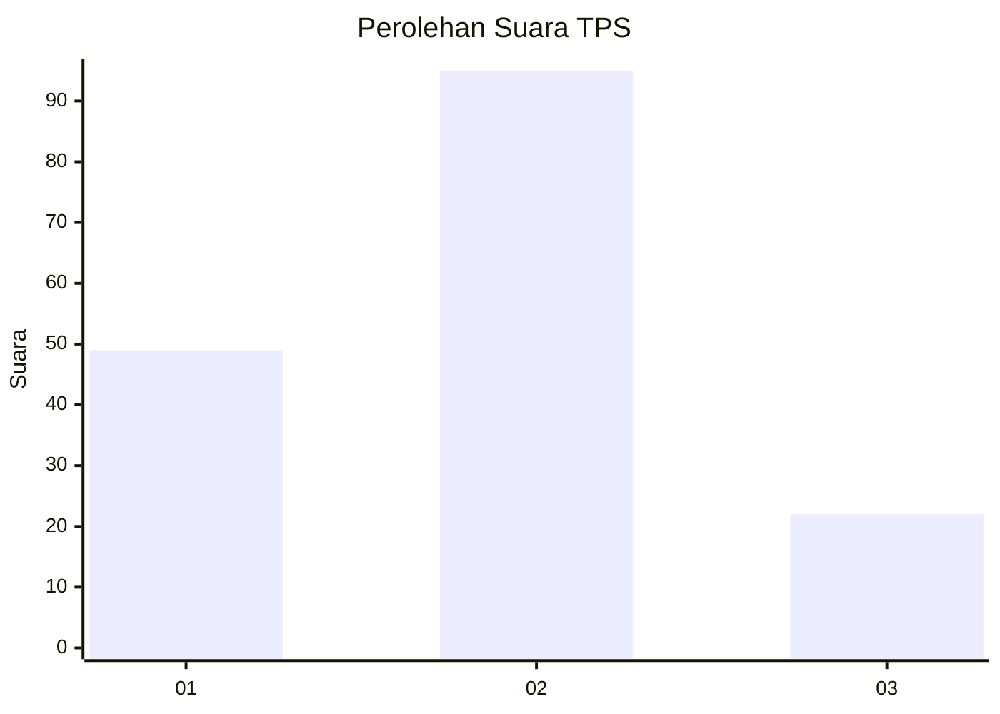
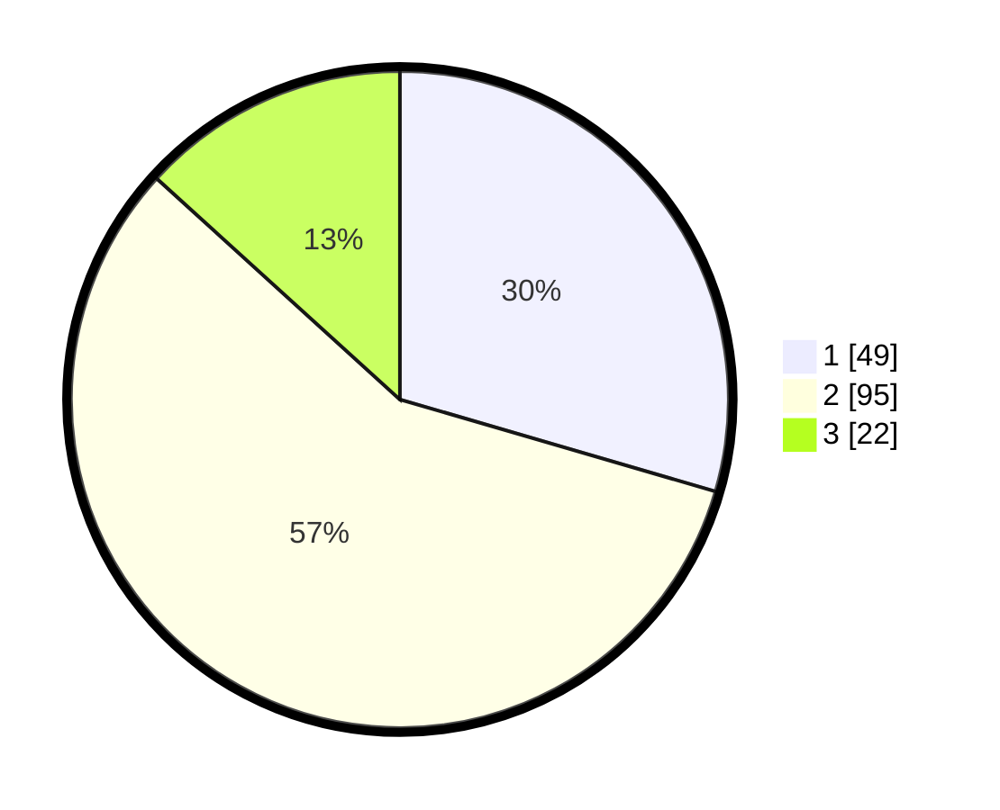

# Hasil

## Grafik

## Tabel

| No. | Nama Paslon    | Suara | Suara (raw) | Persentase |
|:--- |:-------------- | -----:| -----------:| ----------:|
| 1   | ANIES MUHAIMIN | 49    | [49][p-1]   | 29,52      |
| 2   | PRABOWO GIBRAN | 95    | [95][p-2]   | 57,23      |
| 3   | GANJAR MAHFUD  | 22    | [22][p-3]   | 13,25      |

[p-1]: https://github.com/gigit-pemilu/pemilu-2024-11-aceh/blob/main/pilpres/hitung-suara/sub/11-aceh/sub/02-aceh-tenggara/sub/16-leuser/sub/2002-bintang-bukit-indah/sub/001-tps/sub/paslon-1.txt
[p-2]: https://github.com/gigit-pemilu/pemilu-2024-11-aceh/blob/main/pilpres/hitung-suara/sub/11-aceh/sub/02-aceh-tenggara/sub/16-leuser/sub/2002-bintang-bukit-indah/sub/001-tps/sub/paslon-2.txt
[p-3]: https://github.com/gigit-pemilu/pemilu-2024-11-aceh/blob/main/pilpres/hitung-suara/sub/11-aceh/sub/02-aceh-tenggara/sub/16-leuser/sub/2002-bintang-bukit-indah/sub/001-tps/sub/paslon-3.txt

## Foto C Plano

https://sirekap-obj-formc.kpu.go.id/9a3e/pemilu/ppwp/11/02/16/20/02/1102162002001-20240216-055754--fa878981-b78c-40f7-8872-951a385db592.jpg

https://sirekap-obj-formc.kpu.go.id/9a3e/pemilu/ppwp/11/02/16/20/02/1102162002001-20240216-055758--d6ac005e-56e8-4a77-9068-b04d3fa76b56.jpg

https://sirekap-obj-formc.kpu.go.id/9a3e/pemilu/ppwp/11/02/16/20/02/1102162002001-20240216-055756--b41584f5-adf9-45a3-abf3-184376c10512.jpg

## Metadata

| Key        | Value               |
| ---------- | ------------------- |
| Time Stamp | 2024-02-16 21:01:00 |

## DATA PEMILIH TETAP

Jumlah pemilih dalam DPT: **218**.
 * L: **103**.
 * P: **115**.

## DATA PENGGUNA HAK PILIH

Jumlah pengguna hak pilih dalam DPT: **170**.
 * L: **78**.
 * P: **92**.

Jumlah pengguna hak pilih dalam DPTb: **3**.
 * L: **1**.
 * P: **2**.

Jumlah pengguna hak pilih dalam DPK: **0**.
 * L: **0**.
 * P: **0**.

Jumlah pengguna hak pilih: **173**.
 * L: **79**.
 * P: **94**.

## JUMLAH SUARA SAH DAN TIDAK SAH

JUMLAH SELURUH SUARA SAH: **166**.

JUMLAH SUARA TIDAK SAH: **7**.

JUMLAH SELURUH SUARA SAH DAN SUARA TIDAK SAH: **173**.

