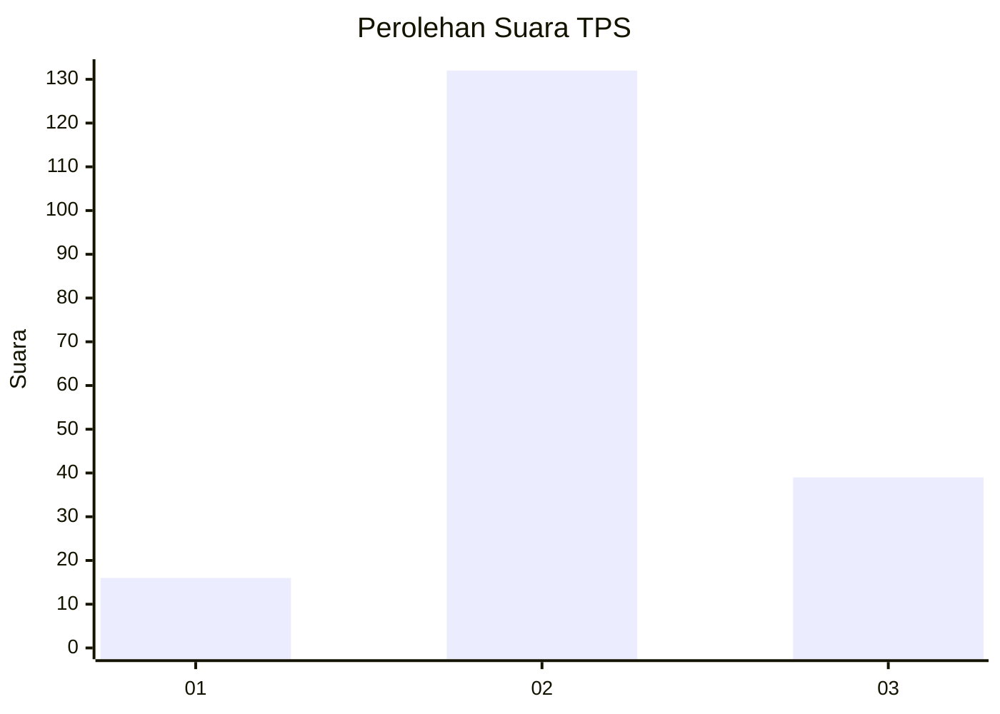
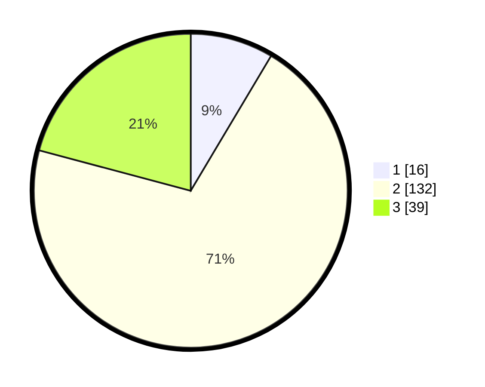

# Hasil

## Grafik

## Tabel

| No. | Nama Paslon    | Suara | Suara (raw) | Persentase |
|:--- |:-------------- | -----:| -----------:| ----------:|
| 1   | ANIES MUHAIMIN | 16    | [16][p-1]   | 8,56       |
| 2   | PRABOWO GIBRAN | 132   | [132][p-2]  | 70,59      |
| 3   | GANJAR MAHFUD  | 39    | [39][p-3]   | 20,86      |

[p-1]: https://github.com/gigit-pemilu/pemilu-2024-11-aceh/blob/main/pilpres/hitung-suara/sub/11-aceh/sub/02-aceh-tenggara/sub/16-leuser/sub/2003-tanjung-sari/sub/001-tps/sub/paslon-1.txt
[p-2]: https://github.com/gigit-pemilu/pemilu-2024-11-aceh/blob/main/pilpres/hitung-suara/sub/11-aceh/sub/02-aceh-tenggara/sub/16-leuser/sub/2003-tanjung-sari/sub/001-tps/sub/paslon-2.txt
[p-3]: https://github.com/gigit-pemilu/pemilu-2024-11-aceh/blob/main/pilpres/hitung-suara/sub/11-aceh/sub/02-aceh-tenggara/sub/16-leuser/sub/2003-tanjung-sari/sub/001-tps/sub/paslon-3.txt

## Foto C Plano

https://sirekap-obj-formc.kpu.go.id/f09e/pemilu/ppwp/11/02/16/20/03/1102162003001-20240222-100047--b41055fa-8ec0-49d5-9ae3-5a9e9d66f73a.jpg

https://sirekap-obj-formc.kpu.go.id/f09e/pemilu/ppwp/11/02/16/20/03/1102162003001-20240222-100048--4246ecbf-6b96-4412-ac52-af51cf8159ad.jpg

https://sirekap-obj-formc.kpu.go.id/f09e/pemilu/ppwp/11/02/16/20/03/1102162003001-20240222-100048--b784af2c-c757-480f-bc73-297795016494.jpg

## Metadata

| Key        | Value               |
| ---------- | ------------------- |
| Time Stamp | 2024-02-24 22:31:28 |

## DATA PEMILIH TETAP

Jumlah pemilih dalam DPT: **239**.
 * L: **128**.
 * P: **111**.

## DATA PENGGUNA HAK PILIH

Jumlah pengguna hak pilih dalam DPT: **193**.
 * L: **104**.
 * P: **89**.

Jumlah pengguna hak pilih dalam DPTb: **2**.
 * L: **2**.
 * P: **0**.

Jumlah pengguna hak pilih dalam DPK: **0**.
 * L: **0**.
 * P: **0**.

Jumlah pengguna hak pilih: **195**.
 * L: **106**.
 * P: **89**.

## JUMLAH SUARA SAH DAN TIDAK SAH

JUMLAH SELURUH SUARA SAH: **187**.

JUMLAH SUARA TIDAK SAH: **8**.

JUMLAH SELURUH SUARA SAH DAN SUARA TIDAK SAH: **195**.

