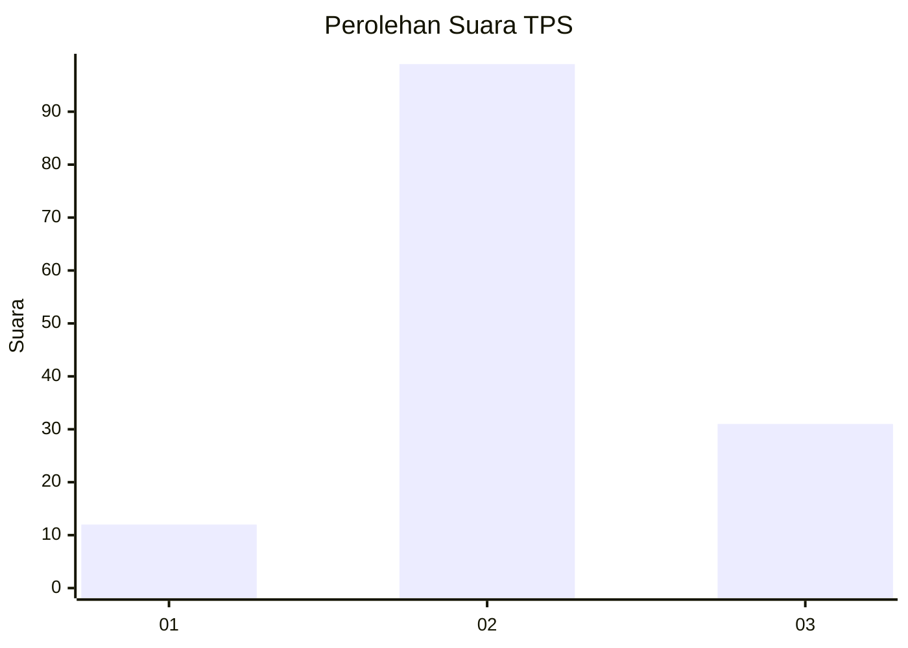
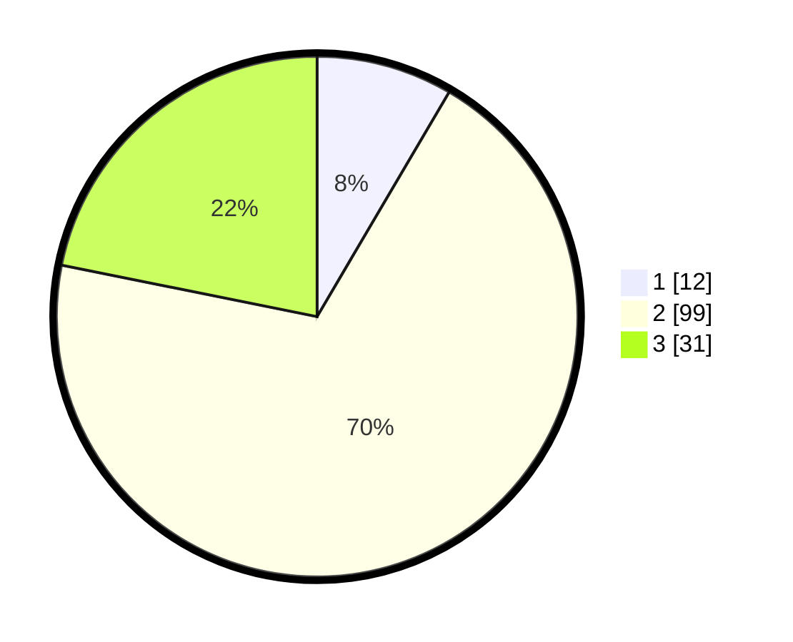

# Hasil

## Grafik

## Tabel

| No. | Nama Paslon    | Suara | Suara (raw) | Persentase |
|:--- |:-------------- | -----:| -----------:| ----------:|
| 1   | ANIES MUHAIMIN | 12    | [12][p-1]   | 8,45       |
| 2   | PRABOWO GIBRAN | 99    | [99][p-2]   | 69,72      |
| 3   | GANJAR MAHFUD  | 31    | [31][p-3]   | 21,83      |

[p-1]: https://github.com/gigit-pemilu/pemilu-2024-11-aceh/blob/main/pilpres/hitung-suara/sub/11-aceh/sub/02-aceh-tenggara/sub/16-leuser/sub/2003-tanjung-sari/sub/002-tps/sub/paslon-1.txt
[p-2]: https://github.com/gigit-pemilu/pemilu-2024-11-aceh/blob/main/pilpres/hitung-suara/sub/11-aceh/sub/02-aceh-tenggara/sub/16-leuser/sub/2003-tanjung-sari/sub/002-tps/sub/paslon-2.txt
[p-3]: https://github.com/gigit-pemilu/pemilu-2024-11-aceh/blob/main/pilpres/hitung-suara/sub/11-aceh/sub/02-aceh-tenggara/sub/16-leuser/sub/2003-tanjung-sari/sub/002-tps/sub/paslon-3.txt

## Foto C Plano

https://sirekap-obj-formc.kpu.go.id/7753/pemilu/ppwp/11/02/16/20/03/1102162003002-20240216-131511--6c2a7e5b-3624-466f-a183-d586d24984de.jpg

https://sirekap-obj-formc.kpu.go.id/7753/pemilu/ppwp/11/02/16/20/03/1102162003002-20240216-131513--972fd511-2a2d-4cf8-bea8-62d92ac3523f.jpg

https://sirekap-obj-formc.kpu.go.id/7753/pemilu/ppwp/11/02/16/20/03/1102162003002-20240216-131512--ad48b8a9-1a07-471a-a3e1-c60af45cd253.jpg

## Metadata

| Key        | Value               |
| ---------- | ------------------- |
| Time Stamp | 2024-02-16 21:01:00 |

## DATA PEMILIH TETAP

Jumlah pemilih dalam DPT: **167**.
 * L: **91**.
 * P: **76**.

## DATA PENGGUNA HAK PILIH

Jumlah pengguna hak pilih dalam DPT: **142**.
 * L: **80**.
 * P: **62**.

Jumlah pengguna hak pilih dalam DPTb: **0**.
 * L: **0**.
 * P: **0**.

Jumlah pengguna hak pilih dalam DPK: **5**.
 * L: **2**.
 * P: **3**.

Jumlah pengguna hak pilih: **147**.
 * L: **82**.
 * P: **65**.

## JUMLAH SUARA SAH DAN TIDAK SAH

JUMLAH SELURUH SUARA SAH: **142**.

JUMLAH SUARA TIDAK SAH: **5**.

JUMLAH SELURUH SUARA SAH DAN SUARA TIDAK SAH: **147**.

