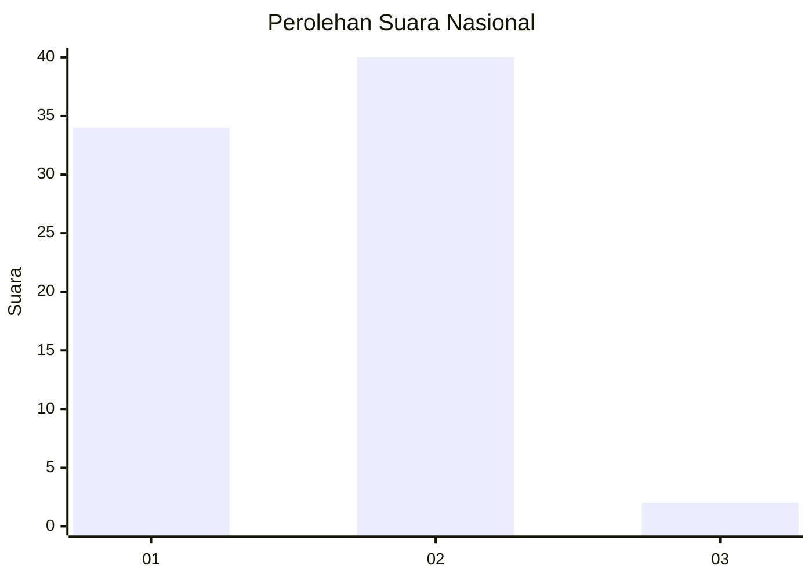
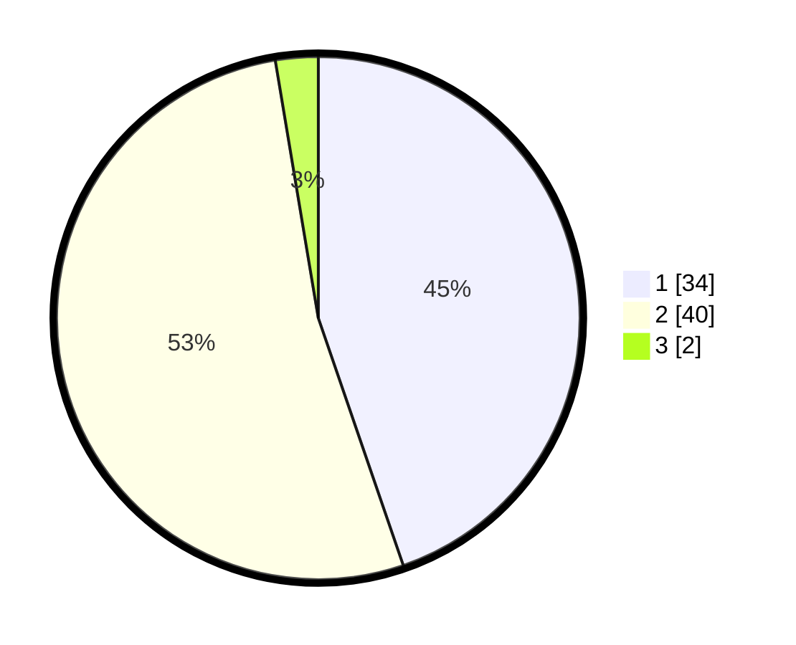

# Hasil

## Grafik

## Tabel

| No. | Nama Paslon    | Suara | Suara (raw) | Persentase |
|:--- |:-------------- | -----:| -----------:| ----------:|
| 1   | ANIES MUHAIMIN | 34    | [34][p-1]   | 44,74      |
| 2   | PRABOWO GIBRAN | 40    | [40][p-2]   | 52,63      |
| 3   | GANJAR MAHFUD  | 2     | [2][p-3]    | 2,63       |

[p-1]: https://github.com/gigit-pemilu/pemilu-2024/blob/main/pilpres/hitung-suara/sub/11-aceh/sub/02-aceh-tenggara/sub/16-leuser/sub/2013-suka-damai/sub/001-tps/sub/paslon-1.txt
[p-2]: https://github.com/gigit-pemilu/pemilu-2024/blob/main/pilpres/hitung-suara/sub/11-aceh/sub/02-aceh-tenggara/sub/16-leuser/sub/2013-suka-damai/sub/001-tps/sub/paslon-2.txt
[p-3]: https://github.com/gigit-pemilu/pemilu-2024/blob/main/pilpres/hitung-suara/sub/11-aceh/sub/02-aceh-tenggara/sub/16-leuser/sub/2013-suka-damai/sub/001-tps/sub/paslon-3.txt

## Foto C Plano

https://sirekap-obj-formc.kpu.go.id/0788/pemilu/ppwp/11/02/16/20/13/1102162013001-20240218-174034--9ad1c1fd-4fea-4347-9bb0-0a30c91069a7.jpg

https://sirekap-obj-formc.kpu.go.id/0788/pemilu/ppwp/11/02/16/20/13/1102162013001-20240218-174035--3093d398-d67d-40ee-91df-4a452fc9557d.jpg

https://sirekap-obj-formc.kpu.go.id/0788/pemilu/ppwp/11/02/16/20/13/1102162013001-20240218-174034--c769991b-3ada-4297-b064-2182e3395ef2.jpg

## Metadata

| Key        | Value               |
| ---------- | ------------------- |
| Time Stamp | 2024-02-21 17:00:00 |

## DATA PEMILIH TETAP

Jumlah pemilih dalam DPT: **82**.
 * L: **43**.
 * P: **39**.

## DATA PENGGUNA HAK PILIH

Jumlah pengguna hak pilih dalam DPT: **73**.
 * L: **38**.
 * P: **35**.

Jumlah pengguna hak pilih dalam DPTb: **0**.
 * L: **0**.
 * P: **0**.

Jumlah pengguna hak pilih dalam DPK: **3**.
 * L: **1**.
 * P: **2**.

Jumlah pengguna hak pilih: **76**.
 * L: **39**.
 * P: **37**.

## JUMLAH SUARA SAH DAN TIDAK SAH

JUMLAH SELURUH SUARA SAH: **76**.

JUMLAH SUARA TIDAK SAH: **0**.

JUMLAH SELURUH SUARA SAH DAN SUARA TIDAK SAH: **76**.

