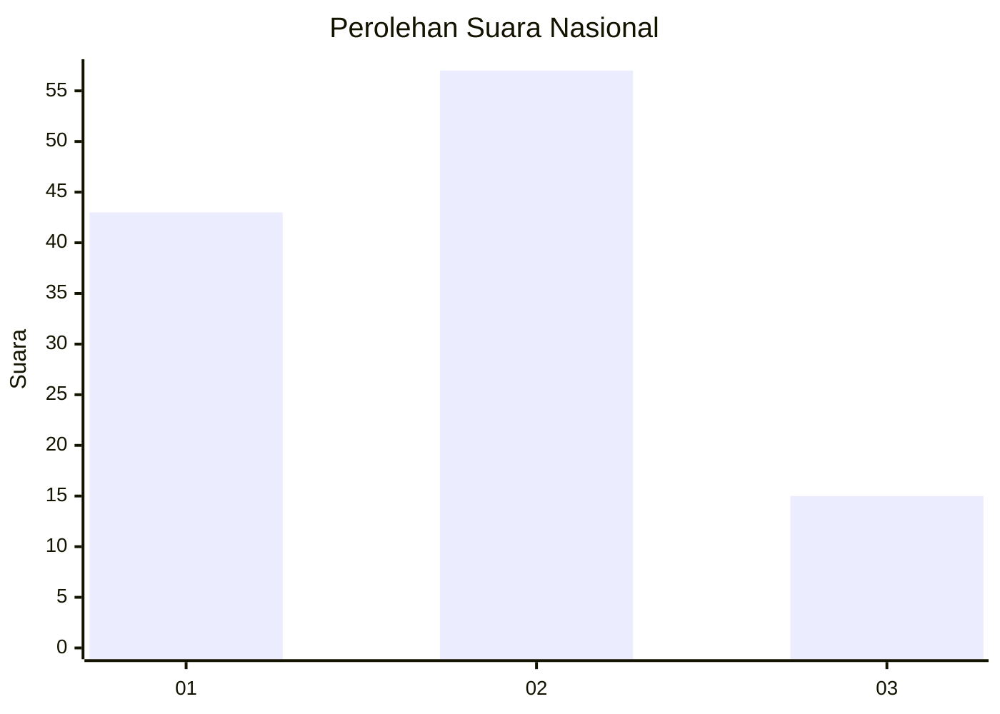
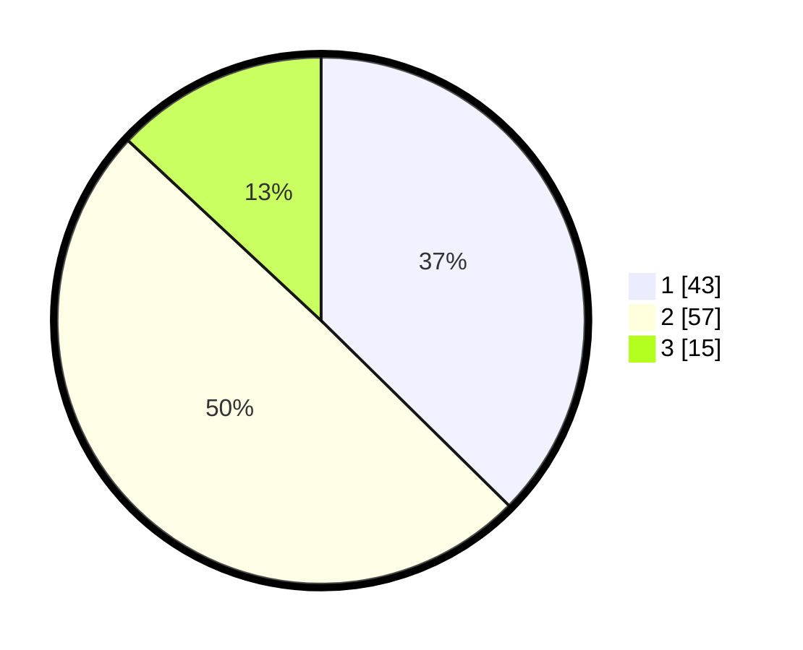

# Hasil

## Grafik

## Tabel

| No. | Nama Paslon    | Suara | Suara (raw) | Persentase |
|:--- |:-------------- | -----:| -----------:| ----------:|
| 1   | ANIES MUHAIMIN | 43    | [43][p-1]   | 37,39      |
| 2   | PRABOWO GIBRAN | 57    | [57][p-2]   | 49,57      |
| 3   | GANJAR MAHFUD  | 15    | [15][p-3]   | 13,04      |

[p-1]: https://github.com/gigit-pemilu/pemilu-2024/blob/main/pilpres/hitung-suara/sub/11-aceh/sub/02-aceh-tenggara/sub/16-leuser/sub/2017-akhih-majile/sub/001-tps/sub/paslon-1.txt
[p-2]: https://github.com/gigit-pemilu/pemilu-2024/blob/main/pilpres/hitung-suara/sub/11-aceh/sub/02-aceh-tenggara/sub/16-leuser/sub/2017-akhih-majile/sub/001-tps/sub/paslon-2.txt
[p-3]: https://github.com/gigit-pemilu/pemilu-2024/blob/main/pilpres/hitung-suara/sub/11-aceh/sub/02-aceh-tenggara/sub/16-leuser/sub/2017-akhih-majile/sub/001-tps/sub/paslon-3.txt

## Foto C Plano

https://sirekap-obj-formc.kpu.go.id/4f9b/pemilu/ppwp/11/02/16/20/17/1102162017001-20240219-101729--32679224-63c6-40cc-b61d-d2a4ad7aaff4.jpg

https://sirekap-obj-formc.kpu.go.id/4f9b/pemilu/ppwp/11/02/16/20/17/1102162017001-20240219-101731--ba96fb6e-9f96-47a3-87ed-7326532d6570.jpg

https://sirekap-obj-formc.kpu.go.id/4f9b/pemilu/ppwp/11/02/16/20/17/1102162017001-20240219-101730--2a954a34-0feb-4ce2-8d1b-abe848f408db.jpg

## Metadata

| Key        | Value               |
| ---------- | ------------------- |
| Time Stamp | 2024-02-21 18:00:00 |

## DATA PEMILIH TETAP

Jumlah pemilih dalam DPT: **135**.
 * L: **59**.
 * P: **76**.

## DATA PENGGUNA HAK PILIH

Jumlah pengguna hak pilih dalam DPT: **111**.
 * L: **57**.
 * P: **54**.

Jumlah pengguna hak pilih dalam DPTb: **0**.
 * L: **0**.
 * P: **0**.

Jumlah pengguna hak pilih dalam DPK: **4**.
 * L: **1**.
 * P: **3**.

Jumlah pengguna hak pilih: **115**.
 * L: **58**.
 * P: **57**.

## JUMLAH SUARA SAH DAN TIDAK SAH

JUMLAH SELURUH SUARA SAH: **115**.

JUMLAH SUARA TIDAK SAH: **0**.

JUMLAH SELURUH SUARA SAH DAN SUARA TIDAK SAH: **115**.

