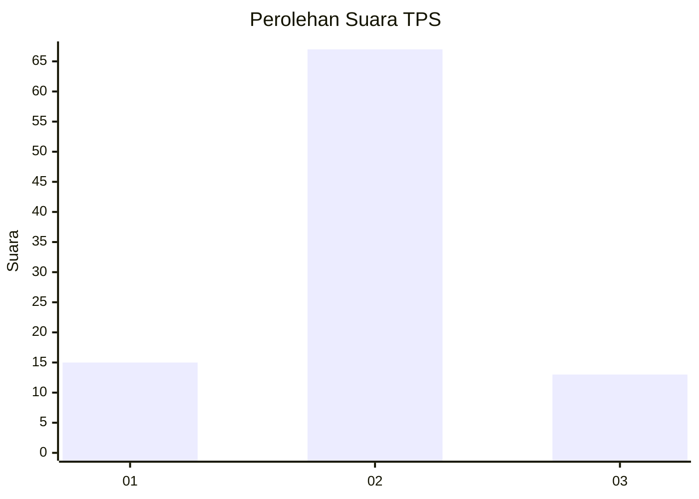
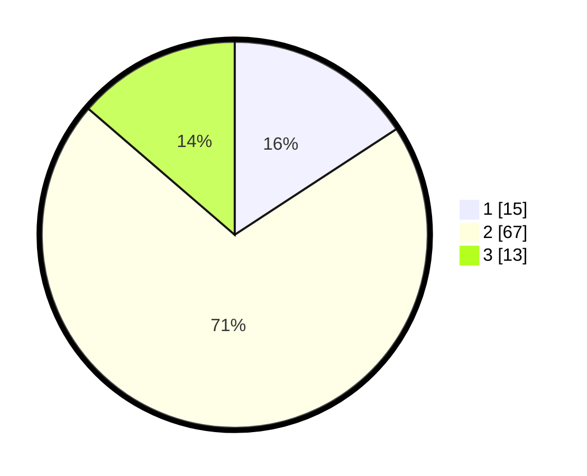

# Hasil

## Grafik

## Tabel

| No. | Nama Paslon    | Suara | Suara (raw) | Persentase |
|:--- |:-------------- | -----:| -----------:| ----------:|
| 1   | ANIES MUHAIMIN | 15    | [15][p-1]   | 15,79      |
| 2   | PRABOWO GIBRAN | 67    | [67][p-2]   | 70,53      |
| 3   | GANJAR MAHFUD  | 13    | [13][p-3]   | 13,68      |

[p-1]: https://github.com/gigit-pemilu/pemilu-2024-11-aceh/blob/main/pilpres/hitung-suara/sub/11-aceh/sub/02-aceh-tenggara/sub/16-leuser/sub/2018-ukhat-peseluk/sub/001-tps/sub/paslon-1.txt
[p-2]: https://github.com/gigit-pemilu/pemilu-2024-11-aceh/blob/main/pilpres/hitung-suara/sub/11-aceh/sub/02-aceh-tenggara/sub/16-leuser/sub/2018-ukhat-peseluk/sub/001-tps/sub/paslon-2.txt
[p-3]: https://github.com/gigit-pemilu/pemilu-2024-11-aceh/blob/main/pilpres/hitung-suara/sub/11-aceh/sub/02-aceh-tenggara/sub/16-leuser/sub/2018-ukhat-peseluk/sub/001-tps/sub/paslon-3.txt

## Foto C Plano

https://sirekap-obj-formc.kpu.go.id/3f01/pemilu/ppwp/11/02/16/20/18/1102162018001-20240222-151814--a5ccec31-727b-4a01-85ef-d29e485c1cf3.jpg

https://sirekap-obj-formc.kpu.go.id/3f01/pemilu/ppwp/11/02/16/20/18/1102162018001-20240222-151816--0b6836df-a971-48f4-a602-9846aa7716e4.jpg

https://sirekap-obj-formc.kpu.go.id/3f01/pemilu/ppwp/11/02/16/20/18/1102162018001-20240222-151815--c81ef901-8a14-4200-a8b8-7db5004aa1ea.jpg

## Metadata

| Key        | Value               |
| ---------- | ------------------- |
| Time Stamp | 2024-02-24 22:31:28 |

## DATA PEMILIH TETAP

Jumlah pemilih dalam DPT: **143**.
 * L: **77**.
 * P: **66**.

## DATA PENGGUNA HAK PILIH

Jumlah pengguna hak pilih dalam DPT: **95**.
 * L: **49**.
 * P: **46**.

Jumlah pengguna hak pilih dalam DPTb: **0**.
 * L: **0**.
 * P: **0**.

Jumlah pengguna hak pilih dalam DPK: **1**.
 * L: **0**.
 * P: **1**.

Jumlah pengguna hak pilih: **96**.
 * L: **49**.
 * P: **47**.

## JUMLAH SUARA SAH DAN TIDAK SAH

JUMLAH SELURUH SUARA SAH: **95**.

JUMLAH SUARA TIDAK SAH: **1**.

JUMLAH SELURUH SUARA SAH DAN SUARA TIDAK SAH: **96**.

