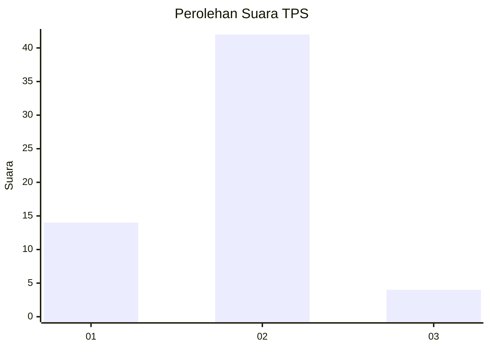
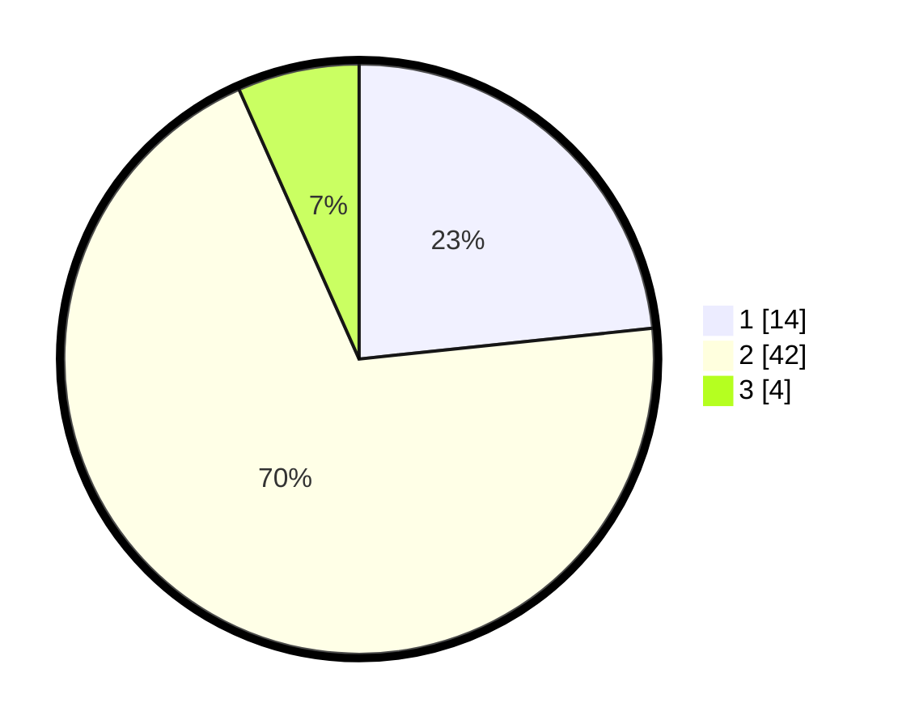

# Hasil

## Grafik

## Tabel

| No. | Nama Paslon    | Suara | Suara (raw) | Persentase |
|:--- |:-------------- | -----:| -----------:| ----------:|
| 1   | ANIES MUHAIMIN | 14    | [14][p-1]   | 23,33      |
| 2   | PRABOWO GIBRAN | 42    | [42][p-2]   | 70,00      |
| 3   | GANJAR MAHFUD  | 4     | [4][p-3]    | 6,67       |

[p-1]: https://github.com/gigit-pemilu/pemilu-2024-11-aceh/blob/main/pilpres/hitung-suara/sub/11-aceh/sub/02-aceh-tenggara/sub/16-leuser/sub/2020-gaye-sendah/sub/001-tps/sub/paslon-1.txt
[p-2]: https://github.com/gigit-pemilu/pemilu-2024-11-aceh/blob/main/pilpres/hitung-suara/sub/11-aceh/sub/02-aceh-tenggara/sub/16-leuser/sub/2020-gaye-sendah/sub/001-tps/sub/paslon-2.txt
[p-3]: https://github.com/gigit-pemilu/pemilu-2024-11-aceh/blob/main/pilpres/hitung-suara/sub/11-aceh/sub/02-aceh-tenggara/sub/16-leuser/sub/2020-gaye-sendah/sub/001-tps/sub/paslon-3.txt

## Foto C Plano

https://sirekap-obj-formc.kpu.go.id/a8b8/pemilu/ppwp/11/02/16/20/20/1102162020001-20240215-132312--723e0b10-a1cb-4126-ab7a-bb13d325e278.jpg

https://sirekap-obj-formc.kpu.go.id/a8b8/pemilu/ppwp/11/02/16/20/20/1102162020001-20240215-132442--f9e7edb0-5c2a-4446-ac0a-d174521d6669.jpg

https://sirekap-obj-formc.kpu.go.id/a8b8/pemilu/ppwp/11/02/16/20/20/1102162020001-20240215-132531--053c618b-80b8-4259-9863-e3efd09715d3.jpg

## Metadata

| Key        | Value               |
| ---------- | ------------------- |
| Time Stamp | 2024-02-24 22:31:28 |

