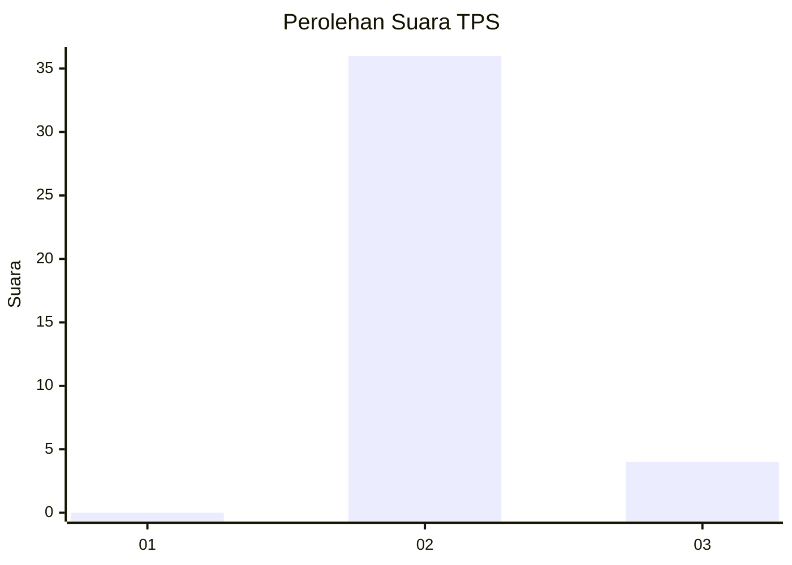
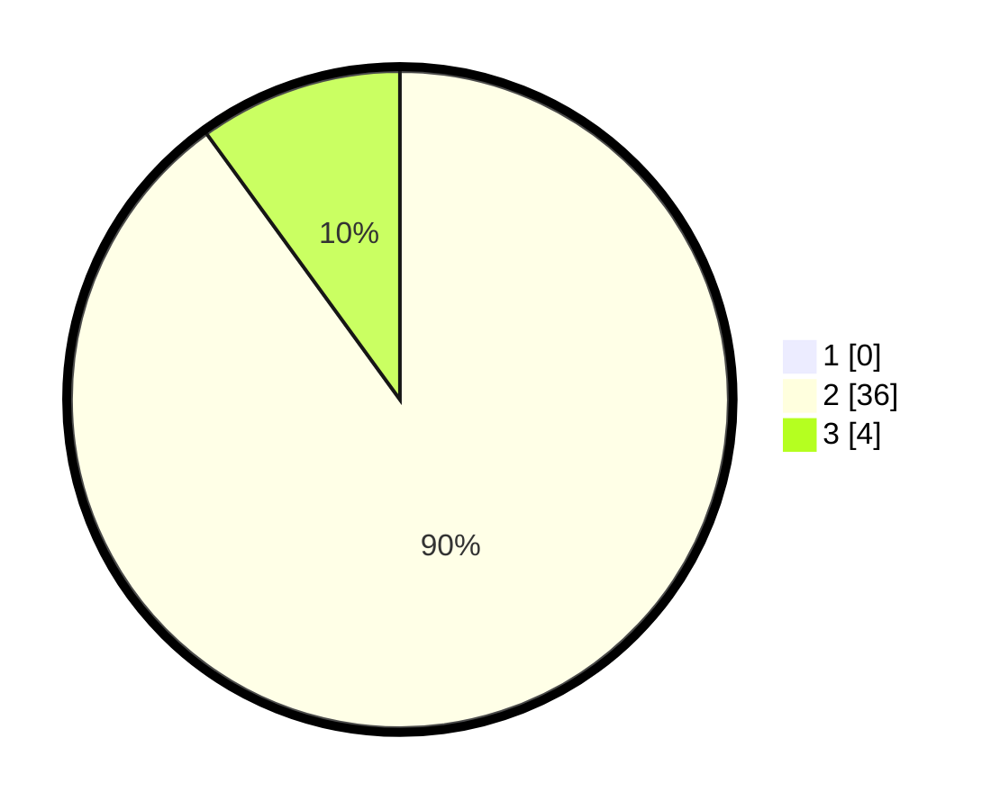

# Hasil

## Grafik

## Tabel

| No. | Nama Paslon    | Suara | Suara (raw) | Persentase |
|:--- |:-------------- | -----:| -----------:| ----------:|
| 1   | ANIES MUHAIMIN | 0     | [0][p-1]    | 0,00       |
| 2   | PRABOWO GIBRAN | 36    | [36][p-2]   | 90,00      |
| 3   | GANJAR MAHFUD  | 4     | [4][p-3]    | 10,00      |

[p-1]: https://github.com/gigit-pemilu/pemilu-2024-11-aceh/blob/main/pilpres/hitung-suara/sub/11-aceh/sub/02-aceh-tenggara/sub/16-leuser/sub/2021-kute-hakhapen/sub/001-tps/sub/paslon-1.txt
[p-2]: https://github.com/gigit-pemilu/pemilu-2024-11-aceh/blob/main/pilpres/hitung-suara/sub/11-aceh/sub/02-aceh-tenggara/sub/16-leuser/sub/2021-kute-hakhapen/sub/001-tps/sub/paslon-2.txt
[p-3]: https://github.com/gigit-pemilu/pemilu-2024-11-aceh/blob/main/pilpres/hitung-suara/sub/11-aceh/sub/02-aceh-tenggara/sub/16-leuser/sub/2021-kute-hakhapen/sub/001-tps/sub/paslon-3.txt

## Foto C Plano

https://sirekap-obj-formc.kpu.go.id/6b62/pemilu/ppwp/11/02/16/20/21/1102162021001-20240222-145656--17220c9c-55e8-44cb-add0-8d4f17d2a923.jpg

https://sirekap-obj-formc.kpu.go.id/6b62/pemilu/ppwp/11/02/16/20/21/1102162021001-20240222-145657--b1af6d77-5cb2-441d-a2b7-871891207989.jpg

https://sirekap-obj-formc.kpu.go.id/6b62/pemilu/ppwp/11/02/16/20/21/1102162021001-20240222-145656--ccb0084d-4691-45f9-abad-0917d1a2eb8c.jpg

## Metadata

| Key        | Value               |
| ---------- | ------------------- |
| Time Stamp | 2024-02-24 22:31:28 |

## DATA PEMILIH TETAP

Jumlah pemilih dalam DPT: **54**.
 * L: **27**.
 * P: **27**.

## DATA PENGGUNA HAK PILIH

Jumlah pengguna hak pilih dalam DPT: **40**.
 * L: **21**.
 * P: **19**.

Jumlah pengguna hak pilih dalam DPTb: **0**.
 * L: **0**.
 * P: **0**.

Jumlah pengguna hak pilih dalam DPK: **0**.
 * L: **0**.
 * P: **0**.

Jumlah pengguna hak pilih: **40**.
 * L: **21**.
 * P: **19**.

## JUMLAH SUARA SAH DAN TIDAK SAH

JUMLAH SELURUH SUARA SAH: **40**.

JUMLAH SUARA TIDAK SAH: **0**.

JUMLAH SELURUH SUARA SAH DAN SUARA TIDAK SAH: **40**.

