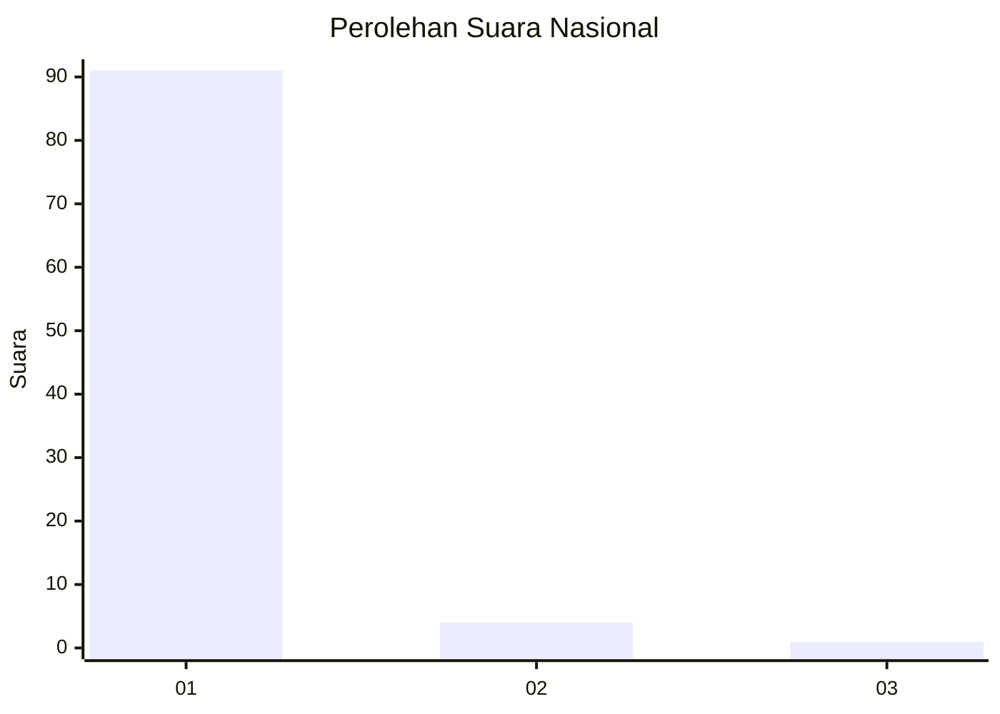
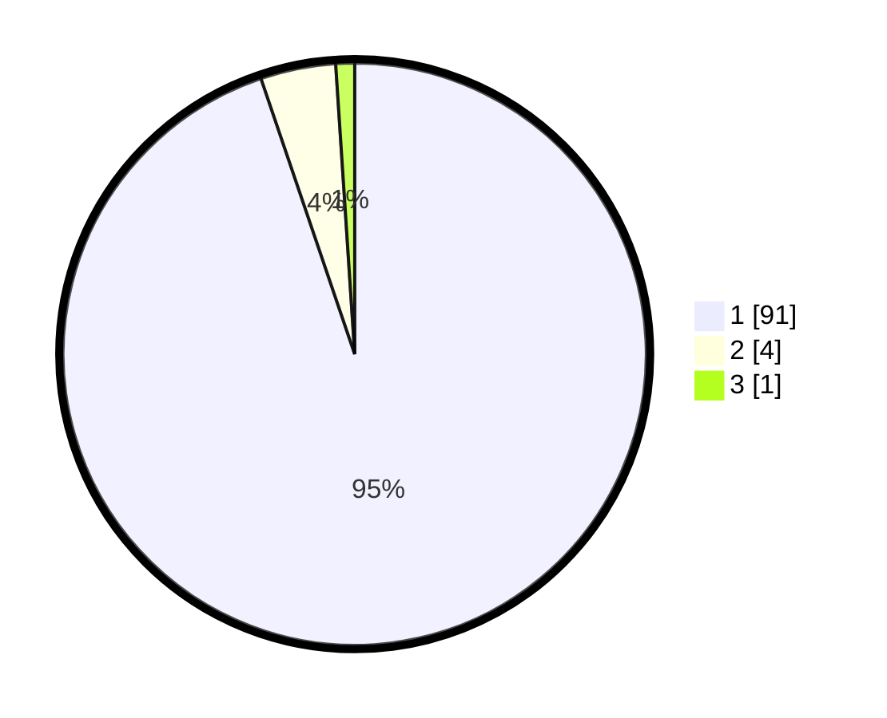

# Hasil

## Grafik

## Tabel

| No. | Nama Paslon    | Suara | Suara (raw) | Persentase |
|:--- |:-------------- | -----:| -----------:| ----------:|
| 1   | ANIES MUHAIMIN | 91    | [91][p-1]   | 94,79      |
| 2   | PRABOWO GIBRAN | 4     | [4][p-2]    | 4,17       |
| 3   | GANJAR MAHFUD  | 1     | [1][p-3]    | 1,04       |

[p-1]: https://github.com/gigit-pemilu/pemilu-2024/blob/main/pilpres/hitung-suara/sub/11-aceh/sub/03-aceh-timur/sub/01-darul-aman/sub/2002-alue-luddin-dua/sub/001-tps/sub/paslon-1.txt
[p-2]: https://github.com/gigit-pemilu/pemilu-2024/blob/main/pilpres/hitung-suara/sub/11-aceh/sub/03-aceh-timur/sub/01-darul-aman/sub/2002-alue-luddin-dua/sub/001-tps/sub/paslon-2.txt
[p-3]: https://github.com/gigit-pemilu/pemilu-2024/blob/main/pilpres/hitung-suara/sub/11-aceh/sub/03-aceh-timur/sub/01-darul-aman/sub/2002-alue-luddin-dua/sub/001-tps/sub/paslon-3.txt

## Foto C Plano

https://sirekap-obj-formc.kpu.go.id/66f8/pemilu/ppwp/11/03/01/20/02/1103012002001-20240214-155157--d78af48c-f009-46f9-a8f5-ad2abf352430.jpg

https://sirekap-obj-formc.kpu.go.id/66f8/pemilu/ppwp/11/03/01/20/02/1103012002001-20240214-155317--40503892-9856-41df-b63e-39cd6bbb79db.jpg

https://sirekap-obj-formc.kpu.go.id/66f8/pemilu/ppwp/11/03/01/20/02/1103012002001-20240214-155430--77278e19-f6e3-4586-a79b-c999737097ce.jpg

## Metadata

| Key        | Value               |
| ---------- | ------------------- |
| Time Stamp | 2024-02-16 17:00:00 |

## DATA PEMILIH TETAP

Jumlah pemilih dalam DPT: **122**.
 * L: **58**.
 * P: **64**.

## DATA PENGGUNA HAK PILIH

Jumlah pengguna hak pilih dalam DPT: **99**.
 * L: **47**.
 * P: **52**.

Jumlah pengguna hak pilih dalam DPTb: **0**.
 * L: **0**.
 * P: **0**.

Jumlah pengguna hak pilih dalam DPK: **0**.
 * L: **0**.
 * P: **0**.

Jumlah pengguna hak pilih: **99**.
 * L: **47**.
 * P: **52**.

## JUMLAH SUARA SAH DAN TIDAK SAH

JUMLAH SELURUH SUARA SAH: **96**.

JUMLAH SUARA TIDAK SAH: **3**.

JUMLAH SELURUH SUARA SAH DAN SUARA TIDAK SAH: **99**.

