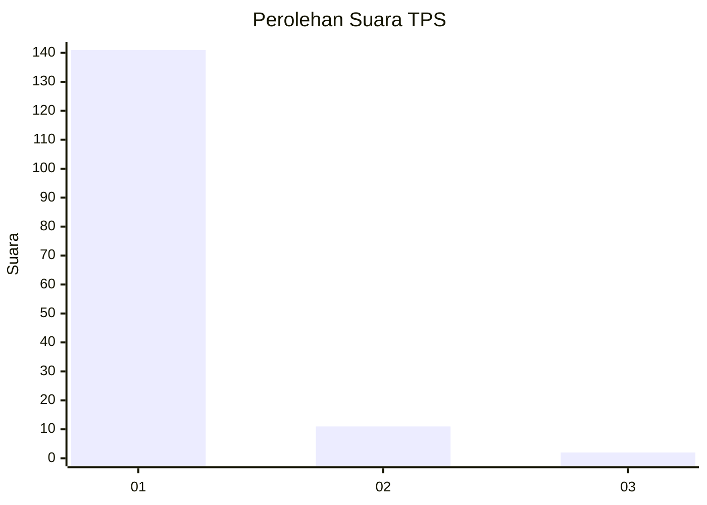
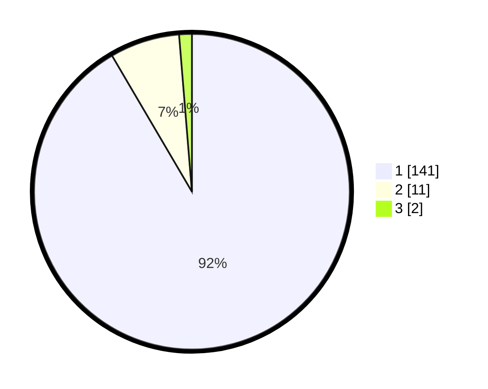

# Hasil

## Grafik

## Tabel

| No. | Nama Paslon    | Suara | Suara (raw) | Persentase |
|:--- |:-------------- | -----:| -----------:| ----------:|
| 1   | ANIES MUHAIMIN | 141   | [141][p-1]  | 91,56      |
| 2   | PRABOWO GIBRAN | 11    | [11][p-2]   | 7,14       |
| 3   | GANJAR MAHFUD  | 2     | [2][p-3]    | 1,30       |

[p-1]: https://github.com/gigit-pemilu/pemilu-2024-11-aceh/blob/main/pilpres/hitung-suara/sub/11-aceh/sub/03-aceh-timur/sub/01-darul-aman/sub/2004-dama-pulo-sa/sub/001-tps/sub/paslon-1.txt
[p-2]: https://github.com/gigit-pemilu/pemilu-2024-11-aceh/blob/main/pilpres/hitung-suara/sub/11-aceh/sub/03-aceh-timur/sub/01-darul-aman/sub/2004-dama-pulo-sa/sub/001-tps/sub/paslon-2.txt
[p-3]: https://github.com/gigit-pemilu/pemilu-2024-11-aceh/blob/main/pilpres/hitung-suara/sub/11-aceh/sub/03-aceh-timur/sub/01-darul-aman/sub/2004-dama-pulo-sa/sub/001-tps/sub/paslon-3.txt

## Foto C Plano

https://sirekap-obj-formc.kpu.go.id/619e/pemilu/ppwp/11/03/01/20/04/1103012004001-20240214-223007--3371daf0-148a-4bbc-b38c-8c21efb3e206.jpg

https://sirekap-obj-formc.kpu.go.id/619e/pemilu/ppwp/11/03/01/20/04/1103012004001-20240214-223209--e3e8d010-bc3b-4c79-b9e2-6cffc63efc42.jpg

https://sirekap-obj-formc.kpu.go.id/619e/pemilu/ppwp/11/03/01/20/04/1103012004001-20240214-223335--9fbf48af-fb92-4b8f-bf1c-baf6699eb770.jpg

## Metadata

| Key        | Value               |
| ---------- | ------------------- |
| Time Stamp | 2024-02-19 06:16:00 |

