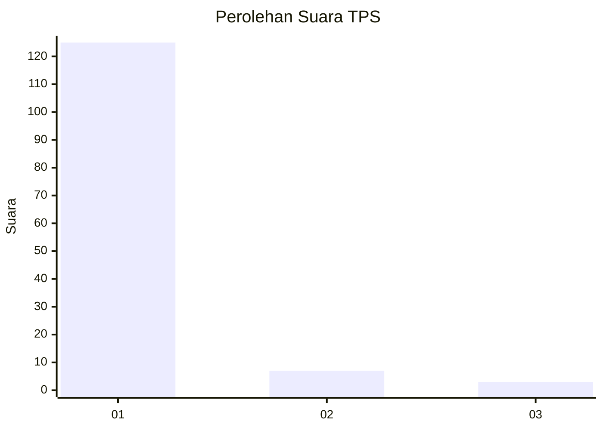
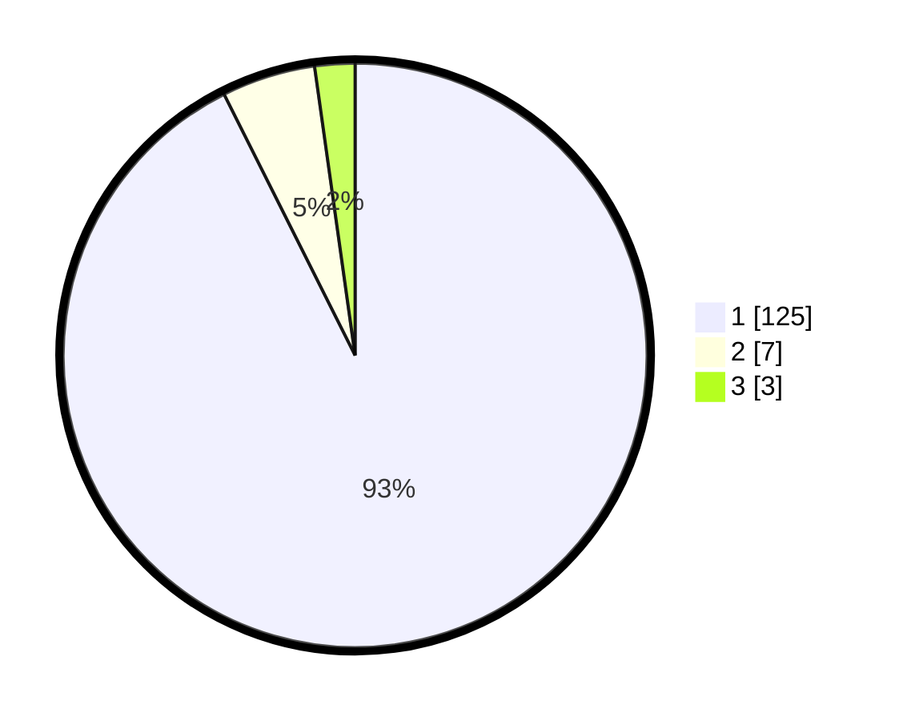

# Hasil

## Grafik

## Tabel

| No. | Nama Paslon    | Suara | Suara (raw) | Persentase |
|:--- |:-------------- | -----:| -----------:| ----------:|
| 1   | ANIES MUHAIMIN | 125   | [125][p-1]  | 92,59      |
| 2   | PRABOWO GIBRAN | 7     | [7][p-2]    | 5,19       |
| 3   | GANJAR MAHFUD  | 3     | [3][p-3]    | 2,22       |

[p-1]: https://github.com/gigit-pemilu/pemilu-2024-11-aceh/blob/main/pilpres/hitung-suara/sub/11-aceh/sub/03-aceh-timur/sub/01-darul-aman/sub/2004-dama-pulo-sa/sub/002-tps/sub/paslon-1.txt
[p-2]: https://github.com/gigit-pemilu/pemilu-2024-11-aceh/blob/main/pilpres/hitung-suara/sub/11-aceh/sub/03-aceh-timur/sub/01-darul-aman/sub/2004-dama-pulo-sa/sub/002-tps/sub/paslon-2.txt
[p-3]: https://github.com/gigit-pemilu/pemilu-2024-11-aceh/blob/main/pilpres/hitung-suara/sub/11-aceh/sub/03-aceh-timur/sub/01-darul-aman/sub/2004-dama-pulo-sa/sub/002-tps/sub/paslon-3.txt

## Foto C Plano

https://sirekap-obj-formc.kpu.go.id/a945/pemilu/ppwp/11/03/01/20/04/1103012004002-20240214-190239--1201989a-bd0e-4e26-a679-815928c83990.jpg

https://sirekap-obj-formc.kpu.go.id/a945/pemilu/ppwp/11/03/01/20/04/1103012004002-20240214-195133--65052b47-59b4-482d-8d29-144aa92c92f4.jpg

https://sirekap-obj-formc.kpu.go.id/a945/pemilu/ppwp/11/03/01/20/04/1103012004002-20240216-141617--fd0f257f-6c3a-412f-9657-579791440f42.jpg

## Metadata

| Key        | Value               |
| ---------- | ------------------- |
| Time Stamp | 2024-02-17 09:30:03 |

## DATA PEMILIH TETAP

Jumlah pemilih dalam DPT: **197**.
 * L: **95**.
 * P: **102**.

## DATA PENGGUNA HAK PILIH

Jumlah pengguna hak pilih dalam DPT: **132**.
 * L: **59**.
 * P: **73**.

Jumlah pengguna hak pilih dalam DPTb: **1**.
 * L: **0**.
 * P: **1**.

Jumlah pengguna hak pilih dalam DPK: **4**.
 * L: **2**.
 * P: **2**.

Jumlah pengguna hak pilih: **137**.
 * L: **61**.
 * P: **76**.

## JUMLAH SUARA SAH DAN TIDAK SAH

JUMLAH SELURUH SUARA SAH: **135**.

JUMLAH SUARA TIDAK SAH: **2**.

JUMLAH SELURUH SUARA SAH DAN SUARA TIDAK SAH: **137**.

