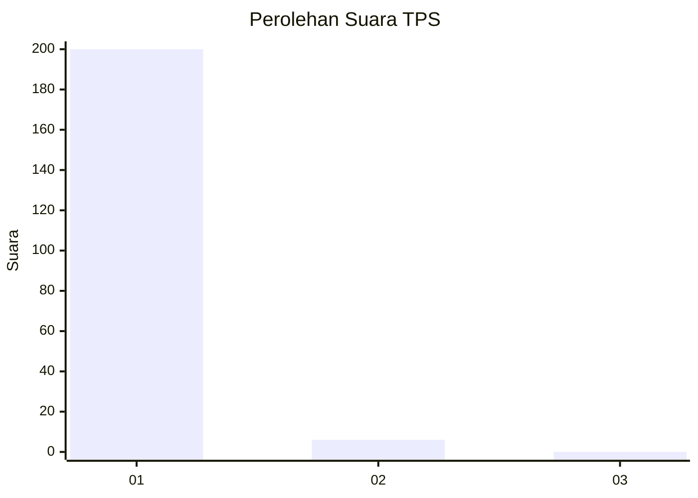
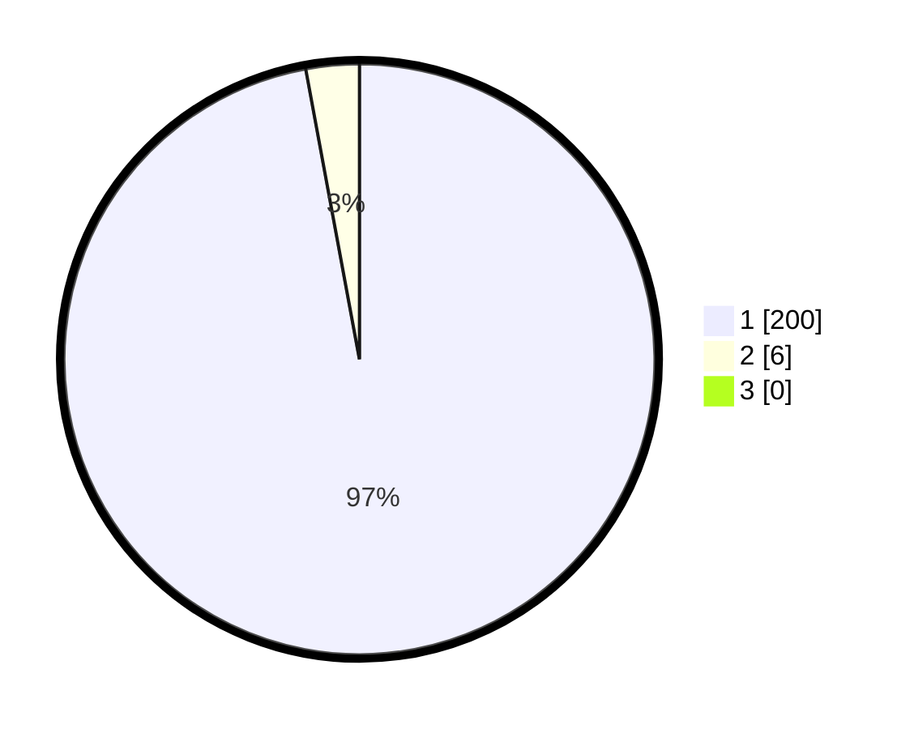

# Hasil

## Grafik

## Tabel

| No. | Nama Paslon    | Suara | Suara (raw) | Persentase |
|:--- |:-------------- | -----:| -----------:| ----------:|
| 1   | ANIES MUHAIMIN | 200   | [200][p-1]  | 97,09      |
| 2   | PRABOWO GIBRAN | 6     | [6][p-2]    | 2,91       |
| 3   | GANJAR MAHFUD  | 0     | [0][p-3]    | 0,00       |

[p-1]: https://github.com/gigit-pemilu/pemilu-2024-11-aceh/blob/main/pilpres/hitung-suara/sub/11-aceh/sub/03-aceh-timur/sub/01-darul-aman/sub/2005-dama-pulo-dua/sub/001-tps/sub/paslon-1.txt
[p-2]: https://github.com/gigit-pemilu/pemilu-2024-11-aceh/blob/main/pilpres/hitung-suara/sub/11-aceh/sub/03-aceh-timur/sub/01-darul-aman/sub/2005-dama-pulo-dua/sub/001-tps/sub/paslon-2.txt
[p-3]: https://github.com/gigit-pemilu/pemilu-2024-11-aceh/blob/main/pilpres/hitung-suara/sub/11-aceh/sub/03-aceh-timur/sub/01-darul-aman/sub/2005-dama-pulo-dua/sub/001-tps/sub/paslon-3.txt

## Foto C Plano

https://sirekap-obj-formc.kpu.go.id/8bb6/pemilu/ppwp/11/03/01/20/05/1103012005001-20240216-131742--7a5a65e1-5888-4c1f-bdad-722e1fa260da.jpg

https://sirekap-obj-formc.kpu.go.id/8bb6/pemilu/ppwp/11/03/01/20/05/1103012005001-20240216-131744--fcebee95-e8be-4f49-a6dd-31e871cd1b9e.jpg

https://sirekap-obj-formc.kpu.go.id/8bb6/pemilu/ppwp/11/03/01/20/05/1103012005001-20240216-131743--23fd478a-ec49-4e42-a393-33187fe26ced.jpg

## Metadata

| Key        | Value               |
| ---------- | ------------------- |
| Time Stamp | 2024-02-17 09:30:03 |

## DATA PEMILIH TETAP

Jumlah pemilih dalam DPT: **277**.
 * L: **130**.
 * P: **147**.

## DATA PENGGUNA HAK PILIH

Jumlah pengguna hak pilih dalam DPT: **216**.
 * L: **98**.
 * P: **118**.

Jumlah pengguna hak pilih dalam DPTb: **0**.
 * L: **0**.
 * P: **0**.

Jumlah pengguna hak pilih dalam DPK: **0**.
 * L: **0**.
 * P: **0**.

Jumlah pengguna hak pilih: **216**.
 * L: **98**.
 * P: **118**.

## JUMLAH SUARA SAH DAN TIDAK SAH

JUMLAH SELURUH SUARA SAH: **206**.

JUMLAH SUARA TIDAK SAH: **10**.

JUMLAH SELURUH SUARA SAH DAN SUARA TIDAK SAH: **216**.

