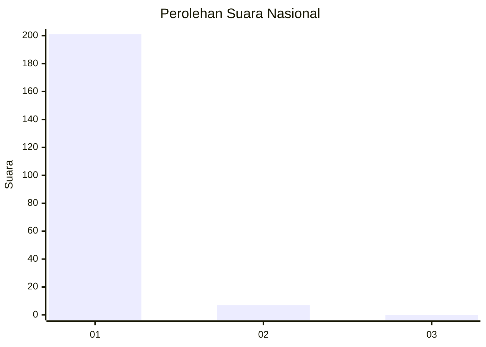
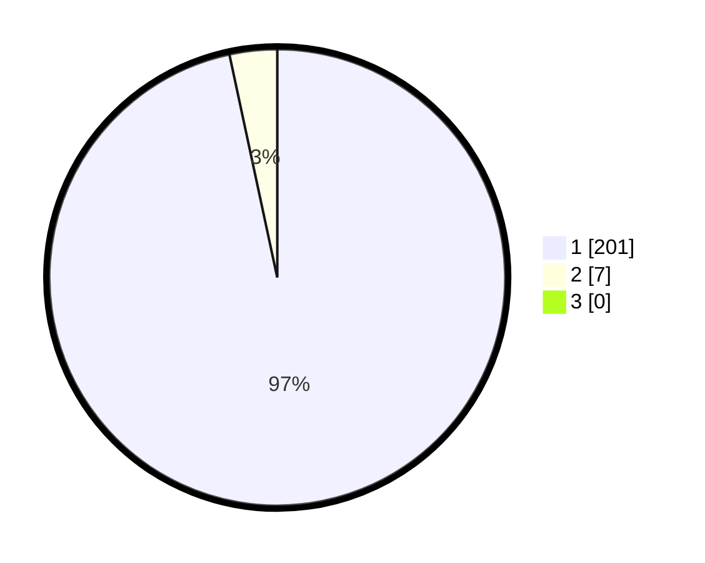

# Hasil

## Grafik

## Tabel

| No. | Nama Paslon    | Suara | Suara (raw) | Persentase |
|:--- |:-------------- | -----:| -----------:| ----------:|
| 1   | ANIES MUHAIMIN | 201   | [201][p-1]  | 96,63      |
| 2   | PRABOWO GIBRAN | 7     | [7][p-2]    | 3,37       |
| 3   | GANJAR MAHFUD  | 0     | [0][p-3]    | 0,00       |

[p-1]: https://github.com/gigit-pemilu/pemilu-2024/blob/main/pilpres/hitung-suara/sub/11-aceh/sub/03-aceh-timur/sub/01-darul-aman/sub/2006-buket-kulam/sub/001-tps/sub/paslon-1.txt
[p-2]: https://github.com/gigit-pemilu/pemilu-2024/blob/main/pilpres/hitung-suara/sub/11-aceh/sub/03-aceh-timur/sub/01-darul-aman/sub/2006-buket-kulam/sub/001-tps/sub/paslon-2.txt
[p-3]: https://github.com/gigit-pemilu/pemilu-2024/blob/main/pilpres/hitung-suara/sub/11-aceh/sub/03-aceh-timur/sub/01-darul-aman/sub/2006-buket-kulam/sub/001-tps/sub/paslon-3.txt

## Foto C Plano

https://sirekap-obj-formc.kpu.go.id/c1d7/pemilu/ppwp/11/03/01/20/06/1103012006001-20240216-205218--6edaced9-f182-4bd4-a066-cb47155303ed.jpg

https://sirekap-obj-formc.kpu.go.id/c1d7/pemilu/ppwp/11/03/01/20/06/1103012006001-20240216-205220--cab43e7c-942b-4638-8c78-8db740de9750.jpg

https://sirekap-obj-formc.kpu.go.id/c1d7/pemilu/ppwp/11/03/01/20/06/1103012006001-20240216-205219--f2b1a27d-e3f3-4ccb-86d7-56db636b9061.jpg

## Metadata

| Key        | Value               |
| ---------- | ------------------- |
| Time Stamp | 2024-02-17 09:30:03 |

## DATA PEMILIH TETAP

Jumlah pemilih dalam DPT: **0**.
 * L: **0**.
 * P: **0**.

## DATA PENGGUNA HAK PILIH

Jumlah pengguna hak pilih dalam DPT: **260**.
 * L: **135**.
 * P: **123**.

Jumlah pengguna hak pilih dalam DPTb: **0**.
 * L: **0**.
 * P: **0**.

Jumlah pengguna hak pilih dalam DPK: **0**.
 * L: **0**.
 * P: **0**.

Jumlah pengguna hak pilih: **208**.
 * L: **101**.
 * P: **107**.

## JUMLAH SUARA SAH DAN TIDAK SAH

JUMLAH SELURUH SUARA SAH: **208**.

JUMLAH SUARA TIDAK SAH: **0**.

JUMLAH SELURUH SUARA SAH DAN SUARA TIDAK SAH: **208**.

