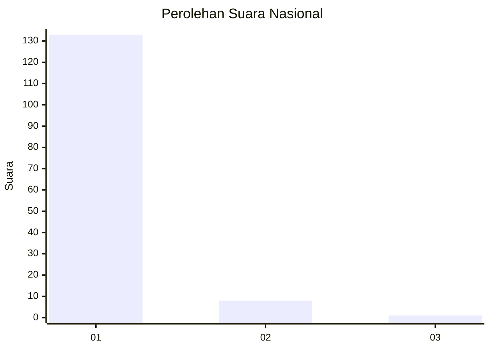
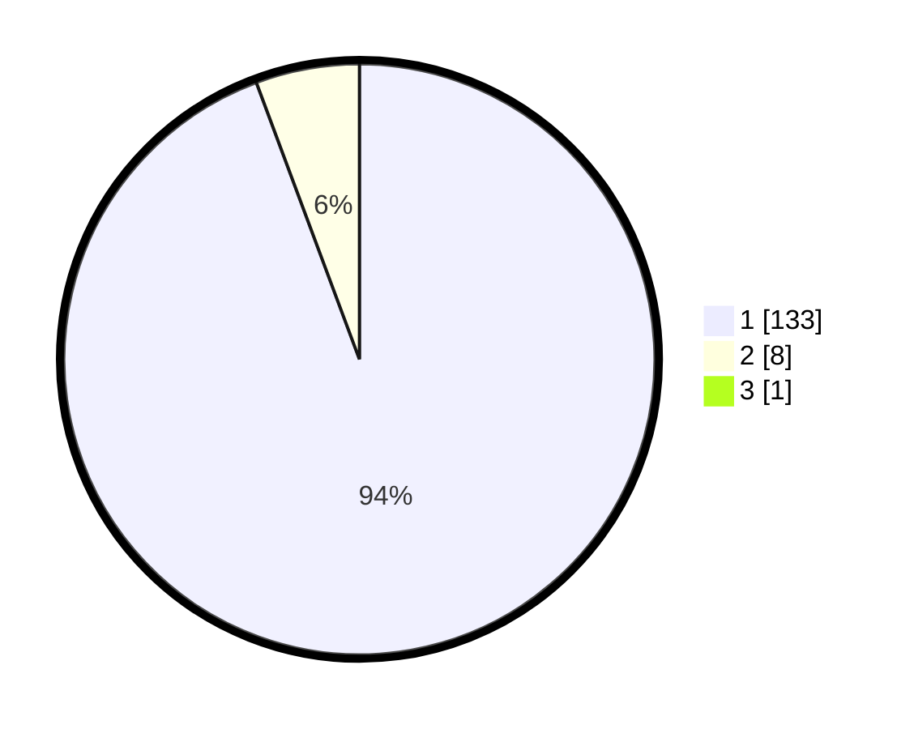

# Hasil

## Grafik

## Tabel

| No. | Nama Paslon    | Suara | Suara (raw) | Persentase |
|:--- |:-------------- | -----:| -----------:| ----------:|
| 1   | ANIES MUHAIMIN | 133   | [133][p-1]  | 93,66      |
| 2   | PRABOWO GIBRAN | 8     | [8][p-2]    | 5,63       |
| 3   | GANJAR MAHFUD  | 1     | [1][p-3]    | 0,70       |

[p-1]: https://github.com/gigit-pemilu/pemilu-2024/blob/main/pilpres/hitung-suara/sub/11-aceh/sub/03-aceh-timur/sub/01-darul-aman/sub/2007-seuneubok-teungoh/sub/001-tps/sub/paslon-1.txt
[p-2]: https://github.com/gigit-pemilu/pemilu-2024/blob/main/pilpres/hitung-suara/sub/11-aceh/sub/03-aceh-timur/sub/01-darul-aman/sub/2007-seuneubok-teungoh/sub/001-tps/sub/paslon-2.txt
[p-3]: https://github.com/gigit-pemilu/pemilu-2024/blob/main/pilpres/hitung-suara/sub/11-aceh/sub/03-aceh-timur/sub/01-darul-aman/sub/2007-seuneubok-teungoh/sub/001-tps/sub/paslon-3.txt

## Foto C Plano

https://sirekap-obj-formc.kpu.go.id/0083/pemilu/ppwp/11/03/01/20/07/1103012007001-20240215-005811--6631c138-8758-4a32-b3cd-86320b67566e.jpg

https://sirekap-obj-formc.kpu.go.id/0083/pemilu/ppwp/11/03/01/20/07/1103012007001-20240215-010349--bd8c6926-4452-4c6e-837f-5298ef4e6d66.jpg

https://sirekap-obj-formc.kpu.go.id/0083/pemilu/ppwp/11/03/01/20/07/1103012007001-20240215-010650--4f2fa66c-de32-49db-8432-3260f00bdaee.jpg

## Metadata

| Key        | Value               |
| ---------- | ------------------- |
| Time Stamp | 2024-02-19 06:16:00 |

