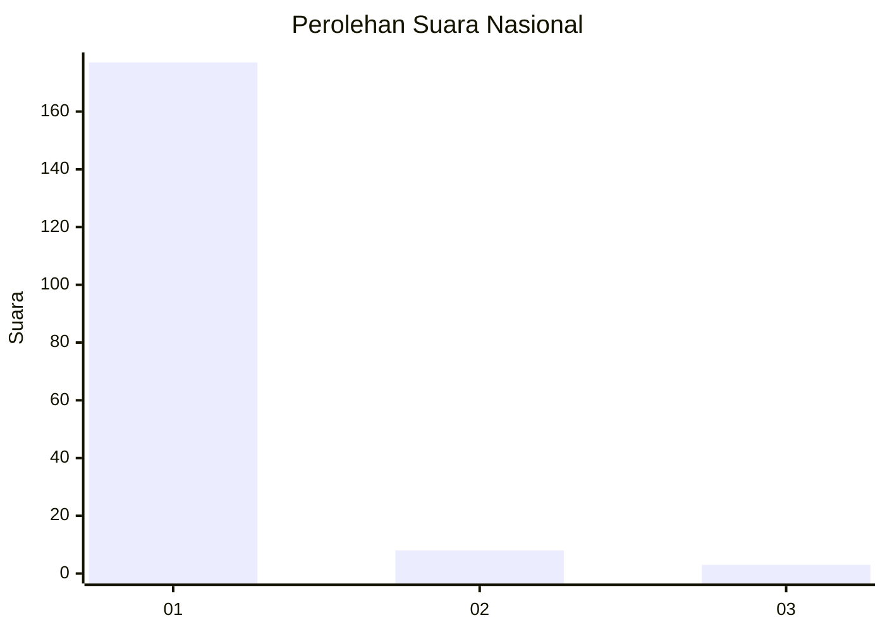
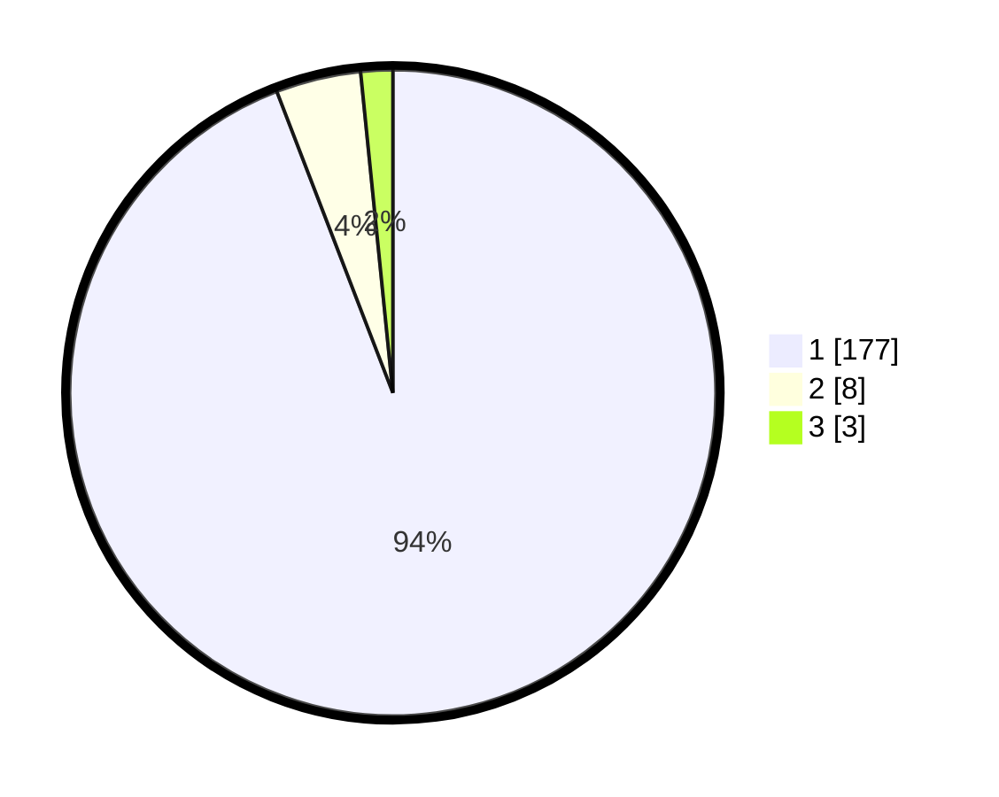

# Hasil

## Grafik

## Tabel

| No. | Nama Paslon    | Suara | Suara (raw) | Persentase |
|:--- |:-------------- | -----:| -----------:| ----------:|
| 1   | ANIES MUHAIMIN | 177   | [177][p-1]  | 94,15      |
| 2   | PRABOWO GIBRAN | 8     | [8][p-2]    | 4,26       |
| 3   | GANJAR MAHFUD  | 3     | [3][p-3]    | 1,60       |

[p-1]: https://github.com/gigit-pemilu/pemilu-2024/blob/main/pilpres/hitung-suara/sub/11-aceh/sub/03-aceh-timur/sub/01-darul-aman/sub/2010-matang-pineung/sub/001-tps/sub/paslon-1.txt
[p-2]: https://github.com/gigit-pemilu/pemilu-2024/blob/main/pilpres/hitung-suara/sub/11-aceh/sub/03-aceh-timur/sub/01-darul-aman/sub/2010-matang-pineung/sub/001-tps/sub/paslon-2.txt
[p-3]: https://github.com/gigit-pemilu/pemilu-2024/blob/main/pilpres/hitung-suara/sub/11-aceh/sub/03-aceh-timur/sub/01-darul-aman/sub/2010-matang-pineung/sub/001-tps/sub/paslon-3.txt

## Foto C Plano

https://sirekap-obj-formc.kpu.go.id/2d12/pemilu/ppwp/11/03/01/20/10/1103012010001-20240215-015338--7049b7d9-4ae1-43ad-b2b0-05eb8cdf2cfd.jpg

https://sirekap-obj-formc.kpu.go.id/2d12/pemilu/ppwp/11/03/01/20/10/1103012010001-20240215-015426--99b6c421-a6bd-4ae8-8092-a9af4f68c716.jpg

https://sirekap-obj-formc.kpu.go.id/2d12/pemilu/ppwp/11/03/01/20/10/1103012010001-20240215-015601--9320160f-2b3a-44cd-99a2-1be60f25cc12.jpg

## Metadata

| Key        | Value               |
| ---------- | ------------------- |
| Time Stamp | 2024-02-19 06:16:00 |

