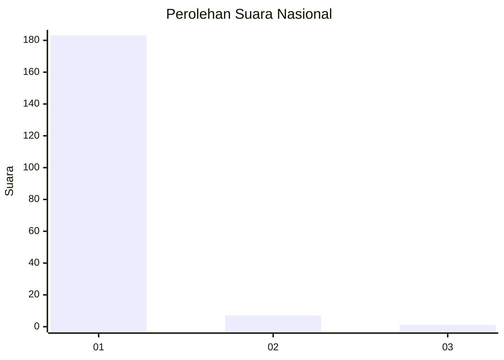
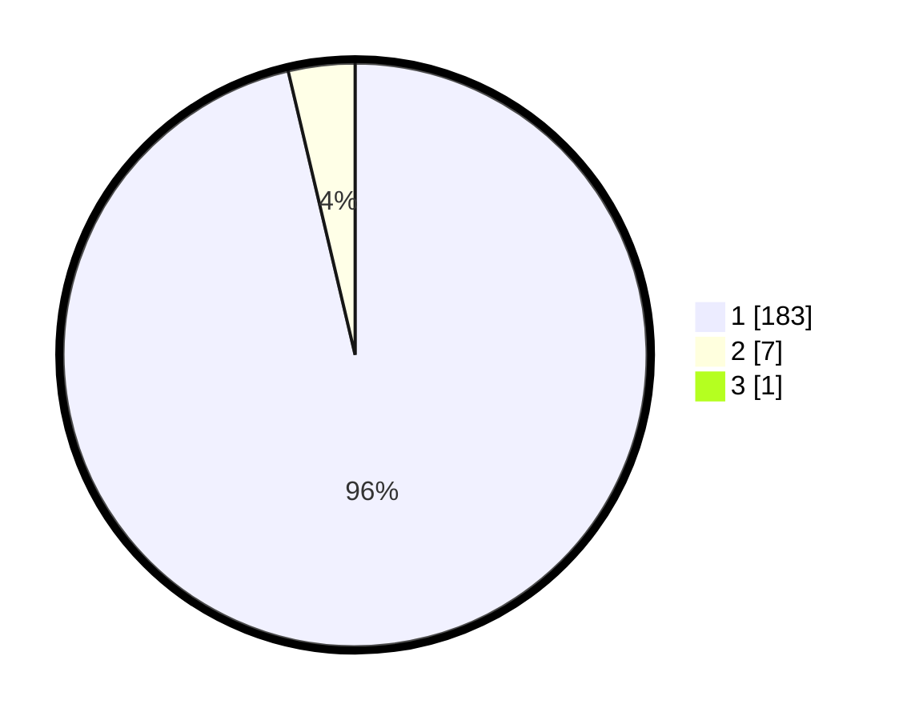

# Hasil

## Grafik

## Tabel

| No. | Nama Paslon    | Suara | Suara (raw) | Persentase |
|:--- |:-------------- | -----:| -----------:| ----------:|
| 1   | ANIES MUHAIMIN | 183   | [183][p-1]  | 95,81      |
| 2   | PRABOWO GIBRAN | 7     | [7][p-2]    | 3,66       |
| 3   | GANJAR MAHFUD  | 1     | [1][p-3]    | 0,52       |

[p-1]: https://github.com/gigit-pemilu/pemilu-2024/blob/main/pilpres/hitung-suara/sub/11-aceh/sub/03-aceh-timur/sub/01-darul-aman/sub/2010-matang-pineung/sub/002-tps/sub/paslon-1.txt
[p-2]: https://github.com/gigit-pemilu/pemilu-2024/blob/main/pilpres/hitung-suara/sub/11-aceh/sub/03-aceh-timur/sub/01-darul-aman/sub/2010-matang-pineung/sub/002-tps/sub/paslon-2.txt
[p-3]: https://github.com/gigit-pemilu/pemilu-2024/blob/main/pilpres/hitung-suara/sub/11-aceh/sub/03-aceh-timur/sub/01-darul-aman/sub/2010-matang-pineung/sub/002-tps/sub/paslon-3.txt

## Foto C Plano

https://sirekap-obj-formc.kpu.go.id/2ad7/pemilu/ppwp/11/03/01/20/10/1103012010002-20240215-013526--79ba7b3f-bf78-4855-b536-8b301de01d39.jpg

https://sirekap-obj-formc.kpu.go.id/2ad7/pemilu/ppwp/11/03/01/20/10/1103012010002-20240215-013635--0508ee33-57d5-4ce9-bff5-223608fa9273.jpg

https://sirekap-obj-formc.kpu.go.id/2ad7/pemilu/ppwp/11/03/01/20/10/1103012010002-20240215-013741--c9931949-c476-459e-90bd-033a2b59f89d.jpg

## Metadata

| Key        | Value               |
| ---------- | ------------------- |
| Time Stamp | 2024-02-19 06:16:00 |

