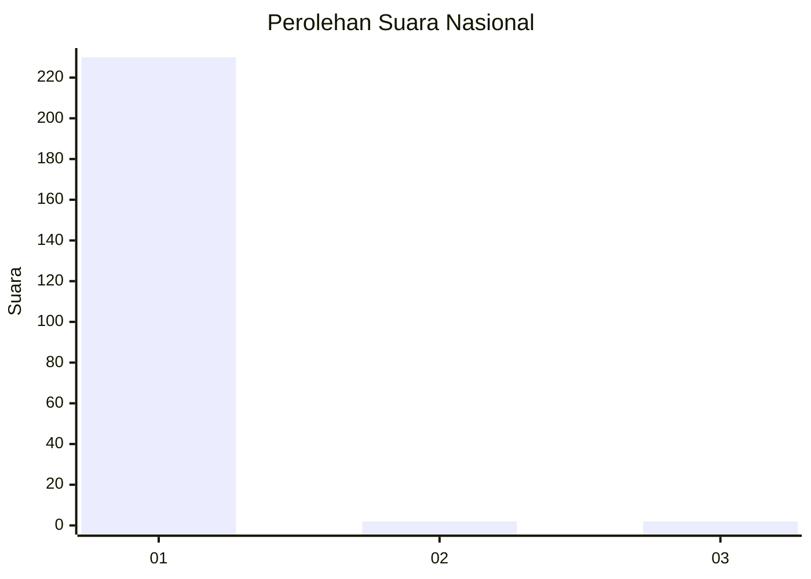
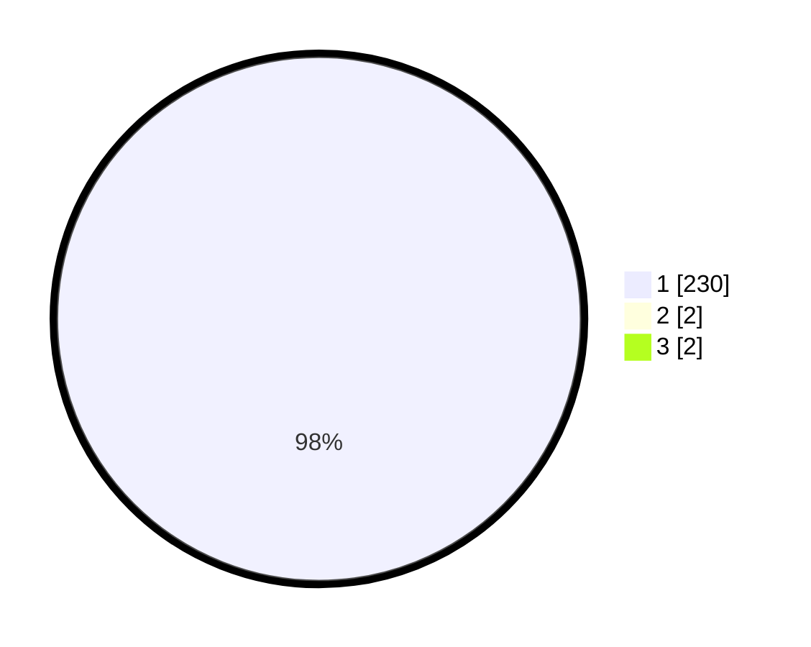

# Hasil

## Grafik

## Tabel

| No. | Nama Paslon    | Suara | Suara (raw) | Persentase |
|:--- |:-------------- | -----:| -----------:| ----------:|
| 1   | ANIES MUHAIMIN | 230   | [230][p-1]  | 98,29      |
| 2   | PRABOWO GIBRAN | 2     | [2][p-2]    | 0,85       |
| 3   | GANJAR MAHFUD  | 2     | [2][p-3]    | 0,85       |

[p-1]: https://github.com/gigit-pemilu/pemilu-2024/blob/main/pilpres/hitung-suara/sub/11-aceh/sub/03-aceh-timur/sub/01-darul-aman/sub/2013-meunasah-keutapang/sub/001-tps/sub/paslon-1.txt
[p-2]: https://github.com/gigit-pemilu/pemilu-2024/blob/main/pilpres/hitung-suara/sub/11-aceh/sub/03-aceh-timur/sub/01-darul-aman/sub/2013-meunasah-keutapang/sub/001-tps/sub/paslon-2.txt
[p-3]: https://github.com/gigit-pemilu/pemilu-2024/blob/main/pilpres/hitung-suara/sub/11-aceh/sub/03-aceh-timur/sub/01-darul-aman/sub/2013-meunasah-keutapang/sub/001-tps/sub/paslon-3.txt

## Foto C Plano

https://sirekap-obj-formc.kpu.go.id/7952/pemilu/ppwp/11/03/01/20/13/1103012013001-20240222-214915--91e81465-499e-4243-9bf1-59295b74bfe2.jpg

https://sirekap-obj-formc.kpu.go.id/7952/pemilu/ppwp/11/03/01/20/13/1103012013001-20240215-052007--aac93510-5dd1-4aa7-8df7-6add95023dba.jpg

https://sirekap-obj-formc.kpu.go.id/7952/pemilu/ppwp/11/03/01/20/13/1103012013001-20240222-215438--fb5a0381-146c-4da0-a91b-8550235d8000.jpg

## Metadata

| Key        | Value               |
| ---------- | ------------------- |
| Time Stamp | 2024-02-22 22:00:00 |

## DATA PEMILIH TETAP

Jumlah pemilih dalam DPT: **294**.
 * L: **160**.
 * P: **134**.

## DATA PENGGUNA HAK PILIH

Jumlah pengguna hak pilih dalam DPT: **218**.
 * L: **103**.
 * P: **115**.

Jumlah pengguna hak pilih dalam DPTb: **2**.
 * L: **1**.
 * P: **1**.

Jumlah pengguna hak pilih dalam DPK: **16**.
 * L: **7**.
 * P: **9**.

Jumlah pengguna hak pilih: **236**.
 * L: **111**.
 * P: **125**.

## JUMLAH SUARA SAH DAN TIDAK SAH

JUMLAH SELURUH SUARA SAH: **234**.

JUMLAH SUARA TIDAK SAH: **2**.

JUMLAH SELURUH SUARA SAH DAN SUARA TIDAK SAH: **236**.

