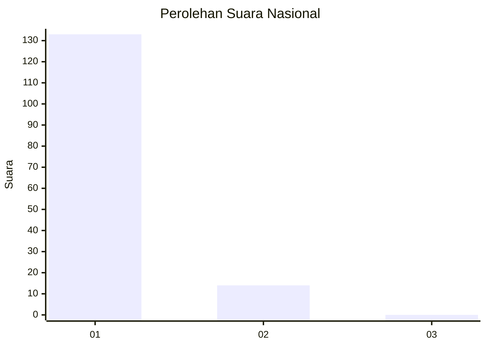
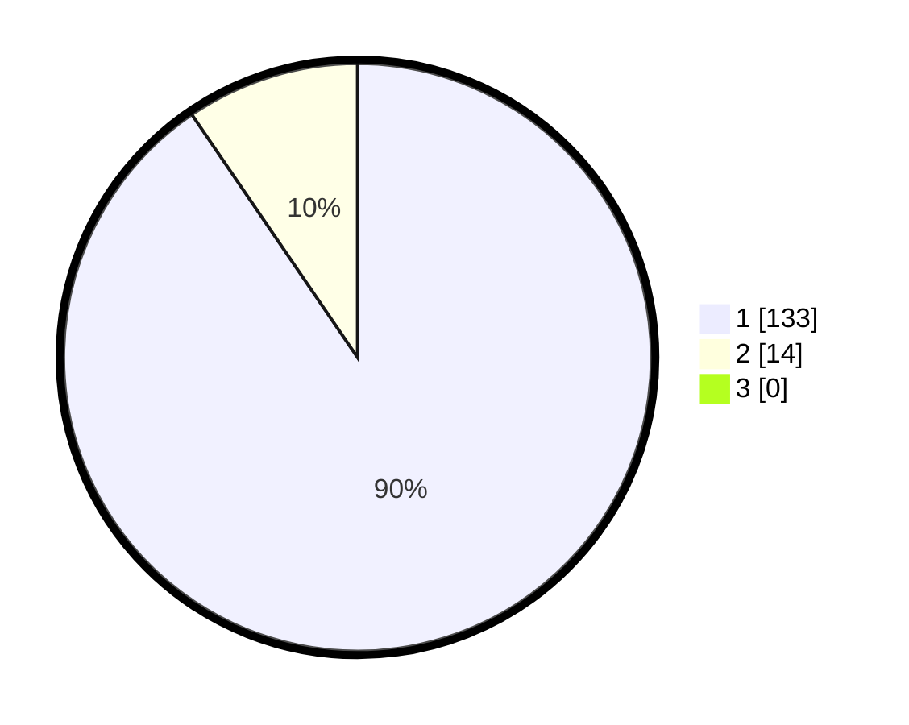

# Hasil

## Grafik

## Tabel

| No. | Nama Paslon    | Suara | Suara (raw) | Persentase |
|:--- |:-------------- | -----:| -----------:| ----------:|
| 1   | ANIES MUHAIMIN | 133   | [133][p-1]  | 90,48      |
| 2   | PRABOWO GIBRAN | 14    | [14][p-2]   | 9,52       |
| 3   | GANJAR MAHFUD  | 0     | [0][p-3]    | 0,00       |

[p-1]: https://github.com/gigit-pemilu/pemilu-2024/blob/main/pilpres/hitung-suara/sub/11-aceh/sub/03-aceh-timur/sub/01-darul-aman/sub/2014-buket-rumia/sub/001-tps/sub/paslon-1.txt
[p-2]: https://github.com/gigit-pemilu/pemilu-2024/blob/main/pilpres/hitung-suara/sub/11-aceh/sub/03-aceh-timur/sub/01-darul-aman/sub/2014-buket-rumia/sub/001-tps/sub/paslon-2.txt
[p-3]: https://github.com/gigit-pemilu/pemilu-2024/blob/main/pilpres/hitung-suara/sub/11-aceh/sub/03-aceh-timur/sub/01-darul-aman/sub/2014-buket-rumia/sub/001-tps/sub/paslon-3.txt

## Foto C Plano

https://sirekap-obj-formc.kpu.go.id/40c1/pemilu/ppwp/11/03/01/20/14/1103012014001-20240214-202942--9972e97e-1516-4466-ad0b-64d8721aedba.jpg

https://sirekap-obj-formc.kpu.go.id/40c1/pemilu/ppwp/11/03/01/20/14/1103012014001-20240214-203344--8f1e5933-ae6d-47ac-962b-3b4bd6a6521b.jpg

https://sirekap-obj-formc.kpu.go.id/40c1/pemilu/ppwp/11/03/01/20/14/1103012014001-20240214-203503--f9bddad5-76a3-4e41-a460-4b92bcba7318.jpg

## Metadata

| Key        | Value               |
| ---------- | ------------------- |
| Time Stamp | 2024-02-19 06:16:00 |

