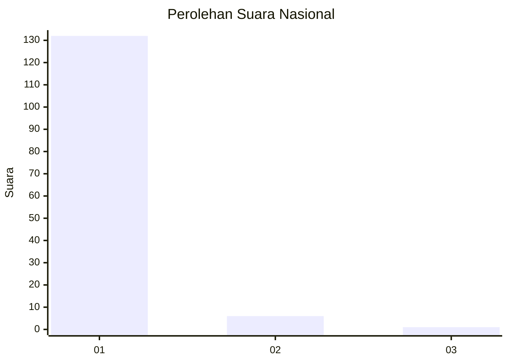
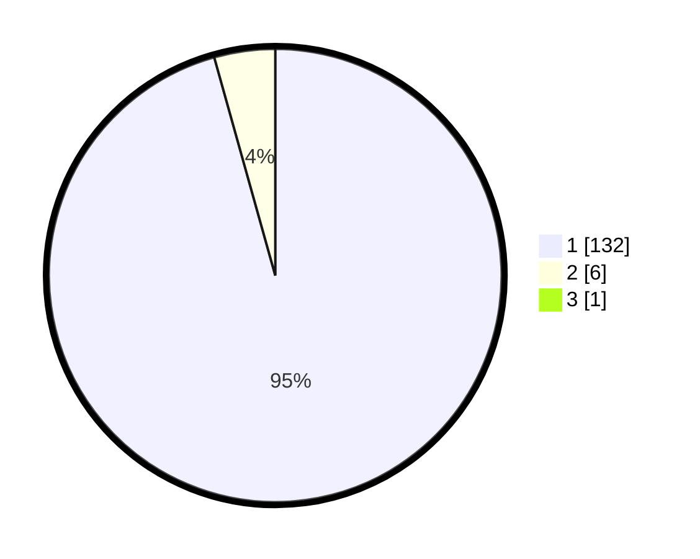

# Hasil

## Grafik

## Tabel

| No. | Nama Paslon    | Suara | Suara (raw) | Persentase |
|:--- |:-------------- | -----:| -----------:| ----------:|
| 1   | ANIES MUHAIMIN | 132   | [132][p-1]  | 94,96      |
| 2   | PRABOWO GIBRAN | 6     | [6][p-2]    | 4,32       |
| 3   | GANJAR MAHFUD  | 1     | [1][p-3]    | 0,72       |

[p-1]: https://github.com/gigit-pemilu/pemilu-2024/blob/main/pilpres/hitung-suara/sub/11-aceh/sub/03-aceh-timur/sub/01-darul-aman/sub/2016-kapai-baro/sub/001-tps/sub/paslon-1.txt
[p-2]: https://github.com/gigit-pemilu/pemilu-2024/blob/main/pilpres/hitung-suara/sub/11-aceh/sub/03-aceh-timur/sub/01-darul-aman/sub/2016-kapai-baro/sub/001-tps/sub/paslon-2.txt
[p-3]: https://github.com/gigit-pemilu/pemilu-2024/blob/main/pilpres/hitung-suara/sub/11-aceh/sub/03-aceh-timur/sub/01-darul-aman/sub/2016-kapai-baro/sub/001-tps/sub/paslon-3.txt

## Foto C Plano

https://sirekap-obj-formc.kpu.go.id/a2f2/pemilu/ppwp/11/03/01/20/16/1103012016001-20240215-183815--2ad22d7d-e115-4dcd-81be-683e588159df.jpg

https://sirekap-obj-formc.kpu.go.id/a2f2/pemilu/ppwp/11/03/01/20/16/1103012016001-20240215-183750--991c4004-0e16-4e0a-a23c-b9c5ab87d31c.jpg

https://sirekap-obj-formc.kpu.go.id/a2f2/pemilu/ppwp/11/03/01/20/16/1103012016001-20240215-184117--a11cf056-eb30-4a3f-9bd0-86049c48ef74.jpg

## Metadata

| Key        | Value               |
| ---------- | ------------------- |
| Time Stamp | 2024-02-19 06:16:00 |

