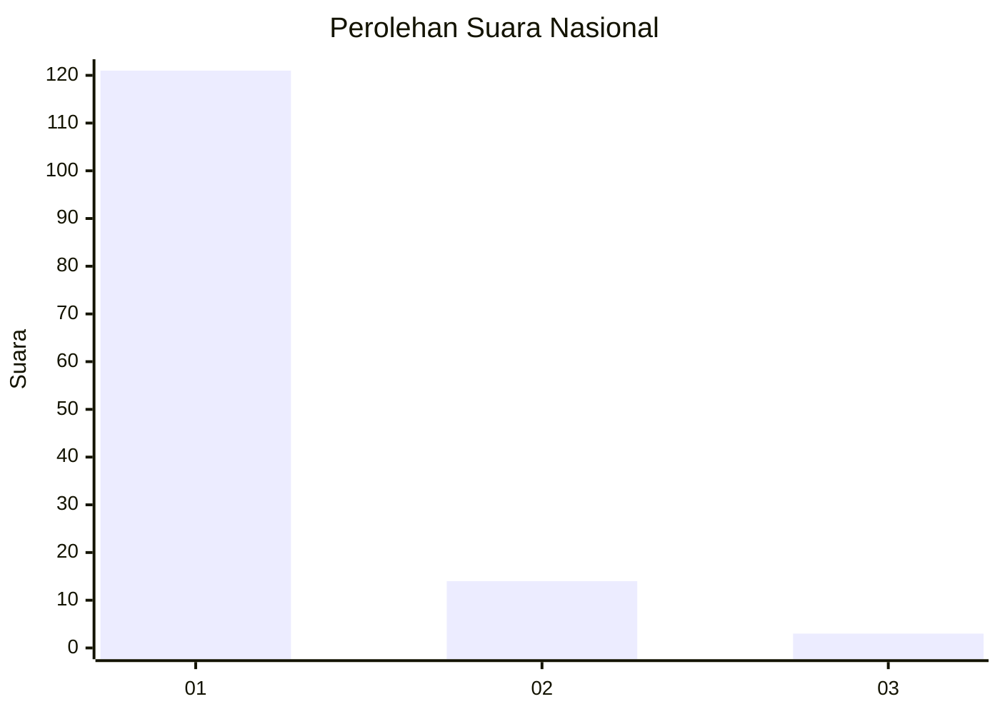
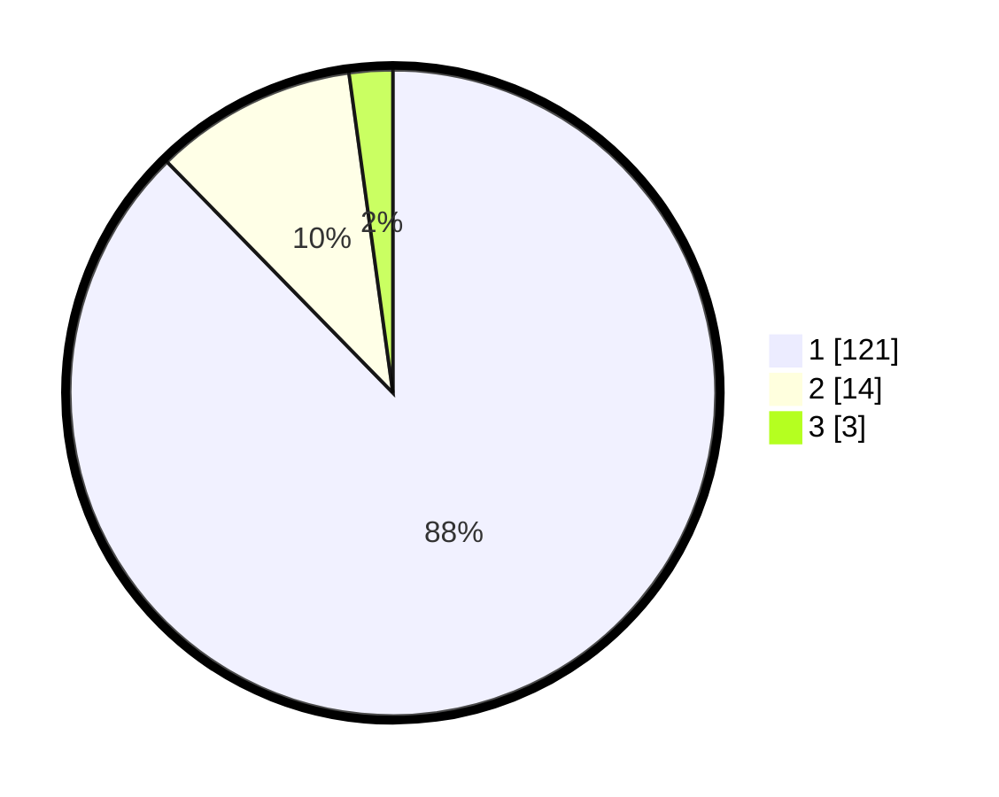

# Hasil

## Grafik

## Tabel

| No. | Nama Paslon    | Suara | Suara (raw) | Persentase |
|:--- |:-------------- | -----:| -----------:| ----------:|
| 1   | ANIES MUHAIMIN | 121   | [121][p-1]  | 87,68      |
| 2   | PRABOWO GIBRAN | 14    | [14][p-2]   | 10,14      |
| 3   | GANJAR MAHFUD  | 3     | [3][p-3]    | 2,17       |

[p-1]: https://github.com/gigit-pemilu/pemilu-2024/blob/main/pilpres/hitung-suara/sub/11-aceh/sub/03-aceh-timur/sub/01-darul-aman/sub/2021-alue-lhok/sub/002-tps/sub/paslon-1.txt
[p-2]: https://github.com/gigit-pemilu/pemilu-2024/blob/main/pilpres/hitung-suara/sub/11-aceh/sub/03-aceh-timur/sub/01-darul-aman/sub/2021-alue-lhok/sub/002-tps/sub/paslon-2.txt
[p-3]: https://github.com/gigit-pemilu/pemilu-2024/blob/main/pilpres/hitung-suara/sub/11-aceh/sub/03-aceh-timur/sub/01-darul-aman/sub/2021-alue-lhok/sub/002-tps/sub/paslon-3.txt

## Foto C Plano

https://sirekap-obj-formc.kpu.go.id/83af/pemilu/ppwp/11/03/01/20/21/1103012021002-20240216-153933--2d3a768c-366b-45de-8e20-f082f38f9d6b.jpg

https://sirekap-obj-formc.kpu.go.id/83af/pemilu/ppwp/11/03/01/20/21/1103012021002-20240216-153934--413fbe41-b12f-4c58-94b6-76df84f77aed.jpg

https://sirekap-obj-formc.kpu.go.id/83af/pemilu/ppwp/11/03/01/20/21/1103012021002-20240216-153934--f337eecf-da5f-47ae-8d4a-dc5d5699ccc4.jpg

## Metadata

| Key        | Value               |
| ---------- | ------------------- |
| Time Stamp | 2024-02-17 09:30:03 |

## DATA PEMILIH TETAP

Jumlah pemilih dalam DPT: **206**.
 * L: **104**.
 * P: **102**.

## DATA PENGGUNA HAK PILIH

Jumlah pengguna hak pilih dalam DPT: **136**.
 * L: **60**.
 * P: **76**.

Jumlah pengguna hak pilih dalam DPTb: **4**.
 * L: **3**.
 * P: **1**.

Jumlah pengguna hak pilih dalam DPK: **2**.
 * L: **1**.
 * P: **1**.

Jumlah pengguna hak pilih: **142**.
 * L: **64**.
 * P: **78**.

## JUMLAH SUARA SAH DAN TIDAK SAH

JUMLAH SELURUH SUARA SAH: **138**.

JUMLAH SUARA TIDAK SAH: **4**.

JUMLAH SELURUH SUARA SAH DAN SUARA TIDAK SAH: **142**.

