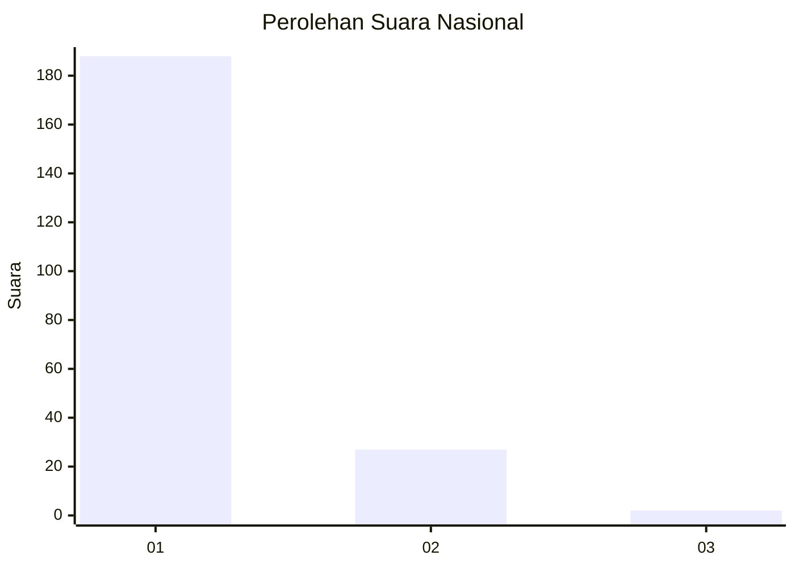
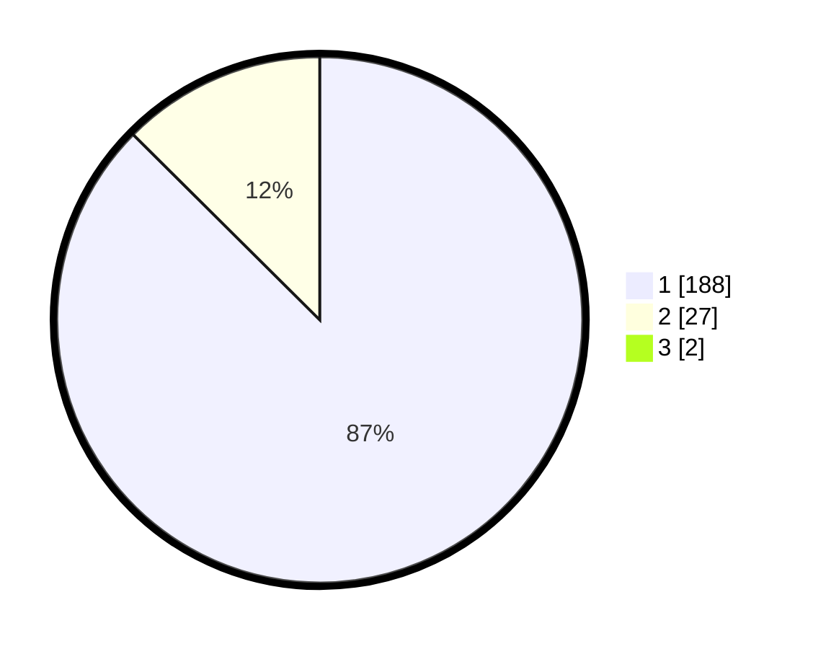

# Hasil

## Grafik

## Tabel

| No. | Nama Paslon    | Suara | Suara (raw) | Persentase |
|:--- |:-------------- | -----:| -----------:| ----------:|
| 1   | ANIES MUHAIMIN | 188   | [188][p-1]  | 86,64      |
| 2   | PRABOWO GIBRAN | 27    | [27][p-2]   | 12,44      |
| 3   | GANJAR MAHFUD  | 2     | [2][p-3]    | 0,92       |

[p-1]: https://github.com/gigit-pemilu/pemilu-2024/blob/main/pilpres/hitung-suara/sub/11-aceh/sub/03-aceh-timur/sub/01-darul-aman/sub/2029-gampong-beunot/sub/001-tps/sub/paslon-1.txt
[p-2]: https://github.com/gigit-pemilu/pemilu-2024/blob/main/pilpres/hitung-suara/sub/11-aceh/sub/03-aceh-timur/sub/01-darul-aman/sub/2029-gampong-beunot/sub/001-tps/sub/paslon-2.txt
[p-3]: https://github.com/gigit-pemilu/pemilu-2024/blob/main/pilpres/hitung-suara/sub/11-aceh/sub/03-aceh-timur/sub/01-darul-aman/sub/2029-gampong-beunot/sub/001-tps/sub/paslon-3.txt

## Foto C Plano

https://sirekap-obj-formc.kpu.go.id/06a0/pemilu/ppwp/11/03/01/20/29/1103012029001-20240214-221409--ba291aa4-badd-4e37-8348-31443f971940.jpg

https://sirekap-obj-formc.kpu.go.id/06a0/pemilu/ppwp/11/03/01/20/29/1103012029001-20240214-221411--0d630801-7421-444a-bf87-1e14744b4859.jpg

https://sirekap-obj-formc.kpu.go.id/06a0/pemilu/ppwp/11/03/01/20/29/1103012029001-20240214-221415--9efc2975-b036-4183-bde3-655d1c596321.jpg

## Metadata

| Key        | Value               |
| ---------- | ------------------- |
| Time Stamp | 2024-02-19 06:16:00 |

