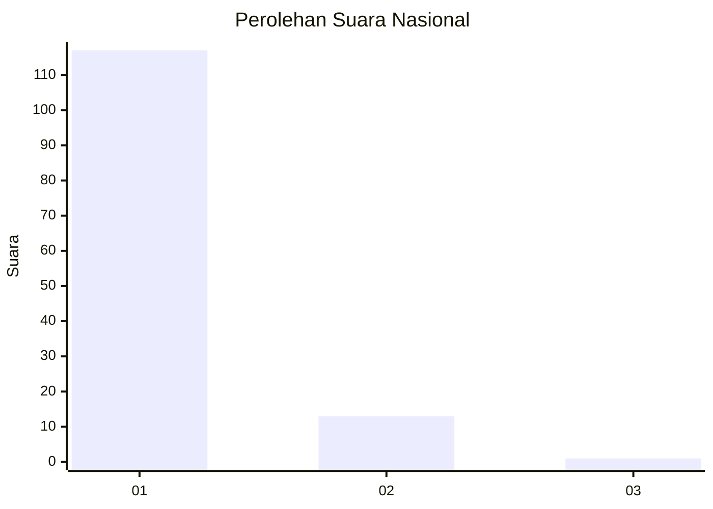
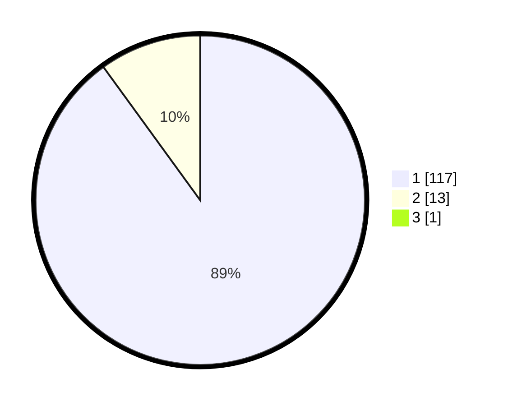

# Hasil

## Grafik

## Tabel

| No. | Nama Paslon    | Suara | Suara (raw) | Persentase |
|:--- |:-------------- | -----:| -----------:| ----------:|
| 1   | ANIES MUHAIMIN | 117   | [117][p-1]  | 89,31      |
| 2   | PRABOWO GIBRAN | 13    | [13][p-2]   | 9,92       |
| 3   | GANJAR MAHFUD  | 1     | [1][p-3]    | 0,76       |

[p-1]: https://github.com/gigit-pemilu/pemilu-2024/blob/main/pilpres/hitung-suara/sub/11-aceh/sub/03-aceh-timur/sub/01-darul-aman/sub/2029-gampong-beunot/sub/002-tps/sub/paslon-1.txt
[p-2]: https://github.com/gigit-pemilu/pemilu-2024/blob/main/pilpres/hitung-suara/sub/11-aceh/sub/03-aceh-timur/sub/01-darul-aman/sub/2029-gampong-beunot/sub/002-tps/sub/paslon-2.txt
[p-3]: https://github.com/gigit-pemilu/pemilu-2024/blob/main/pilpres/hitung-suara/sub/11-aceh/sub/03-aceh-timur/sub/01-darul-aman/sub/2029-gampong-beunot/sub/002-tps/sub/paslon-3.txt

## Foto C Plano

https://sirekap-obj-formc.kpu.go.id/15ef/pemilu/ppwp/11/03/01/20/29/1103012029002-20240214-235838--7fa7a9ac-c6f9-419e-be2f-4bbb2deea45f.jpg

https://sirekap-obj-formc.kpu.go.id/15ef/pemilu/ppwp/11/03/01/20/29/1103012029002-20240214-235816--72f8afe8-5222-4c3b-b735-e3a099626c04.jpg

https://sirekap-obj-formc.kpu.go.id/15ef/pemilu/ppwp/11/03/01/20/29/1103012029002-20240214-235831--eb4460e0-4008-4074-a845-ef0949297fb3.jpg

## Metadata

| Key        | Value               |
| ---------- | ------------------- |
| Time Stamp | 2024-02-19 06:16:00 |

