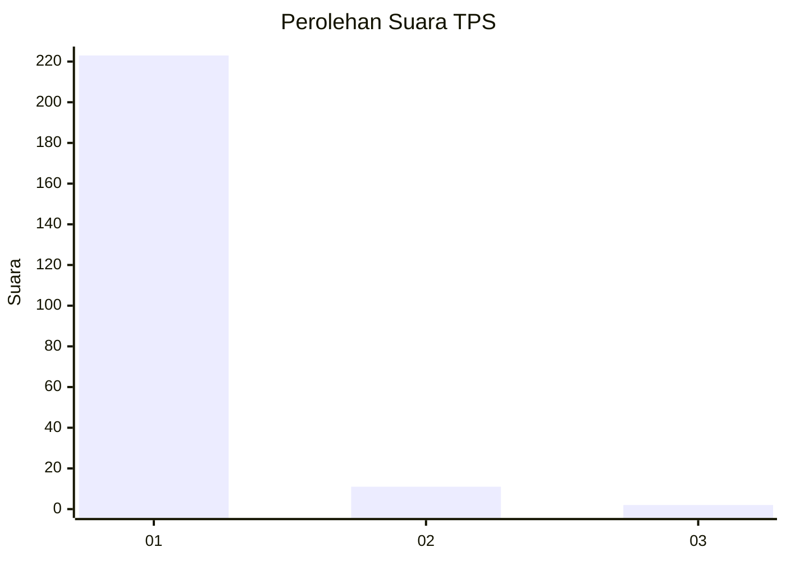
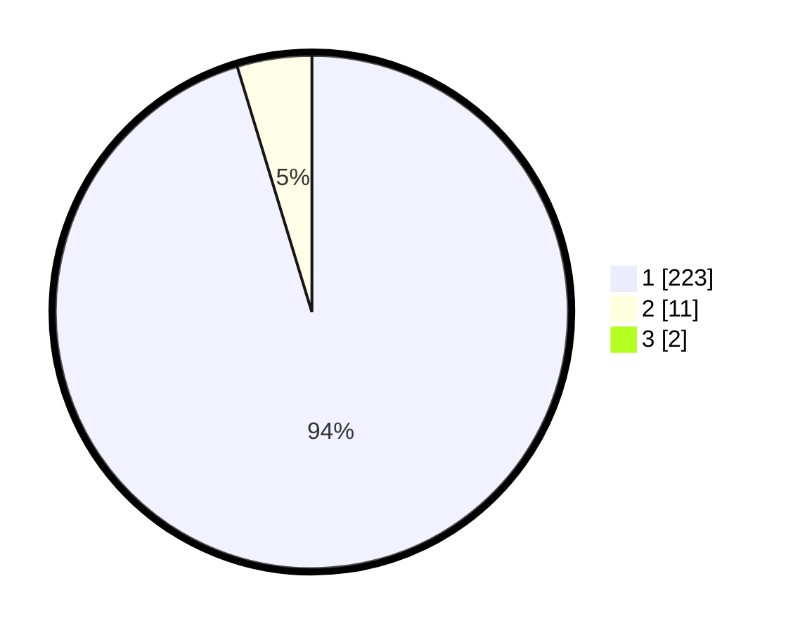

# Hasil

## Grafik

## Tabel

| No. | Nama Paslon    | Suara | Suara (raw) | Persentase |
|:--- |:-------------- | -----:| -----------:| ----------:|
| 1   | ANIES MUHAIMIN | 223   | [223][p-1]  | 94,49      |
| 2   | PRABOWO GIBRAN | 11    | [11][p-2]   | 4,66       |
| 3   | GANJAR MAHFUD  | 2     | [2][p-3]    | 0,85       |

[p-1]: https://github.com/gigit-pemilu/pemilu-2024-11-aceh/blob/main/pilpres/hitung-suara/sub/11-aceh/sub/03-aceh-timur/sub/01-darul-aman/sub/2030-seuneubok-baroh/sub/002-tps/sub/paslon-1.txt
[p-2]: https://github.com/gigit-pemilu/pemilu-2024-11-aceh/blob/main/pilpres/hitung-suara/sub/11-aceh/sub/03-aceh-timur/sub/01-darul-aman/sub/2030-seuneubok-baroh/sub/002-tps/sub/paslon-2.txt
[p-3]: https://github.com/gigit-pemilu/pemilu-2024-11-aceh/blob/main/pilpres/hitung-suara/sub/11-aceh/sub/03-aceh-timur/sub/01-darul-aman/sub/2030-seuneubok-baroh/sub/002-tps/sub/paslon-3.txt

## Foto C Plano

https://sirekap-obj-formc.kpu.go.id/7e41/pemilu/ppwp/11/03/01/20/30/1103012030002-20240215-024915--5fdef871-dbed-416b-b516-05ec4181a1ee.jpg

https://sirekap-obj-formc.kpu.go.id/7e41/pemilu/ppwp/11/03/01/20/30/1103012030002-20240215-000457--34ef20f0-b5a8-4db1-9876-c241a2a1eee7.jpg

https://sirekap-obj-formc.kpu.go.id/7e41/pemilu/ppwp/11/03/01/20/30/1103012030002-20240215-023610--d648452c-87d1-458e-af77-3fc8e974b150.jpg

## Metadata

| Key        | Value               |
| ---------- | ------------------- |
| Time Stamp | 2024-02-24 22:31:28 |

